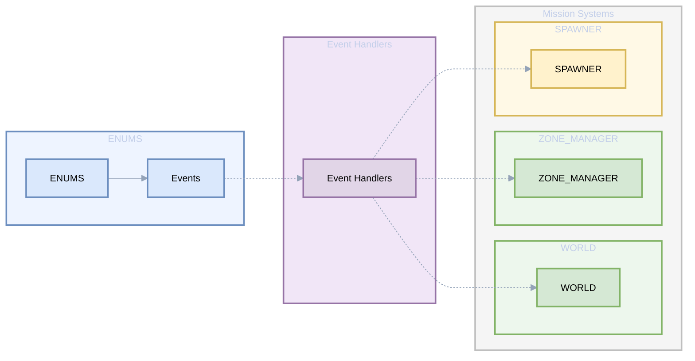
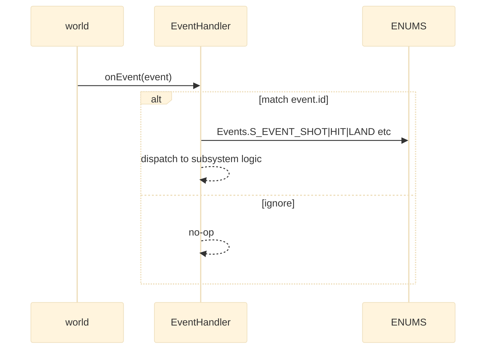

# ENUMS DCS events

Enumeration of DCS world events exposed via AETHR.ENUMS and guidance for usage in event handlers.

Primary sources

- Events class doc: [AETHR.ENUMS.Events](../../dev/ENUMS.lua:58)
- Events mapping table: [AETHR.ENUMS.Events = { ... }](../../dev/ENUMS.lua:374)
- Root table initialization: [AETHR.ENUMS](../../dev/ENUMS.lua:337)

Overview relationships

Typical usage pattern

Event keys provided

- Combat and object lifecycle
  - S_EVENT_SHOT, S_EVENT_HIT, S_EVENT_DEAD, S_EVENT_KILL, S_EVENT_WEAPON_ADD
  - S_EVENT_BIRTH, S_EVENT_UNIT_LOST
- Flight operations
  - S_EVENT_TAKEOFF, S_EVENT_LAND, S_EVENT_CRASH, S_EVENT_EJECTION
  - S_EVENT_ENGINE_STARTUP, S_EVENT_ENGINE_SHUTDOWN
- Player interactions
  - S_EVENT_TOOK_CONTROL, S_EVENT_PLAYER_ENTER_UNIT, S_EVENT_PLAYER_LEAVE_UNIT
  - S_EVENT_PLAYER_COMMENT, S_EVENT_PLAYER_SELF_KILL_PILOT
- Airbase and mission
  - S_EVENT_BASE_CAPTURED, S_EVENT_MISSION_START, S_EVENT_MISSION_END
- Refueling and weapons
  - S_EVENT_REFUELING, S_EVENT_REFUELING_STOP, S_EVENT_SHOOTING_START, S_EVENT_SHOOTING_END
- Misc and telemetry
  - S_EVENT_HUMAN_FAILURE, S_EVENT_SCORE, S_EVENT_LANDING_AFTER_EJECTION, S_EVENT_PARATROOPER_LENDING
  - S_EVENT_DISCARD_CHAIR_AFTER_EJECTION, S_EVENT_TRIGGER_ZONE, S_EVENT_LANDING_QUALITY_MARK
  - S_EVENT_BDA, S_EVENT_AI_ABORT_MISSION, S_EVENT_DAYNIGHT, S_EVENT_FLIGHT_TIME
  - S_EVENT_PLAYER_CAPTURE_AIRFIELD, S_EVENT_EMERGENCY_LANDING

Notes and guardrails

- The mapping is a pass-through to world.event.* constants via ENUMS, allowing editor-friendly references and static analysis out of DCS
- Some events cannot be caught during script init due to timing (see comments in [Events mapping](../../dev/ENUMS.lua:384))
- Handlers should be robust to missing fields on the event structure depending on event.id

Validation checklist

- Class docs for Events at [dev/ENUMS.lua](../../dev/ENUMS.lua:58)
- Mapping block for Events at [dev/ENUMS.lua](../../dev/ENUMS.lua:374)
- Root ENUMS initialization at [dev/ENUMS.lua](../../dev/ENUMS.lua:337)

Related breakouts

- Categories: [categories.md](./categories.md)
- Coalition and texts: [coalition_and_text.md](./coalition_and_text.md)
- Surface types and NOGO: [surface_types.md](./surface_types.md)
- Spawn types and priority: [spawn_types.md](./spawn_types.md)
- Lines and markers: [lines_and_markers.md](./lines_and_markers.md)

Conventions

- Mermaid fenced blocks with GitHub parser
- Labels avoid double quotes and parentheses inside bracket labels
- Relative links use stable line anchors to source