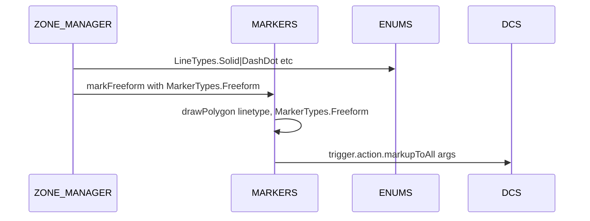
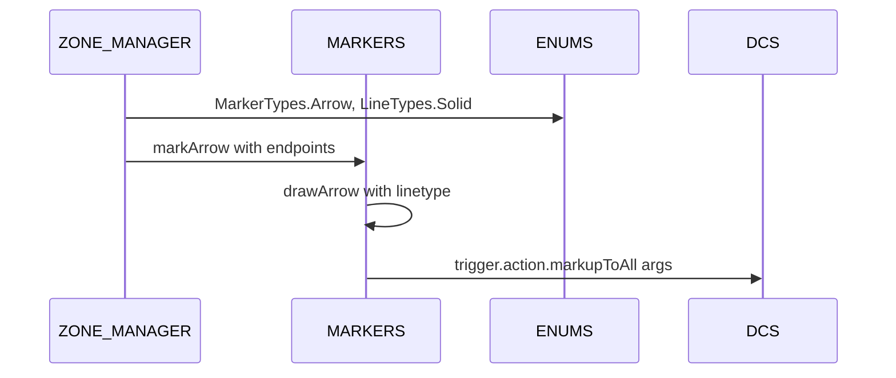
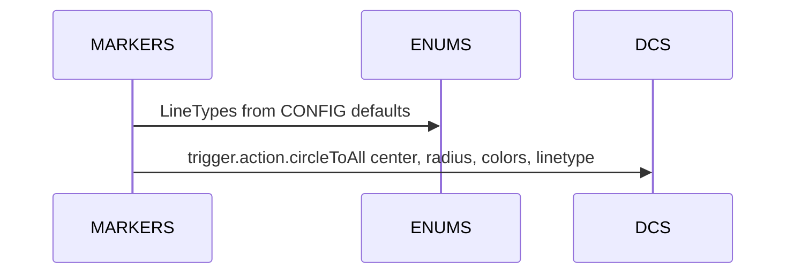

# ENUMS lines and markers

A focused breakout on AETHR.ENUMS.LineTypes and AETHR.ENUMS.MarkerTypes and their consumers in MARKERS and ZONE_MANAGER.

Primary sources

- Line types class doc: [AETHR.ENUMS.LineTypes](../../dev/ENUMS.lua:137)
- Line types mapping: [AETHR.ENUMS.LineTypes = { ... }](../../dev/ENUMS.lua:452)
- Marker types class doc: [AETHR.ENUMS.MarkerTypes](../../dev/ENUMS.lua:146)
- Marker types mapping: [AETHR.ENUMS.MarkerTypes = { ... }](../../dev/ENUMS.lua:461)
- ENUMS root init: [AETHR.ENUMS](../../dev/ENUMS.lua:337)

Consumers and anchors

- MARKERS drawing helpers
  - Freeform polygon draw: [AETHR.MARKERS:drawPolygon()](../../dev/MARKERS.lua:85)
  - Arrow draw: [AETHR.MARKERS:drawArrow()](../../dev/MARKERS.lua:176)
  - Circle draw: [AETHR.MARKERS:drawCircle()](../../dev/MARKERS.lua:269)
  - Marker wrappers: [markFreeform](../../dev/MARKERS.lua:43), [markArrow](../../dev/MARKERS.lua:138), [markCircle](../../dev/MARKERS.lua:229)

- ZONE_MANAGER rendering
  - Zone polygons: [AETHR.ZONE_MANAGER:drawMissionZones()](../../dev/ZONE_MANAGER.lua:980)
  - Game bounds quads: [AETHR.ZONE_MANAGER:drawGameBounds()](../../dev/ZONE_MANAGER.lua:929)
  - Border arrows: [AETHR.ZONE_MANAGER:drawZoneArrows()](../../dev/ZONE_MANAGER.lua:1025), marker init [initZoneArrows](../../dev/ZONE_MANAGER.lua:1075)

Overview relationships

```mermaid
%% shared theme: docs/_mermaid/theme.json %%
flowchart LR
  subgraph ENUMS [ENUMS]
    EN[ENUMS]
    LT[LineTypes]
    MT[MarkerTypes]
  end

  subgraph ZM [ZONE_MANAGER]
    ZM[ZONE_MANAGER]
  end

  subgraph MK [MARKERS]
    MK[MARKERS]
  end

  EN --> LT
  EN --> MT
  LT -.-> ZM
  MT -.-> MK
  ZM -.-> MK

  class EN,LT,MT class-data
  class ZM,MK class-compute
```

Drawing sequences

Polygon freeform



Arrow borders



Circle helpers



Key integration notes

- ZONE_MANAGER:drawMissionZones uses CONFIG-driven colors and [LineTypes](../../dev/ENUMS.lua:452) for outlines; shapes are rendered through MARKERS freeform pipelines
- ZONE_MANAGER:drawZoneArrows creates Arrow markers using [MarkerTypes.Arrow](../../dev/ENUMS.lua:461) and [LineTypes.Solid](../../dev/ENUMS.lua:452)
- MARKERS helpers normalize vertices as vec3 for DCS trigger.action APIs and take linetype values from LineTypes

Validation checklist

- LineTypes mapping exists at [dev/ENUMS.lua](../../dev/ENUMS.lua:452)
- MarkerTypes mapping exists at [dev/ENUMS.lua](../../dev/ENUMS.lua:461)
- MARKERS drawing functions at [dev/MARKERS.lua](../../dev/MARKERS.lua:85), [dev/MARKERS.lua](../../dev/MARKERS.lua:176), [dev/MARKERS.lua](../../dev/MARKERS.lua:269)
- ZONE_MANAGER renderers at [dev/ZONE_MANAGER.lua](../../dev/ZONE_MANAGER.lua:929), [dev/ZONE_MANAGER.lua](../../dev/ZONE_MANAGER.lua:980), [dev/ZONE_MANAGER.lua](../../dev/ZONE_MANAGER.lua:1025)

Related breakouts

- Categories: [categories.md](./categories.md)
- Coalition and text strings: [coalition_and_text.md](./coalition_and_text.md)
- Spawn types: [spawn_types.md](./spawn_types.md)