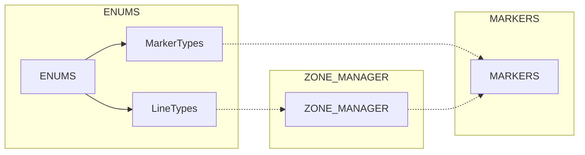
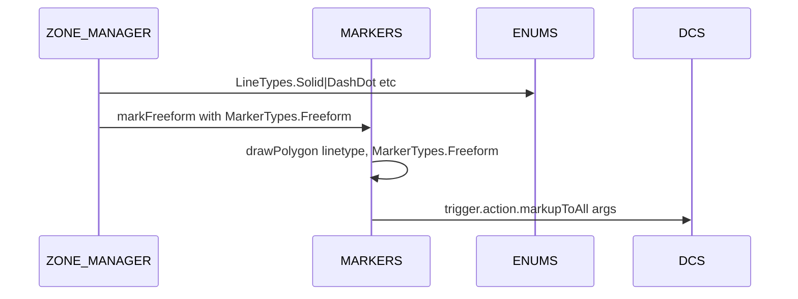
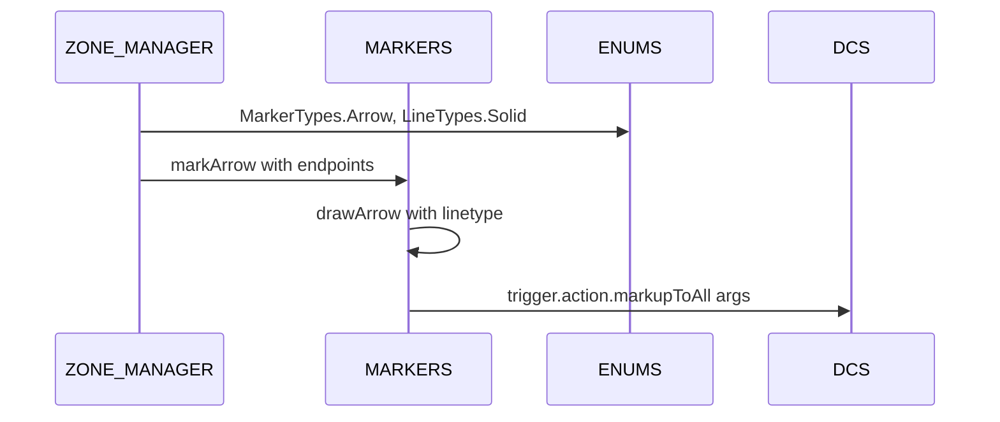
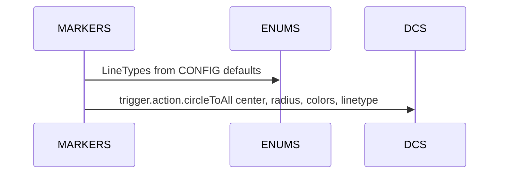

# ENUMS lines and markers

A focused breakout on AETHR.ENUMS.LineTypes and AETHR.ENUMS.MarkerTypes and their consumers in MARKERS and ZONE_MANAGER.

# Primary sources

- Line types class doc: [AETHR.ENUMS.LineTypes](https://github.com/Gh0st352/AETHR/blob/main/dev/ENUMS.lua#L137)
- Line types mapping: [AETHR.ENUMS.LineTypes = { ... }](https://github.com/Gh0st352/AETHR/blob/main/dev/ENUMS.lua#L452)
- Marker types class doc: [AETHR.ENUMS.MarkerTypes](https://github.com/Gh0st352/AETHR/blob/main/dev/ENUMS.lua#L146)
- Marker types mapping: [AETHR.ENUMS.MarkerTypes = { ... }](https://github.com/Gh0st352/AETHR/blob/main/dev/ENUMS.lua#L461)
- ENUMS root init: [AETHR.ENUMS](https://github.com/Gh0st352/AETHR/blob/main/dev/ENUMS.lua#L337)

# Consumers and anchors

- MARKERS drawing helpers
  - Freeform polygon draw: [AETHR.MARKERS:drawPolygon()](https://github.com/Gh0st352/AETHR/blob/main/dev/MARKERS.lua#L85)
  - Arrow draw: [AETHR.MARKERS:drawArrow()](https://github.com/Gh0st352/AETHR/blob/main/dev/MARKERS.lua#L176)
  - Circle draw: [AETHR.MARKERS:drawCircle()](https://github.com/Gh0st352/AETHR/blob/main/dev/MARKERS.lua#L269)
  - Marker wrappers: [markFreeform](https://github.com/Gh0st352/AETHR/blob/main/dev/MARKERS.lua#L43), [markArrow](https://github.com/Gh0st352/AETHR/blob/main/dev/MARKERS.lua#L138), [markCircle](https://github.com/Gh0st352/AETHR/blob/main/dev/MARKERS.lua#L229)

- ZONE_MANAGER rendering
  - Zone polygons: [AETHR.ZONE_MANAGER:drawMissionZones()](https://github.com/Gh0st352/AETHR/blob/main/dev/ZONE_MANAGER.lua#L980)
  - Game bounds quads: [AETHR.ZONE_MANAGER:drawGameBounds()](https://github.com/Gh0st352/AETHR/blob/main/dev/ZONE_MANAGER.lua#L929)
  - Border arrows: [AETHR.ZONE_MANAGER:drawZoneArrows()](https://github.com/Gh0st352/AETHR/blob/main/dev/ZONE_MANAGER.lua#L1025), marker init [initZoneArrows](https://github.com/Gh0st352/AETHR/blob/main/dev/ZONE_MANAGER.lua#L1075)

# Overview relationships

# Drawing sequences

## Polygon freeform

## Arrow borders

## Circle helpers

# Key integration notes

- ZONE_MANAGER:drawMissionZones uses CONFIG-driven colors and [LineTypes](https://github.com/Gh0st352/AETHR/blob/main/dev/ENUMS.lua#L452) for outlines; shapes are rendered through MARKERS freeform pipelines
- ZONE_MANAGER:drawZoneArrows creates Arrow markers using [MarkerTypes.Arrow](https://github.com/Gh0st352/AETHR/blob/main/dev/ENUMS.lua#L461) and [LineTypes.Solid](https://github.com/Gh0st352/AETHR/blob/main/dev/ENUMS.lua#L452)
- MARKERS helpers normalize vertices as vec3 for DCS trigger.action APIs and take linetype values from LineTypes

# Validation checklist

- LineTypes mapping exists at [dev/ENUMS.lua](https://github.com/Gh0st352/AETHR/blob/main/dev/ENUMS.lua#L452)
- MarkerTypes mapping exists at [dev/ENUMS.lua](https://github.com/Gh0st352/AETHR/blob/main/dev/ENUMS.lua#L461)
- MARKERS drawing functions at [dev/MARKERS.lua](https://github.com/Gh0st352/AETHR/blob/main/dev/MARKERS.lua#L85), [dev/MARKERS.lua](https://github.com/Gh0st352/AETHR/blob/main/dev/MARKERS.lua#L176), [dev/MARKERS.lua](https://github.com/Gh0st352/AETHR/blob/main/dev/MARKERS.lua#L269)
- ZONE_MANAGER renderers at [dev/ZONE_MANAGER.lua](https://github.com/Gh0st352/AETHR/blob/main/dev/ZONE_MANAGER.lua#L929), [dev/ZONE_MANAGER.lua](https://github.com/Gh0st352/AETHR/blob/main/dev/ZONE_MANAGER.lua#L980), [dev/ZONE_MANAGER.lua](https://github.com/Gh0st352/AETHR/blob/main/dev/ZONE_MANAGER.lua#L1025)

# Related breakouts

- Categories: [categories.md](./categories.md)
- Coalition and text strings: [coalition_and_text.md](./coalition_and_text.md)
- Spawn types: [spawn_types.md](./spawn_types.md)