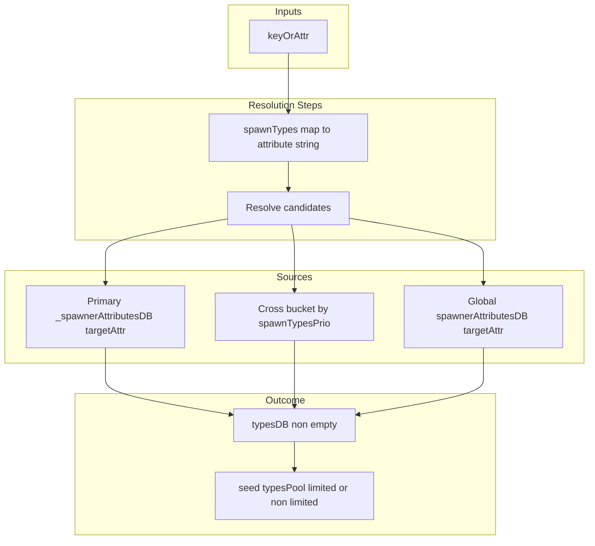
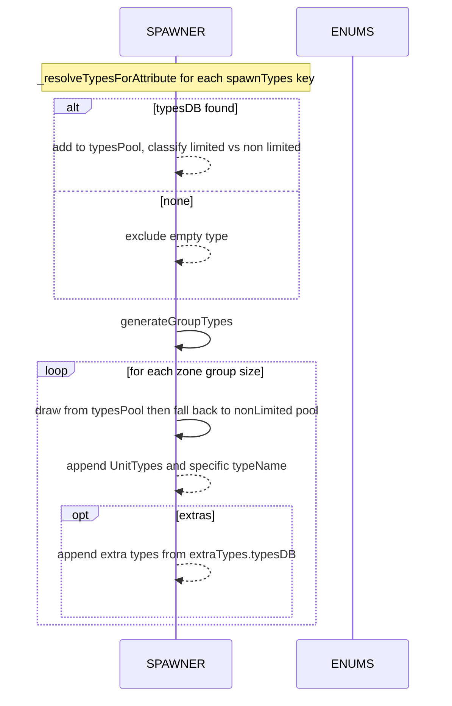
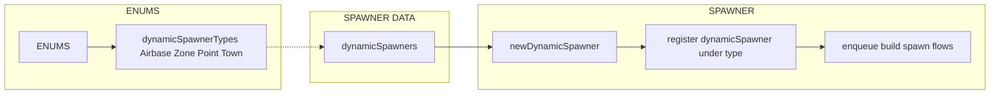

# ENUMS spawn types, priority and dynamic spawner types

Detailed breakdown of AETHR.ENUMS spawnTypes and spawnTypesPrio and how SPAWNER consumes them to seed type pools and build groups. Includes dynamicSpawnerTypes mapping and usage.

# Primary sources

- spawnTypes class doc: [AETHR.ENUMS.spawnTypes](https://github.com/Gh0st352/AETHR/blob/main/dev/ENUMS.lua#L174)
- spawnTypes mapping: [AETHR.ENUMS.spawnTypes = { ... }](https://github.com/Gh0st352/AETHR/blob/main/dev/ENUMS.lua#L490)
- spawnTypesPrio class doc: [AETHR.ENUMS.spawnTypesPrio](https://github.com/Gh0st352/AETHR/blob/main/dev/ENUMS.lua#L245)
- spawnTypesPrio mapping: [AETHR.ENUMS.spawnTypesPrio = { ... }](https://github.com/Gh0st352/AETHR/blob/main/dev/ENUMS.lua#L562)
- dynamicSpawnerTypes class doc: [AETHR.ENUMS.dynamicSpawnerTypes](https://github.com/Gh0st352/AETHR/blob/main/dev/ENUMS.lua#L316)
- dynamicSpawnerTypes mapping: [AETHR.ENUMS.dynamicSpawnerTypes = { ... }](https://github.com/Gh0st352/AETHR/blob/main/dev/ENUMS.lua#L632)

# Consumers and anchors

- SPAWNER type resolution and seeding
  - Attribute resolution with fallbacks: [AETHR.SPAWNER:_resolveTypesForAttribute()](https://github.com/Gh0st352/AETHR/blob/main/dev/SPAWNER.lua#L1747)
  - Seed pools and limited vs non-limited: [AETHR.SPAWNER:seedTypes()](https://github.com/Gh0st352/AETHR/blob/main/dev/SPAWNER.lua#L1804)
  - Generate concrete unit type lists per group: [AETHR.SPAWNER:generateGroupTypes()](https://github.com/Gh0st352/AETHR/blob/main/dev/SPAWNER.lua#L1599)
  - Pipeline composition: [AETHR.SPAWNER:generateSpawnerGroups()](https://github.com/Gh0st352/AETHR/blob/main/dev/SPAWNER.lua#L660)
- Dynamic spawner types
  - Containers by type: [AETHR.SPAWNER.DATA.dynamicSpawners](https://github.com/Gh0st352/AETHR/blob/main/dev/SPAWNER.lua#L85)
  - new dynamic spawner creation: [AETHR.SPAWNER:newDynamicSpawner()](https://github.com/Gh0st352/AETHR/blob/main/dev/SPAWNER.lua#L467)
  - spawn dynamic spawner groups: [AETHR.SPAWNER:spawnDynamicSpawner()](https://github.com/Gh0st352/AETHR/blob/main/dev/SPAWNER.lua#L438)

# Resolution strategy overview

# Seeding and generation sequence

# Pool classification

- Each selected spawnTypes key receives a filtered typesDB; if type.limited is true, it is placed in _limitedTypesPool; otherwise in _nonLimitedTypesPool
- generateGroupTypes draws from limited first; falls back to non-limited when exhausted

# Dynamic spawner types and containers

# Key behaviors and guardrails

- Attribute normalization: [AETHR.SPAWNER:_toSpawnAttr()](https://github.com/Gh0st352/AETHR/blob/main/dev/SPAWNER.lua#L1713) maps enum keys to canonical attribute strings
- Reverse lookup of attr to enum key for priority sort: [AETHR.SPAWNER:_attrToEnumKey()](https://github.com/Gh0st352/AETHR/blob/main/dev/SPAWNER.lua#L1721)
- Fallback precedence in _resolveTypesForAttribute:
  1. Primary priority bucket [WORLD.DATA._spawnerAttributesDB] for target attribute
  2. Cross-bucket scan in order of [spawnTypesPrio](https://github.com/Gh0st352/AETHR/blob/main/dev/ENUMS.lua#L562), selecting units that include the target attribute
  3. Global attribute map [WORLD.DATA.spawnerAttributesDB[targetAttr]]
- Extras are appended without consuming pools, based on extraTypes[min] and their typesDB when non-empty

# Validation checklist

- spawnTypes mapping present at [dev/ENUMS.lua](https://github.com/Gh0st352/AETHR/blob/main/dev/ENUMS.lua#L490)
- spawnTypesPrio mapping present at [dev/ENUMS.lua](https://github.com/Gh0st352/AETHR/blob/main/dev/ENUMS.lua#L562)
- dynamicSpawnerTypes mapping present at [dev/ENUMS.lua](https://github.com/Gh0st352/AETHR/blob/main/dev/ENUMS.lua#L632)
- Resolution and seeding code at [dev/SPAWNER.lua](https://github.com/Gh0st352/AETHR/blob/main/dev/SPAWNER.lua#L1747), [dev/SPAWNER.lua](https://github.com/Gh0st352/AETHR/blob/main/dev/SPAWNER.lua#L1804)
- Group types generation at [dev/SPAWNER.lua](https://github.com/Gh0st352/AETHR/blob/main/dev/SPAWNER.lua#L1599)
- Dynamic spawner storage and creation at [dev/SPAWNER.lua](https://github.com/Gh0st352/AETHR/blob/main/dev/SPAWNER.lua#L85), [dev/SPAWNER.lua](https://github.com/Gh0st352/AETHR/blob/main/dev/SPAWNER.lua#L467), [dev/SPAWNER.lua](https://github.com/Gh0st352/AETHR/blob/main/dev/SPAWNER.lua#L438)

# Related breakouts

- Categories: [categories.md](./categories.md)
- Lines and markers: [lines_and_markers.md](./lines_and_markers.md)
- Coalition and text strings: [coalition_and_text.md](./coalition_and_text.md)
- Surface types and NOGO: [surface_types.md](./surface_types.md)