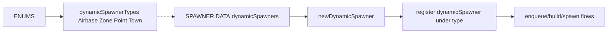

# ENUMS spawn types, priority and dynamic spawner types

Detailed breakdown of AETHR.ENUMS spawnTypes and spawnTypesPrio and how SPAWNER consumes them to seed type pools and build groups. Includes dynamicSpawnerTypes mapping and usage.

Primary sources

- spawnTypes class doc: [AETHR.ENUMS.spawnTypes](../../dev/ENUMS.lua:174)
- spawnTypes mapping: [AETHR.ENUMS.spawnTypes = { ... }](../../dev/ENUMS.lua:490)
- spawnTypesPrio class doc: [AETHR.ENUMS.spawnTypesPrio](../../dev/ENUMS.lua:245)
- spawnTypesPrio mapping: [AETHR.ENUMS.spawnTypesPrio = { ... }](../../dev/ENUMS.lua:562)
- dynamicSpawnerTypes class doc: [AETHR.ENUMS.dynamicSpawnerTypes](../../dev/ENUMS.lua:316)
- dynamicSpawnerTypes mapping: [AETHR.ENUMS.dynamicSpawnerTypes = { ... }](../../dev/ENUMS.lua:632)

Consumers and anchors

- SPAWNER type resolution and seeding
  - Attribute resolution with fallbacks: [AETHR.SPAWNER:_resolveTypesForAttribute()](../../dev/SPAWNER.lua:1747)
  - Seed pools and limited vs non-limited: [AETHR.SPAWNER:seedTypes()](../../dev/SPAWNER.lua:1804)
  - Generate concrete unit type lists per group: [AETHR.SPAWNER:generateGroupTypes()](../../dev/SPAWNER.lua:1599)
  - Pipeline composition: [AETHR.SPAWNER:generateSpawnerGroups()](../../dev/SPAWNER.lua:660)
- Dynamic spawner types
  - Containers by type: [AETHR.SPAWNER.DATA.dynamicSpawners](../../dev/SPAWNER.lua:85)
  - new dynamic spawner creation: [AETHR.SPAWNER:newDynamicSpawner()](../../dev/SPAWNER.lua:467)
  - spawn dynamic spawner groups: [AETHR.SPAWNER:spawnDynamicSpawner()](../../dev/SPAWNER.lua:438)

Resolution strategy overview

```mermaid
flowchart TD
  K[keyOrAttr] --> T1[spawnTypes map to attribute string]
  T1 --> R0[Resolve candidates]
  R0 --> P1[Primary _spawnerAttributesDB[targetAttr]]
  R0 --> P2[Cross-bucket scan by spawnTypesPrio]
  R0 --> P3[Global spawnerAttributesDB[targetAttr]]
  P1 --> OUT[typesDB non-empty]
  P2 --> OUT
  P3 --> OUT
  OUT --> POOLS[seed typesPool limited or non-limited]
```

Seeding and generation sequence

```mermaid
sequenceDiagram
  participant SP as SPAWNER
  participant EN as ENUMS
  SP->>SP: _resolveTypesForAttribute for each spawnTypes key
  alt typesDB found
    SP-->>SP: add to typesPool, classify limited vs non-limited
  else none
    SP-->>SP: exclude empty type
  end
  SP->>SP: generateGroupTypes
  loop for each zone/group size
    SP->>SP: draw from typesPool; fall back to nonLimited pool
    SP-->>SP: append UnitTypes and specific typeName
    opt extras
      SP-->>SP: append extra types from extraTypes.typesDB
    end
  end
```

Pool classification

- Each selected spawnTypes key receives a filtered typesDB; if type.limited is true, it is placed in _limitedTypesPool; otherwise in _nonLimitedTypesPool
- generateGroupTypes draws from limited first; falls back to non-limited when exhausted

Dynamic spawner types and containers



Key behaviors and guardrails

- Attribute normalization: [AETHR.SPAWNER:_toSpawnAttr()](../../dev/SPAWNER.lua:1713) maps enum keys to canonical attribute strings
- Reverse lookup of attr to enum key for priority sort: [AETHR.SPAWNER:_attrToEnumKey()](../../dev/SPAWNER.lua:1721)
- Fallback precedence in _resolveTypesForAttribute:
  1. Primary priority bucket [WORLD.DATA._spawnerAttributesDB] for target attribute
  2. Cross-bucket scan in order of [spawnTypesPrio](../../dev/ENUMS.lua:562), selecting units that include the target attribute
  3. Global attribute map [WORLD.DATA.spawnerAttributesDB[targetAttr]]
- Extras are appended without consuming pools, based on extraTypes[min] and their typesDB when non-empty

Validation checklist

- spawnTypes mapping present at [dev/ENUMS.lua](../../dev/ENUMS.lua:490)
- spawnTypesPrio mapping present at [dev/ENUMS.lua](../../dev/ENUMS.lua:562)
- dynamicSpawnerTypes mapping present at [dev/ENUMS.lua](../../dev/ENUMS.lua:632)
- Resolution and seeding code at [dev/SPAWNER.lua](../../dev/SPAWNER.lua:1747), [dev/SPAWNER.lua](../../dev/SPAWNER.lua:1804)
- Group types generation at [dev/SPAWNER.lua](../../dev/SPAWNER.lua:1599)
- Dynamic spawner storage and creation at [dev/SPAWNER.lua](../../dev/SPAWNER.lua:85), [dev/SPAWNER.lua](../../dev/SPAWNER.lua:467), [dev/SPAWNER.lua](../../dev/SPAWNER.lua:438)

Related breakouts

- Categories: [categories.md](./categories.md)
- Lines and markers: [lines_and_markers.md](./lines_and_markers.md)
- Coalition and text strings: [coalition_and_text.md](./coalition_and_text.md)
- Surface types and NOGO: [surface_types.md](./surface_types.md)