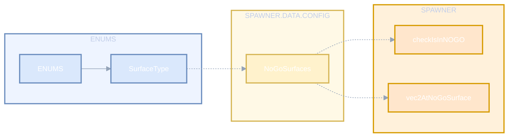
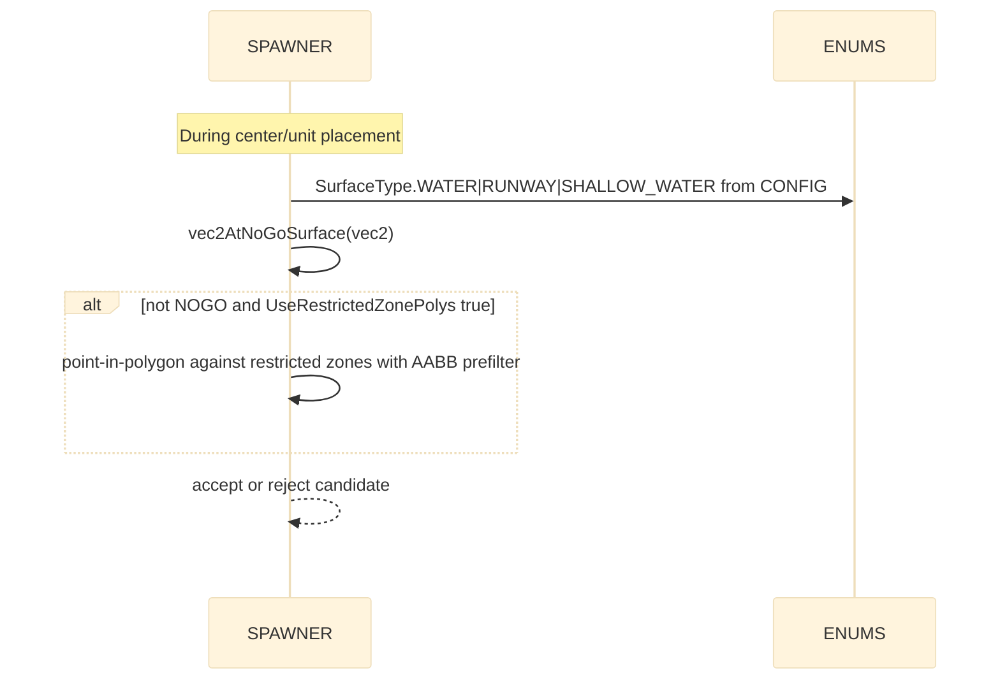

# ENUMS surface types and NOGO flows

Surface type enumeration and how SPAWNER enforces NOGO surfaces and optional restricted polygons during placement.

Primary sources

- Surface types class doc: [AETHR.ENUMS.SurfaceType](../../dev/ENUMS.lua:50)
- Surface types mapping: [AETHR.ENUMS.SurfaceType = { ... }](../../dev/ENUMS.lua:365)
- SPAWNER config defaults referencing surface types: [AETHR.SPAWNER.DATA.CONFIG.NoGoSurfaces](../../dev/SPAWNER.lua:108)
- NOGO checks:
  - Polygon plus surfaces: [AETHR.SPAWNER:checkIsInNOGO()](../../dev/SPAWNER.lua:2085)
  - Surface-only: [AETHR.SPAWNER:vec2AtNoGoSurface()](../../dev/SPAWNER.lua:2128)

Overview relationships

Placement NOGO flow

Configuration knobs

- SPAWNER.DATA.CONFIG.NoGoSurfaces defaults: [RUNWAY, WATER, SHALLOW_WATER] at [dev/SPAWNER.lua](../../dev/SPAWNER.lua:108)
- SPAWNER.DATA.CONFIG.UseRestrictedZonePolys enables polygon checks in [checkIsInNOGO](../../dev/SPAWNER.lua:2085)

Where checks apply

- Group center placement: [AETHR.SPAWNER:generateVec2GroupCenters()](../../dev/SPAWNER.lua:1067)
  - Invokes [checkIsInNOGO](../../dev/SPAWNER.lua:2085) after cheap grid rejections
- Unit position placement: [AETHR.SPAWNER:generateVec2UnitPos()](../../dev/SPAWNER.lua:1299)
  - Invokes [checkIsInNOGO](../../dev/SPAWNER.lua:2085) after proximity checks

Surface-only quick check

- [AETHR.SPAWNER:vec2AtNoGoSurface()](../../dev/SPAWNER.lua:2128) queries land.getSurfaceType and compares against CONFIG NoGoSurfaces

Validation checklist

- SurfaceType mapping is set at [dev/ENUMS.lua](../../dev/ENUMS.lua:365)
- NoGoSurfaces default defined at [dev/SPAWNER.lua](../../dev/SPAWNER.lua:108)
- NOGO functions present at [checkIsInNOGO](../../dev/SPAWNER.lua:2085) and [vec2AtNoGoSurface](../../dev/SPAWNER.lua:2128)
- Placement generators call NOGO logic at [dev/SPAWNER.lua](../../dev/SPAWNER.lua:1227) and [dev/SPAWNER.lua](../../dev/SPAWNER.lua:1505)

Related breakouts

- Categories: [categories.md](./categories.md)
- Spawn types and priority: [spawn_types.md](./spawn_types.md)
- Lines and markers: [lines_and_markers.md](./lines_and_markers.md)
- Coalition and text strings: [coalition_and_text.md](./coalition_and_text.md)

Conventions

- GitHub Mermaid fenced blocks
- Labels avoid double quotes and parentheses inside bracket labels
- Relative links use stable line anchors to source