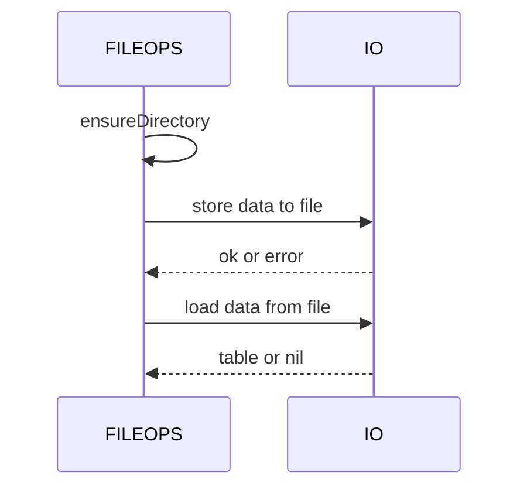
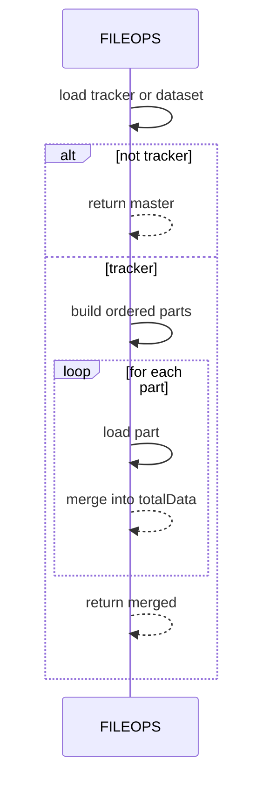

# AETHR FILEOPS diagrams and flows

Primary anchors
- [AETHR.FILEOPS:joinPaths()](../../dev/FILEOPS_.lua:37)
- [AETHR.FILEOPS:ensureDirectory()](../../dev/FILEOPS_.lua:46)
- [AETHR.FILEOPS:ensureFile()](../../dev/FILEOPS_.lua:120)
- [AETHR.FILEOPS:saveData()](../../dev/FILEOPS_.lua:155)
- [AETHR.FILEOPS:loadData()](../../dev/FILEOPS_.lua:173)
- [AETHR.FILEOPS:fileExists()](../../dev/FILEOPS_.lua:189)
- [AETHR.FILEOPS:deepcopy()](../../dev/FILEOPS_.lua:206)
- [AETHR.FILEOPS:splitAndSaveData()](../../dev/FILEOPS_.lua:246)
- [AETHR.FILEOPS:loadandJoinData()](../../dev/FILEOPS_.lua:328)

Documents and indices
- Master diagrams index: [docs/README.md](../README.md)
- AETHR overview: [docs/aethr/README.md](../aethr/README.md)

Breakout documents
- Paths and ensure: [paths_and_ensure.md](./paths_and_ensure.md)
- Save and load: [save_and_load.md](./save_and_load.md)
- Chunking and tracker: [chunking.md](./chunking.md)
- Deep copy helper: [deepcopy.md](./deepcopy.md)

Overview relationships

```mermaid
%% shared theme: docs/_mermaid/theme.json %%
flowchart

  subgraph API[Core FILEOPS API]
    JP[joinPaths]
    ED[ensureDirectory]
    EF[ensureFile]
    FE[fileExists]
    SD[saveData]
    LD[loadData]
    DC[deepcopy]
  end

  subgraph Chunking[Chunking and tracker]
    SPT[splitAndSaveData tracker]
    LAD[loadandJoinData]
  end

  JP --> SD
  JP --> LD
  ED --> SD
  ED --> EF
  EF --> SD
  SD --> SPT
  SPT --> LAD
  LD --> LAD
  FE -.-> IO[IO read write]
  DC -.-> LAD

  class JP,ED,EF,FE,SD,LD,DC,SPT,LAD class-step;
  class IO class-io;
```

Save and load sequence



Directory creation flow

```mermaid
%% shared theme: docs/_mermaid/theme.json %%
flowchart
  subgraph Normalize[Normalize path]
    P[path input] --> N[normalize separators]
  end
  N --> S[split path into parts]

  subgraph Iterate[Iterate and mkdir as needed]
    S --> L[loop parts]
    L --> Q{existsDir check}
    Q -- "exists" --> C[continue]
    Q -- "missing" --> M[mkdir part]
    M --> E{error check}
    E -- "ok" --> C
    E -- "fail" --> X[stop and return false]
  end

  C --> D[done return true]

  class Q,E class-decision;
  class N,S,L,M,C,Normalize,Iterate class-step;
  class D class-result;
```

Chunked persistence flow

```mermaid
%% shared theme: docs/_mermaid/theme.json %%
flowchart
  subgraph SortChunk[Sort and chunk]
    S1[count records] --> S2[resolve chunk size]
    S2 --> S3[sort keys deterministic]
    S3 --> S4[fill chunk map]
  end

  subgraph PersistMeta[Persist and metadata]
    S4 --> S5[flushChunk write part file]
    S5 --> S6[repeat until done]
    S6 --> S7[write tracker file]
    S7 --> OUT[return metadata]
  end

  class S1,S2,S3,S4,S5,S6,S7 class-step;
  class OUT class-result;
```

Chunked load sequence



Source anchors
- [AETHR.FILEOPS:joinPaths()](../../dev/FILEOPS_.lua:37)
- [AETHR.FILEOPS:ensureDirectory()](../../dev/FILEOPS_.lua:46)
- [AETHR.FILEOPS:ensureFile()](../../dev/FILEOPS_.lua:120)
- [AETHR.FILEOPS:saveData()](../../dev/FILEOPS_.lua:155)
- [AETHR.FILEOPS:loadData()](../../dev/FILEOPS_.lua:173)
- [AETHR.FILEOPS:fileExists()](../../dev/FILEOPS_.lua:189)
- [AETHR.FILEOPS:deepcopy()](../../dev/FILEOPS_.lua:206)
- [AETHR.FILEOPS:splitAndSaveData()](../../dev/FILEOPS_.lua:246)
- [AETHR.FILEOPS:loadandJoinData()](../../dev/FILEOPS_.lua:328)

Notes
- Diagrams reference a shared theme snippet for generation: [docs/_mermaid/theme.json](../_mermaid/theme.json)
- Sequence diagrams omit inline color; generation pipeline should inject styles from the shared theme.