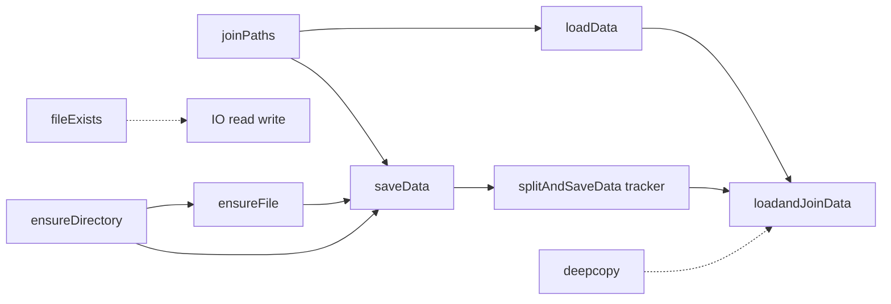
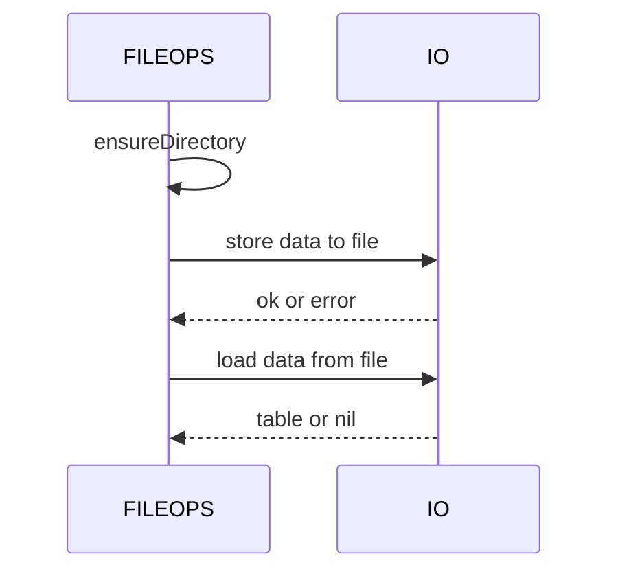
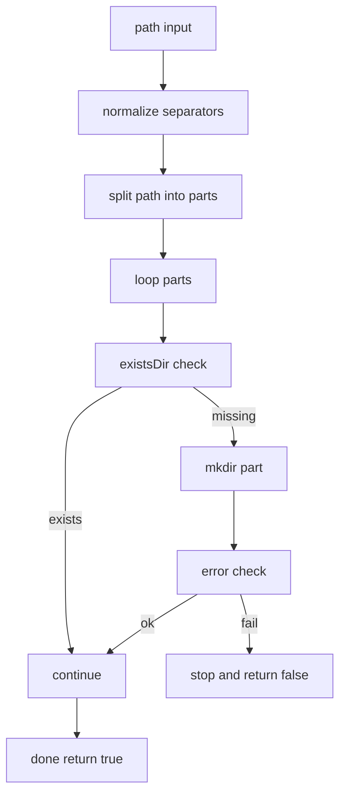
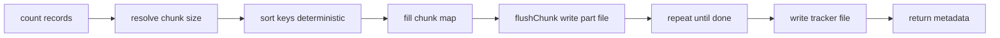
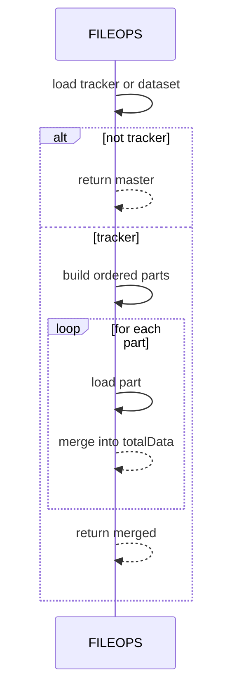

# AETHR FILEOPS diagrams and flows

Primary anchors
- [AETHR.FILEOPS:joinPaths()](../../dev/FILEOPS_.lua:37)
- [AETHR.FILEOPS:ensureDirectory()](../../dev/FILEOPS_.lua:46)
- [AETHR.FILEOPS:ensureFile()](../../dev/FILEOPS_.lua:120)
- [AETHR.FILEOPS:saveData()](../../dev/FILEOPS_.lua:155)
- [AETHR.FILEOPS:loadData()](../../dev/FILEOPS_.lua:173)
- [AETHR.FILEOPS:fileExists()](../../dev/FILEOPS_.lua:189)
- [AETHR.FILEOPS:deepcopy()](../../dev/FILEOPS_.lua:206)
- [AETHR.FILEOPS:splitAndSaveData()](../../dev/FILEOPS_.lua:246)
- [AETHR.FILEOPS:loadandJoinData()](../../dev/FILEOPS_.lua:328)

Documents and indices
- Master diagrams index: [docs/README.md](../README.md)
- AETHR overview: [docs/aethr/README.md](../aethr/README.md)

Breakout documents
- Paths and ensure: [paths_and_ensure.md](./paths_and_ensure.md)
- Save and load: [save_and_load.md](./save_and_load.md)
- Chunking and tracker: [chunking.md](./chunking.md)
- Deep copy helper: [deepcopy.md](./deepcopy.md)

Overview relationships

Save and load sequence

Directory creation flow

Chunked persistence flow

Chunked load sequence

Source anchors
- [AETHR.FILEOPS:joinPaths()](../../dev/FILEOPS_.lua:37)
- [AETHR.FILEOPS:ensureDirectory()](../../dev/FILEOPS_.lua:46)
- [AETHR.FILEOPS:ensureFile()](../../dev/FILEOPS_.lua:120)
- [AETHR.FILEOPS:saveData()](../../dev/FILEOPS_.lua:155)
- [AETHR.FILEOPS:loadData()](../../dev/FILEOPS_.lua:173)
- [AETHR.FILEOPS:fileExists()](../../dev/FILEOPS_.lua:189)
- [AETHR.FILEOPS:deepcopy()](../../dev/FILEOPS_.lua:206)
- [AETHR.FILEOPS:splitAndSaveData()](../../dev/FILEOPS_.lua:246)
- [AETHR.FILEOPS:loadandJoinData()](../../dev/FILEOPS_.lua:328)

Notes
- Mermaid labels avoid double quotes and parentheses.
- All diagrams use GitHub Mermaid fenced blocks.