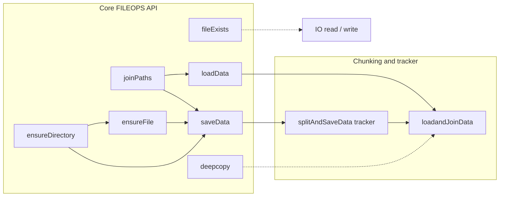
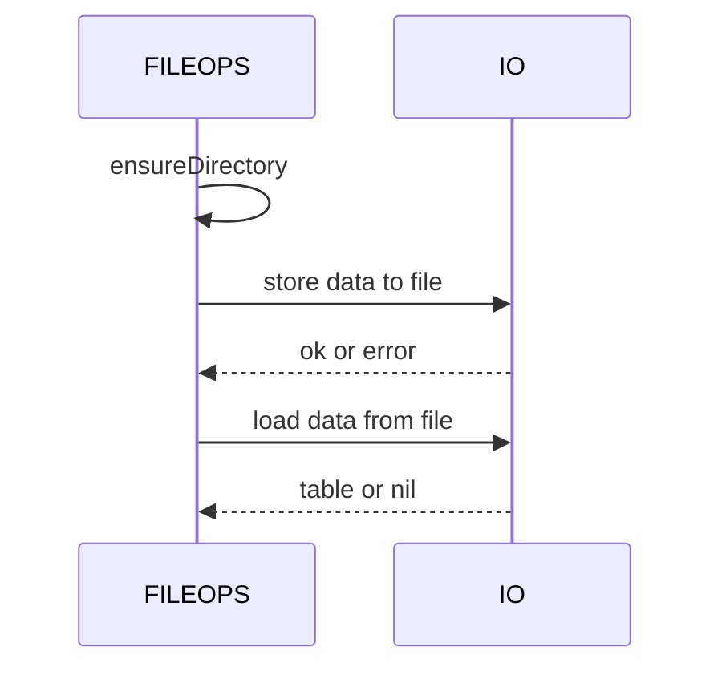
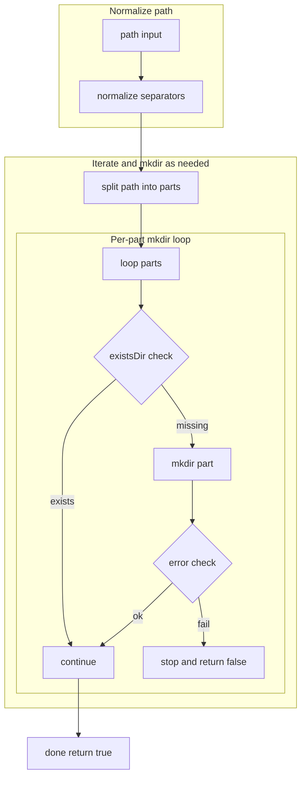
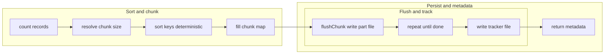
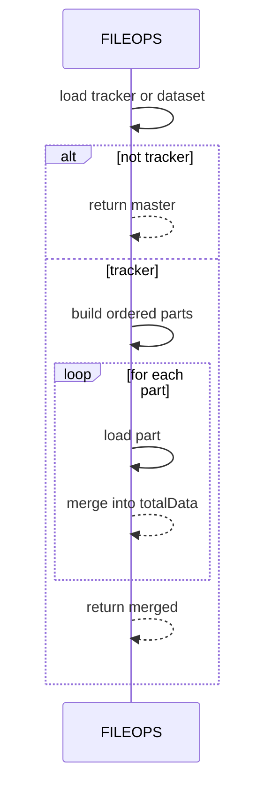

# AETHR FILEOPS diagrams and flows

# Primary anchors
- [AETHR.FILEOPS:joinPaths()](https://github.com/Gh0st352/AETHR/blob/main/dev/FILEOPS_.lua#L37)
- [AETHR.FILEOPS:ensureDirectory()](https://github.com/Gh0st352/AETHR/blob/main/dev/FILEOPS_.lua#L46)
- [AETHR.FILEOPS:ensureFile()](https://github.com/Gh0st352/AETHR/blob/main/dev/FILEOPS_.lua#L120)
- [AETHR.FILEOPS:saveData()](https://github.com/Gh0st352/AETHR/blob/main/dev/FILEOPS_.lua#L155)
- [AETHR.FILEOPS:loadData()](https://github.com/Gh0st352/AETHR/blob/main/dev/FILEOPS_.lua#L173)
- [AETHR.FILEOPS:fileExists()](https://github.com/Gh0st352/AETHR/blob/main/dev/FILEOPS_.lua#L189)
- [AETHR.FILEOPS:deepcopy()](https://github.com/Gh0st352/AETHR/blob/main/dev/FILEOPS_.lua#L206)
- [AETHR.FILEOPS:splitAndSaveData()](https://github.com/Gh0st352/AETHR/blob/main/dev/FILEOPS_.lua#L246)
- [AETHR.FILEOPS:loadandJoinData()](https://github.com/Gh0st352/AETHR/blob/main/dev/FILEOPS_.lua#L328)

# Documents and indices
- Master diagrams index: [docs/README.md](../README.md)
- AETHR overview: [docs/aethr/README.md](../aethr/README.md)

# Breakout documents
- Paths and ensure: [paths_and_ensure.md](./paths_and_ensure.md)
- Save and load: [save_and_load.md](./save_and_load.md)
- Chunking and tracker: [chunking.md](./chunking.md)
- Deep copy helper: [deepcopy.md](./deepcopy.md)

# Overview relationships

# Save and load sequence

# Directory creation flow

# Chunked persistence flow

# Chunked load sequence

# Source anchors
- [AETHR.FILEOPS:joinPaths()](https://github.com/Gh0st352/AETHR/blob/main/dev/FILEOPS_.lua#L37)
- [AETHR.FILEOPS:ensureDirectory()](https://github.com/Gh0st352/AETHR/blob/main/dev/FILEOPS_.lua#L46)
- [AETHR.FILEOPS:ensureFile()](https://github.com/Gh0st352/AETHR/blob/main/dev/FILEOPS_.lua#L120)
- [AETHR.FILEOPS:saveData()](https://github.com/Gh0st352/AETHR/blob/main/dev/FILEOPS_.lua#L155)
- [AETHR.FILEOPS:loadData()](https://github.com/Gh0st352/AETHR/blob/main/dev/FILEOPS_.lua#L173)
- [AETHR.FILEOPS:fileExists()](https://github.com/Gh0st352/AETHR/blob/main/dev/FILEOPS_.lua#L189)
- [AETHR.FILEOPS:deepcopy()](https://github.com/Gh0st352/AETHR/blob/main/dev/FILEOPS_.lua#L206)
- [AETHR.FILEOPS:splitAndSaveData()](https://github.com/Gh0st352/AETHR/blob/main/dev/FILEOPS_.lua#L246)
- [AETHR.FILEOPS:loadandJoinData()](https://github.com/Gh0st352/AETHR/blob/main/dev/FILEOPS_.lua#L328)

# Notes
- Diagrams reference a shared theme snippet for generation: [docs/_mermaid/theme.json](../_mermaid/theme.json)
- Sequence diagrams omit inline color; generation pipeline should inject styles from the shared theme.