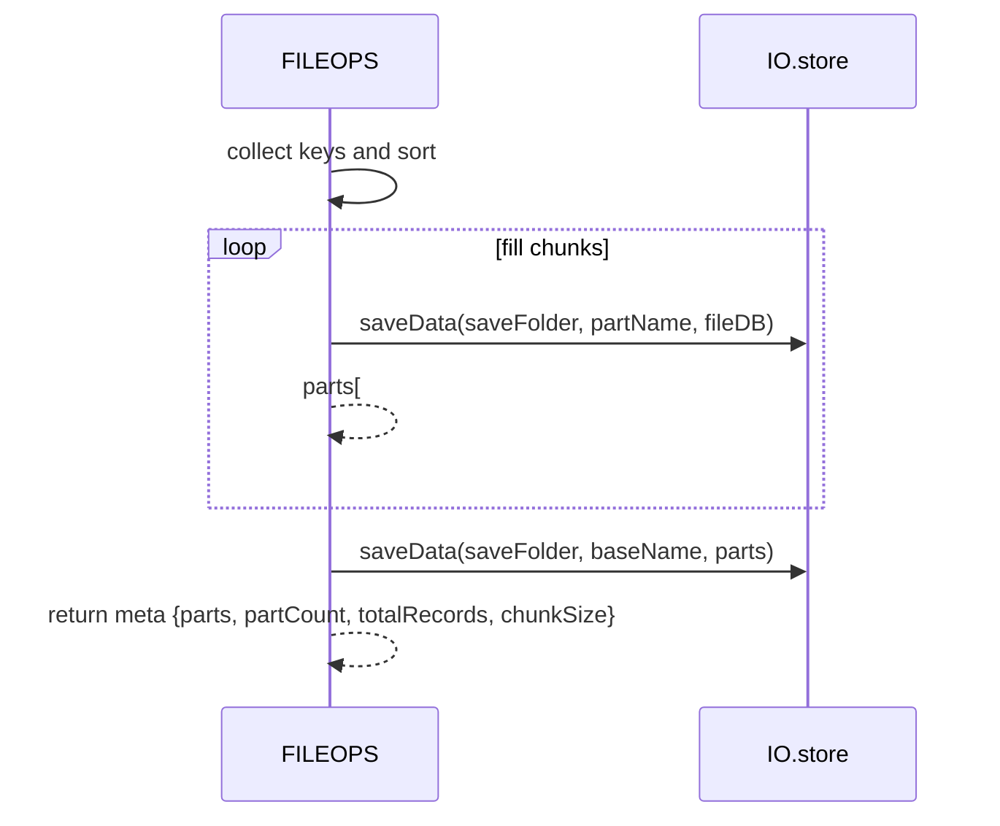
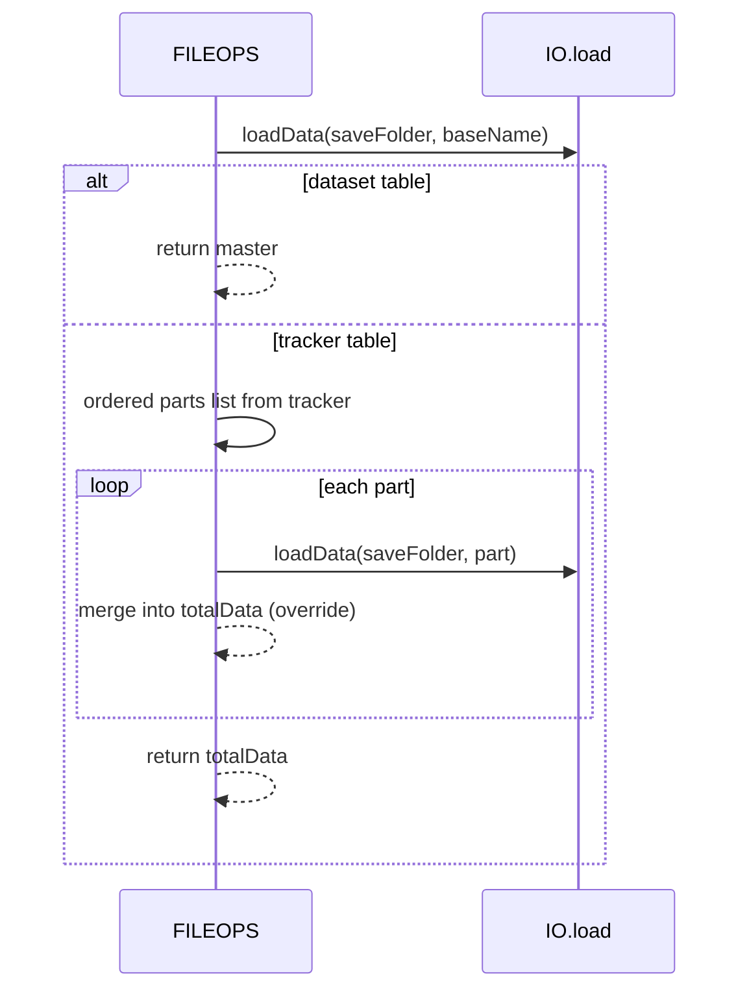

# FILEOPS chunking and tracker files

Deterministic split and merge for large datasets using part files and a tracker. Covers splitAndSaveData and loadandJoinData, usage sites, and error behavior.

Primary anchors

- Split writer: [AETHR.FILEOPS:splitAndSaveData()](../../dev/FILEOPS_.lua:246)
- Merge reader: [AETHR.FILEOPS:loadandJoinData()](../../dev/FILEOPS_.lua:328)

Consumers

- WORLD per-division object caches
  - Join on read: [AETHR.WORLD:_initObjectsInDivisions()](../../dev/WORLD.lua:1395) calls [FILEOPS:loadandJoinData](../../dev/WORLD.lua:1406)
  - Split on write: [AETHR.WORLD:_initObjectsInDivisions()](../../dev/WORLD.lua:1415) calls [FILEOPS:splitAndSaveData](../../dev/WORLD.lua:1415)
- WORLD town clusters
  - Load: [AETHR.WORLD:loadTowns()](../../dev/WORLD.lua:1529)
  - Save split: [AETHR.WORLD:saveTowns()](../../dev/WORLD.lua:1541)

High-level flow

```mermaid
%% shared theme: docs/_mermaid/theme.json %%
flowchart
  %% Write phase
  subgraph Write[Write: split and track]
    DB[dataset table] -- "collect" --> KEYS[collect keys deterministic]
    KEYS -- "fill up to chunkSize" --> CHUNK[fill chunk]
    CHUNK -- "flush part" --> FLUSH[write part file baseName.partNNNN]
    FLUSH -- "iterate" --> REPEAT[repeat until done]
    REPEAT -- "persist" --> TRACK[write tracker baseName with ordered parts]
  end

  %% Read phase
  subgraph Read[Read: resolve and merge]
    TRACK -- "input" --> READ[loadandJoinData]
    READ -- "load" --> master[load tracker or dataset]
    master -- "resolve" --> parts[resolve ordered part filenames]
    parts -- "override-later" --> MERGE[merge parts]
    MERGE --> OUT[return totalData]
  end

  %% Classes only; styling via shared theme
  class FLUSH,READ class-io
  class CHUNK,MERGE class-compute
  class DB,master,parts,OUT class-data
  class TRACK class-tracker
```

Split writer details

- Input db table is split deterministically by sorted keys
  - Numeric keys sorted ascending; other keys sorted by tostring
- Chunk size divParam coerced to integer, default 500
- For each chunk, writes part file named baseName.partNNNN via [saveData](../../dev/FILEOPS_.lua:155)
- After parts, writes tracker file baseName containing an array (preferred) or map of part filenames
- Anchor: [AETHR.FILEOPS:splitAndSaveData()](../../dev/FILEOPS_.lua:246)

Merge reader details

- Loads master via [loadData](../../dev/FILEOPS_.lua:173)
- If master is not a tracker (not a table of strings), returns it directly
- If tracker is array-like, preserves order; if map-like, orders numeric keys ascending then the rest by string compare
- Loads parts sequentially and merges with later parts overriding earlier keys
- Anchor: [AETHR.FILEOPS:loadandJoinData()](../../dev/FILEOPS_.lua:328)

Write sequence



Read sequence



Determinism and ordering

- Keys sorted predictably to guarantee the same split result for identical input
- Part naming uses 4-digit zero-padded counters baseName.part0001, baseName.part0002, ...
- Tracker prefers array order if given; otherwise, numeric keys first ascending, then lexicographic

Error paths and logging

- All file IO is wrapped in pcall via [saveData](../../dev/FILEOPS_.lua:155) and [loadData](../../dev/FILEOPS_.lua:173)
- Missing parts during merge are logged when DEBUG is enabled
  - See [loadandJoinData](../../dev/FILEOPS_.lua:395)
- Tracker save failure is logged under DEBUG
  - See [splitAndSaveData](../../dev/FILEOPS_.lua:309)
- Part save failure per-chunk logged under DEBUG
  - See [splitAndSaveData](../../dev/FILEOPS_.lua:287)

Configuration knobs

- Chunk size is supplied by callers; see CONFIG defaults for:
  - Per-division object chunks: [CONFIG.MAIN.saveChunks.divObjects](../../dev/CONFIG_.lua:241)
  - Town DB chunks: [CONFIG.MAIN.saveChunks.townDB](../../dev/CONFIG_.lua:242)

Validation checklist

- Writer entry: [dev/FILEOPS_.lua](../../dev/FILEOPS_.lua:246)
- Reader entry: [dev/FILEOPS_.lua](../../dev/FILEOPS_.lua:328)
- WORLD per-division integration: [dev/WORLD.lua](../../dev/WORLD.lua:1395), [dev/WORLD.lua](../../dev/WORLD.lua:1404), [dev/WORLD.lua](../../dev/WORLD.lua:1415)
- WORLD towns integration: [dev/WORLD.lua](../../dev/WORLD.lua:1529), [dev/WORLD.lua](../../dev/WORLD.lua:1541)

Related breakouts

- Paths and ensure: [paths_and_ensure.md](./paths_and_ensure.md)
- Save and load: [save_and_load.md](./save_and_load.md)
- Deep copy helper: [deepcopy.md](./deepcopy.md)