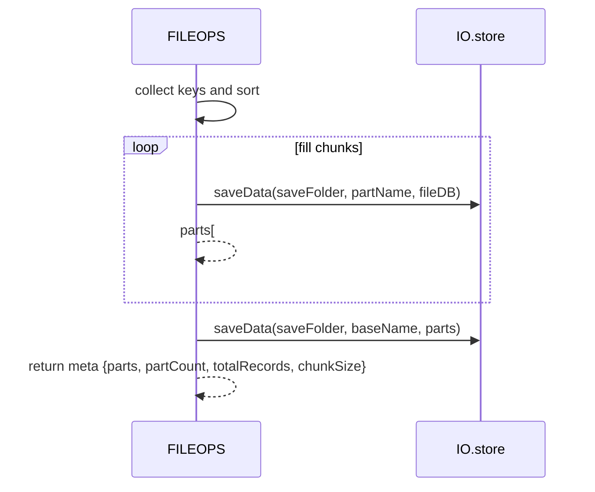
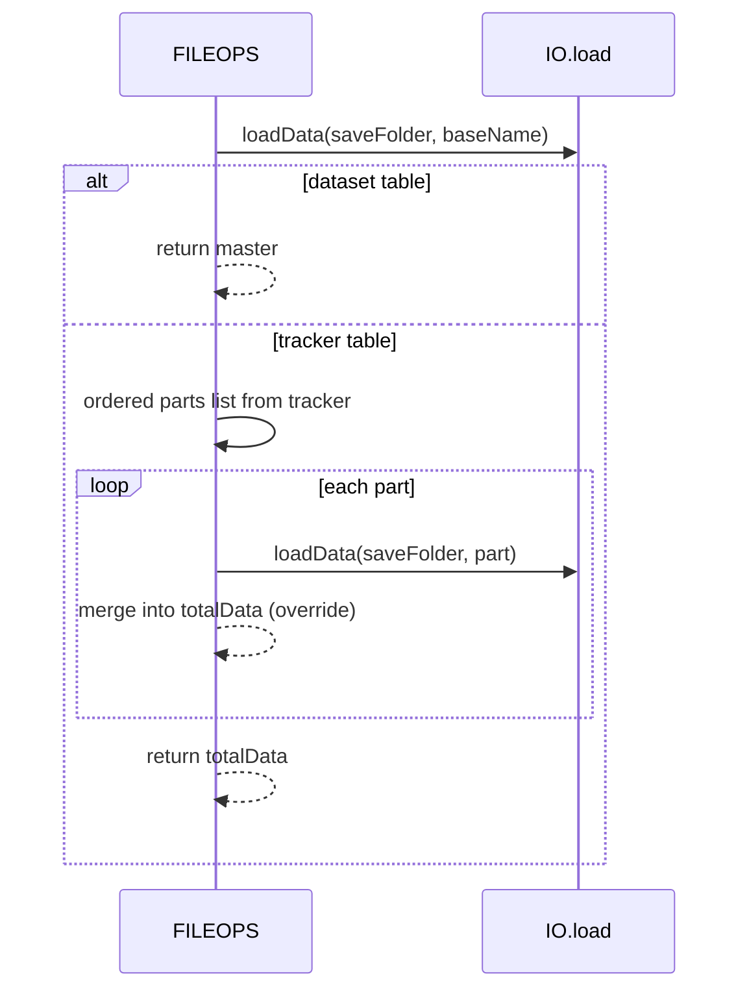

# FILEOPS chunking and tracker files

Deterministic split and merge for large datasets using part files and a tracker. Covers splitAndSaveData and loadandJoinData, usage sites, and error behavior.

# Primary anchors

- Split writer: [AETHR.FILEOPS:splitAndSaveData()](https://github.com/Gh0st352/AETHR/blob/main/dev/FILEOPS_.lua#L246)
- Merge reader: [AETHR.FILEOPS:loadandJoinData()](https://github.com/Gh0st352/AETHR/blob/main/dev/FILEOPS_.lua#L328)

# Consumers

- WORLD per-division object caches
  - Join on read: [AETHR.WORLD:_initObjectsInDivisions()](https://github.com/Gh0st352/AETHR/blob/main/dev/WORLD.lua#L1395) calls [FILEOPS:loadandJoinData](https://github.com/Gh0st352/AETHR/blob/main/dev/WORLD.lua#L1406)
  - Split on write: [AETHR.WORLD:_initObjectsInDivisions()](https://github.com/Gh0st352/AETHR/blob/main/dev/WORLD.lua#L1415) calls [FILEOPS:splitAndSaveData](https://github.com/Gh0st352/AETHR/blob/main/dev/WORLD.lua#L1415)
- WORLD town clusters
  - Load: [AETHR.WORLD:loadTowns()](https://github.com/Gh0st352/AETHR/blob/main/dev/WORLD.lua#L1529)
  - Save split: [AETHR.WORLD:saveTowns()](https://github.com/Gh0st352/AETHR/blob/main/dev/WORLD.lua#L1541)

# High-level flow

```mermaid
%% shared theme: docs/_mermaid/theme.json %%
flowchart LR
  %% Write phase
  subgraph Write["Write: split and track"]
    DB[dataset table] -- "collect" --> KEYS[collect keys deterministic]
    KEYS -- "fill up to chunkSize" --> CHUNK[fill chunk]
    subgraph ChunkLoop["Chunk loop"]
      CHUNK -- "flush part" --> FLUSH[write part file baseName.partNNNN]
      FLUSH -- "iterate" --> REPEAT[repeat until done]
    end
    REPEAT -- "persist" --> TRACK[write tracker baseName with ordered parts]
  end

  %% Read phase
  subgraph Read["Read: resolve and merge"]
    TRACK -- "input" --> READ[loadandJoinData]
    READ -- "load" --> master[load tracker or dataset]
    master -- "resolve" --> parts[resolve ordered part filenames]
    parts -- "override-later" --> MERGE[merge parts]
    MERGE --> OUT[return totalData]
  end

  %% Classes only; styling via shared theme (use underscore-style class names to match docs/_mermaid/theme.json)
  class FLUSH,READ class_io;
  class CHUNK,MERGE class_compute;
  class DB,master,parts,OUT class_data;
  class TRACK class_tracker;
```

# Split writer details

- Input db table is split deterministically by sorted keys
  - Numeric keys sorted ascending; other keys sorted by tostring
- Chunk size divParam coerced to integer, default 500
- For each chunk, writes part file named baseName.partNNNN via [saveData](https://github.com/Gh0st352/AETHR/blob/main/dev/FILEOPS_.lua#L155)
- After parts, writes tracker file baseName containing an array (preferred) or map of part filenames
- Anchor: [AETHR.FILEOPS:splitAndSaveData()](https://github.com/Gh0st352/AETHR/blob/main/dev/FILEOPS_.lua#L246)

# Merge reader details

- Loads master via [loadData](https://github.com/Gh0st352/AETHR/blob/main/dev/FILEOPS_.lua#L173)
- If master is not a tracker (not a table of strings), returns it directly
- If tracker is array-like, preserves order; if map-like, orders numeric keys ascending then the rest by string compare
- Loads parts sequentially and merges with later parts overriding earlier keys
- Anchor: [AETHR.FILEOPS:loadandJoinData()](https://github.com/Gh0st352/AETHR/blob/main/dev/FILEOPS_.lua#L328)

# Write sequence

# Read sequence

# Determinism and ordering

- Keys sorted predictably to guarantee the same split result for identical input
- Part naming uses 4-digit zero-padded counters baseName.part0001, baseName.part0002, ...
- Tracker prefers array order if given; otherwise, numeric keys first ascending, then lexicographic

# Error paths and logging

- All file IO is wrapped in pcall via [saveData](https://github.com/Gh0st352/AETHR/blob/main/dev/FILEOPS_.lua#L155) and [loadData](https://github.com/Gh0st352/AETHR/blob/main/dev/FILEOPS_.lua#L173)
- Missing parts during merge are logged when DEBUG is enabled
  - See [loadandJoinData](https://github.com/Gh0st352/AETHR/blob/main/dev/FILEOPS_.lua#L395)
- Tracker save failure is logged under DEBUG
  - See [splitAndSaveData](https://github.com/Gh0st352/AETHR/blob/main/dev/FILEOPS_.lua#L309)
- Part save failure per-chunk logged under DEBUG
  - See [splitAndSaveData](https://github.com/Gh0st352/AETHR/blob/main/dev/FILEOPS_.lua#L287)

# Configuration knobs

- Chunk size is supplied by callers; see CONFIG defaults for:
  - Per-division object chunks: [CONFIG.MAIN.saveChunks.divObjects](https://github.com/Gh0st352/AETHR/blob/main/dev/CONFIG_.lua#L241)
  - Town DB chunks: [CONFIG.MAIN.saveChunks.townDB](https://github.com/Gh0st352/AETHR/blob/main/dev/CONFIG_.lua#L242)

# Validation checklist

- Writer entry: [dev/FILEOPS_.lua](https://github.com/Gh0st352/AETHR/blob/main/dev/FILEOPS_.lua#L246)
- Reader entry: [dev/FILEOPS_.lua](https://github.com/Gh0st352/AETHR/blob/main/dev/FILEOPS_.lua#L328)
- WORLD per-division integration: [dev/WORLD.lua](https://github.com/Gh0st352/AETHR/blob/main/dev/WORLD.lua#L1395), [dev/WORLD.lua](https://github.com/Gh0st352/AETHR/blob/main/dev/WORLD.lua#L1404), [dev/WORLD.lua](https://github.com/Gh0st352/AETHR/blob/main/dev/WORLD.lua#L1415)
- WORLD towns integration: [dev/WORLD.lua](https://github.com/Gh0st352/AETHR/blob/main/dev/WORLD.lua#L1529), [dev/WORLD.lua](https://github.com/Gh0st352/AETHR/blob/main/dev/WORLD.lua#L1541)

# Related breakouts

- Paths and ensure: [paths_and_ensure.md](./paths_and_ensure.md)
- Save and load: [save_and_load.md](./save_and_load.md)
- Deep copy helper: [deepcopy.md](./deepcopy.md)