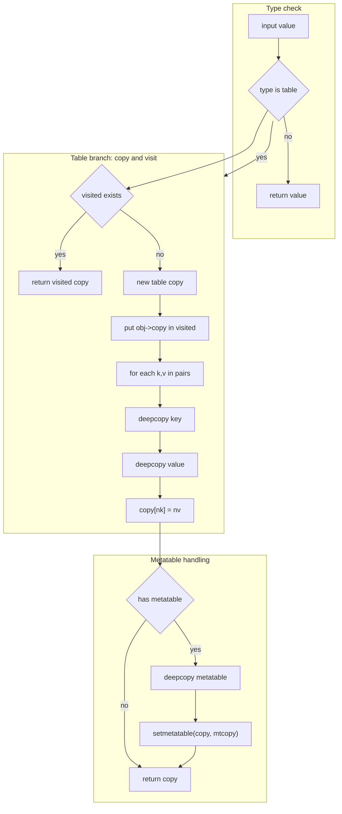
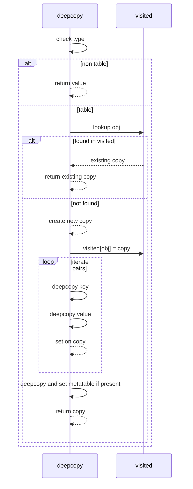

# FILEOPS deep copy helper

Cycle safe deep copy for arbitrary Lua tables, preserving nested structure and metatables.

# Primary anchor

- [AETHR.FILEOPS:deepcopy()](../../dev/FILEOPS_.lua:206)

# Overview

- Recursively copies tables and nested subtables
- Uses a visited map to break cycles and preserve graph structure
- Preserves metatables by deep copying the metatable and attaching it to the copy
- Non table values are returned as is primitive or reference

# Deep copy flow

# Sequence illustration

# Usage notes

- Functions and userdata are copied by reference as values inside tables
- Keys are deep copied too which preserves structure if keys are tables
- Graphs with cycles or shared subtrees are preserved due to visited mapping

# Edge cases

- Sparse array tables retain their keys by iterating with pairs
- Metatable copy uses the same deepcopy routine so nested meta structures are handled
- If metatable enforces read only fields via __newindex, assignments during copy may trigger metamethods in user provided metas ensure your metas tolerate raw set via normal assignment

# Validation checklist

- Entry point: [dev/FILEOPS_.lua](../../dev/FILEOPS_.lua:206)

# Related breakouts

- Paths and ensure: [paths_and_ensure.md](./paths_and_ensure.md)
- Save and load: [save_and_load.md](./save_and_load.md)
- Chunking and tracker: [chunking.md](./chunking.md)