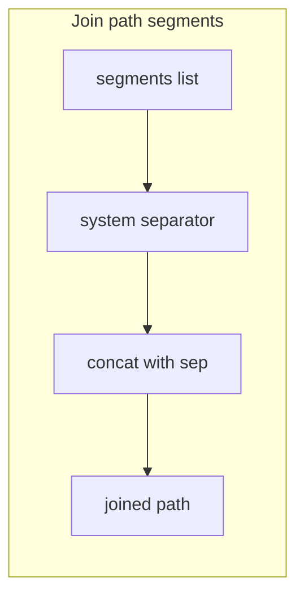
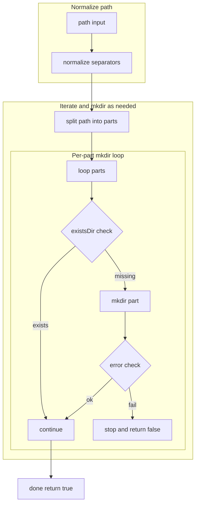

# FILEOPS paths and ensure helpers

Join and normalize paths, create missing directories recursively, and ensure file presence. Covers joinPaths, ensureDirectory, ensureFile, fileExists, plus flows and typical consumers.

# Primary anchors

- [AETHR.FILEOPS:joinPaths()](../../dev/FILEOPS_.lua:37)
- [AETHR.FILEOPS:ensureDirectory()](../../dev/FILEOPS_.lua:46)
- [AETHR.FILEOPS:ensureFile()](../../dev/FILEOPS_.lua:120)
- [AETHR.FILEOPS:fileExists()](../../dev/FILEOPS_.lua:189)

# Overview

- Paths are joined using the system separator to avoid mixed slashes.
- Directories are created best effort with lfs when available, falling back to OS mkdir.
- File ensuring creates parent directories then writes an empty file if missing.

# Path joining

# Directory ensure flow

# File ensure sequence

# Consumers and call chain

- [AETHR.FILEOPS:saveData()](../../dev/FILEOPS_.lua:155) ensures directory before storing.
- [AETHR.CONFIG:saveConfig()](../../dev/CONFIG_.lua:404) persists MAIN via FILEOPS saveData.
- [AETHR.CONFIG:loadConfig()](../../dev/CONFIG_.lua:380) loads persisted config via FILEOPS loadData.

# Notes

- Separator normalization avoids mixing forward and back slashes.
- OS mkdir fallback may be sandboxed; errors are tolerated and logged.

# Validation checklist

- Join: [dev/FILEOPS_.lua](../../dev/FILEOPS_.lua:37)
- Ensure dir: [dev/FILEOPS_.lua](../../dev/FILEOPS_.lua:46)
- Ensure file: [dev/FILEOPS_.lua](../../dev/FILEOPS_.lua:120)
- Exists: [dev/FILEOPS_.lua](../../dev/FILEOPS_.lua:189)

Related breakouts

- Save and load: [save_and_load.md](./save_and_load.md)
- Chunking and tracker: [chunking.md](./chunking.md)
- Deep copy helper: [deepcopy.md](./deepcopy.md)