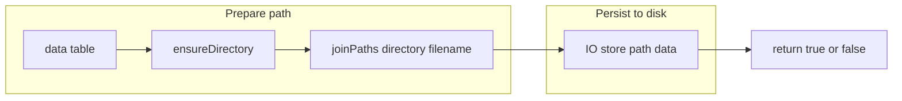
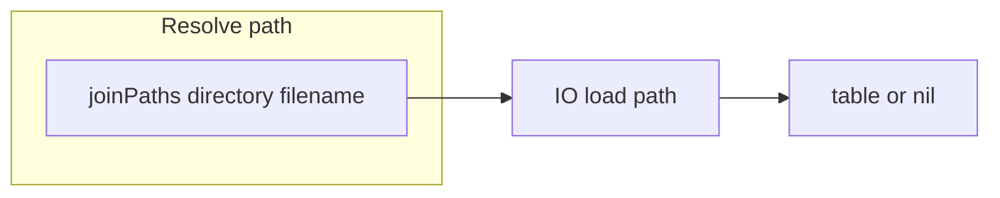
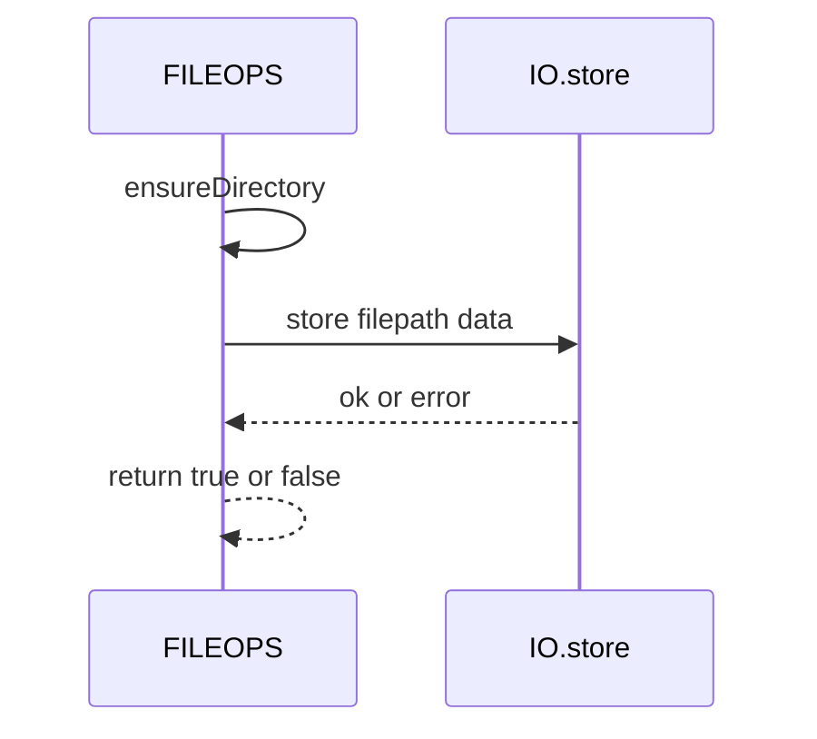
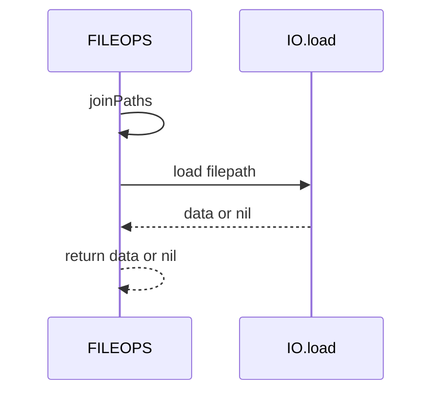

# FILEOPS save and load

High-level persistence helpers for writing and reading data files via IO, with defensive guards and directory creation.

# Primary anchors

- save: [AETHR.FILEOPS:saveData()](https://github.com/Gh0st352/AETHR/blob/main/dev/FILEOPS_.lua#L155)
- load: [AETHR.FILEOPS:loadData()](https://github.com/Gh0st352/AETHR/blob/main/dev/FILEOPS_.lua#L173)
- ensure dir: [AETHR.FILEOPS:ensureDirectory()](https://github.com/Gh0st352/AETHR/blob/main/dev/FILEOPS_.lua#L46)
- join paths: [AETHR.FILEOPS:joinPaths()](https://github.com/Gh0st352/AETHR/blob/main/dev/FILEOPS_.lua#L37)

# Callers

- CONFIG persistence
  - Write: [AETHR.CONFIG:saveConfig()](https://github.com/Gh0st352/AETHR/blob/main/dev/CONFIG_.lua#L404) -> [FILEOPS:saveData](https://github.com/Gh0st352/AETHR/blob/main/dev/FILEOPS_.lua#L155)
  - Read: [AETHR.CONFIG:loadConfig()](https://github.com/Gh0st352/AETHR/blob/main/dev/CONFIG_.lua#L380) -> [FILEOPS:loadData](https://github.com/Gh0st352/AETHR/blob/main/dev/FILEOPS_.lua#L173)
- FILEOPS chunked IO
  - Part write: [splitAndSaveData](https://github.com/Gh0st352/AETHR/blob/main/dev/FILEOPS_.lua#L246) -> [saveData](https://github.com/Gh0st352/AETHR/blob/main/dev/FILEOPS_.lua#L155)
  - Part read: [loadandJoinData](https://github.com/Gh0st352/AETHR/blob/main/dev/FILEOPS_.lua#L329) -> [loadData](https://github.com/Gh0st352/AETHR/blob/main/dev/FILEOPS_.lua#L173)

# Save flow

# Load flow

# Save sequence

# Load sequence

# Behavior and errors

- Directory creation is required for save and uses ensureDirectory best effort
- IO calls are wrapped in pcall for robustness
- On save failure prints message and returns false
- On load failure prints message and returns nil

# Data format

- Uses IO module functions in [dev/IO.lua](../../dev/IO.lua) to serialize and parse tables
- Encoding specifics are determined by the implementation in [dev/IO.lua](../../dev/IO.lua)

# Validation checklist

- Save entry: [dev/FILEOPS_.lua](https://github.com/Gh0st352/AETHR/blob/main/dev/FILEOPS_.lua#L155)
- Load entry: [dev/FILEOPS_.lua](https://github.com/Gh0st352/AETHR/blob/main/dev/FILEOPS_.lua#L173)
- Directory ensure: [dev/FILEOPS_.lua](https://github.com/Gh0st352/AETHR/blob/main/dev/FILEOPS_.lua#L46)
- Path join: [dev/FILEOPS_.lua](https://github.com/Gh0st352/AETHR/blob/main/dev/FILEOPS_.lua#L37)
- CONFIG save: [dev/CONFIG_.lua](https://github.com/Gh0st352/AETHR/blob/main/dev/CONFIG_.lua#L404)
- CONFIG load: [dev/CONFIG_.lua](https://github.com/Gh0st352/AETHR/blob/main/dev/CONFIG_.lua#L380)

# Related breakouts

- Paths and ensure: [paths_and_ensure.md](./paths_and_ensure.md)
- Chunking and tracker: [chunking.md](./chunking.md)
- Deep copy helper: [deepcopy.md](./deepcopy.md)