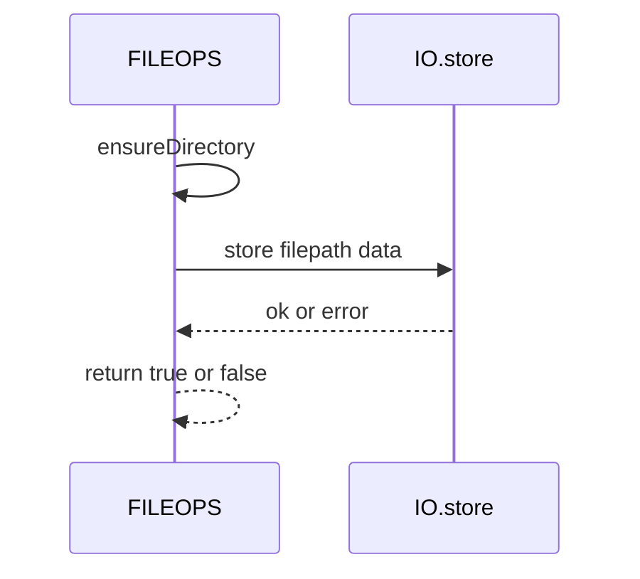
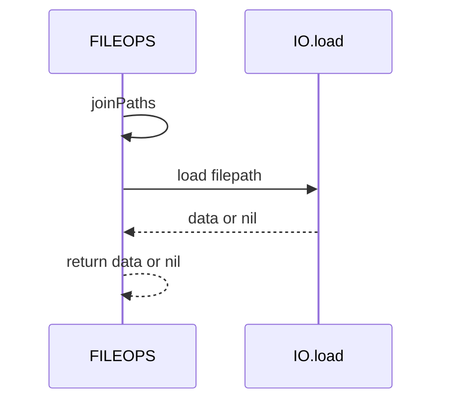

# FILEOPS save and load

High-level persistence helpers for writing and reading data files via IO, with defensive guards and directory creation.

Primary anchors

- save: [AETHR.FILEOPS:saveData()](../../dev/FILEOPS_.lua:155)
- load: [AETHR.FILEOPS:loadData()](../../dev/FILEOPS_.lua:173)
- ensure dir: [AETHR.FILEOPS:ensureDirectory()](../../dev/FILEOPS_.lua:46)
- join paths: [AETHR.FILEOPS:joinPaths()](../../dev/FILEOPS_.lua:37)

Callers

- CONFIG persistence
  - Write: [AETHR.CONFIG:saveConfig()](../../dev/CONFIG_.lua:404) -> [FILEOPS:saveData](../../dev/FILEOPS_.lua:155)
  - Read: [AETHR.CONFIG:loadConfig()](../../dev/CONFIG_.lua:380) -> [FILEOPS:loadData](../../dev/FILEOPS_.lua:173)
- FILEOPS chunked IO
  - Part write: [splitAndSaveData](../../dev/FILEOPS_.lua:246) -> [saveData](../../dev/FILEOPS_.lua:155)
  - Part read: [loadandJoinData](../../dev/FILEOPS_.lua:329) -> [loadData](../../dev/FILEOPS_.lua:173)

Save flow

```mermaid
%% shared theme: docs/_mermaid/theme.json %%
flowchart LR
  subgraph Prepare[Prepare path]
    D[data table] --> ED[ensureDirectory]
    ED --> JP[joinPaths directory filename]
  end

  subgraph Persist[Persist to disk]
    JP --> STORE[IO store path data]
  end

  STORE --> RES[return true or false]

  class ED,JP,Prepare,Persist class-step
  class STORE class-io
  class D class-data
  class RES class-result
```

Load flow

```mermaid
%% shared theme: docs/_mermaid/theme.json %%
flowchart LR
  subgraph ResolvePath[Resolve path]
    JP2[joinPaths directory filename]
  end

  JP2 --> LOAD[IO load path]
  LOAD --> T[table or nil]

  class JP2,ResolvePath class-step
  class LOAD class-io
  class T class-data
```

Save sequence



Load sequence



Behavior and errors

- Directory creation is required for save and uses ensureDirectory best effort
- IO calls are wrapped in pcall for robustness
- On save failure prints message and returns false
- On load failure prints message and returns nil

Data format

- Uses IO module functions in [dev/IO.lua](../../dev/IO.lua) to serialize and parse tables
- Encoding specifics are determined by the implementation in [dev/IO.lua](../../dev/IO.lua)

Validation checklist

- Save entry: [dev/FILEOPS_.lua](../../dev/FILEOPS_.lua:155)
- Load entry: [dev/FILEOPS_.lua](../../dev/FILEOPS_.lua:173)
- Directory ensure: [dev/FILEOPS_.lua](../../dev/FILEOPS_.lua:46)
- Path join: [dev/FILEOPS_.lua](../../dev/FILEOPS_.lua:37)
- CONFIG save: [dev/CONFIG_.lua](../../dev/CONFIG_.lua:404)
- CONFIG load: [dev/CONFIG_.lua](../../dev/CONFIG_.lua:380)

Related breakouts

- Paths and ensure: [paths_and_ensure.md](./paths_and_ensure.md)
- Chunking and tracker: [chunking.md](./chunking.md)
- Deep copy helper: [deepcopy.md](./deepcopy.md)