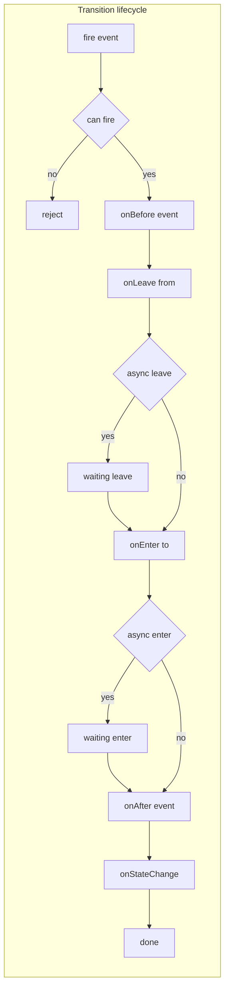
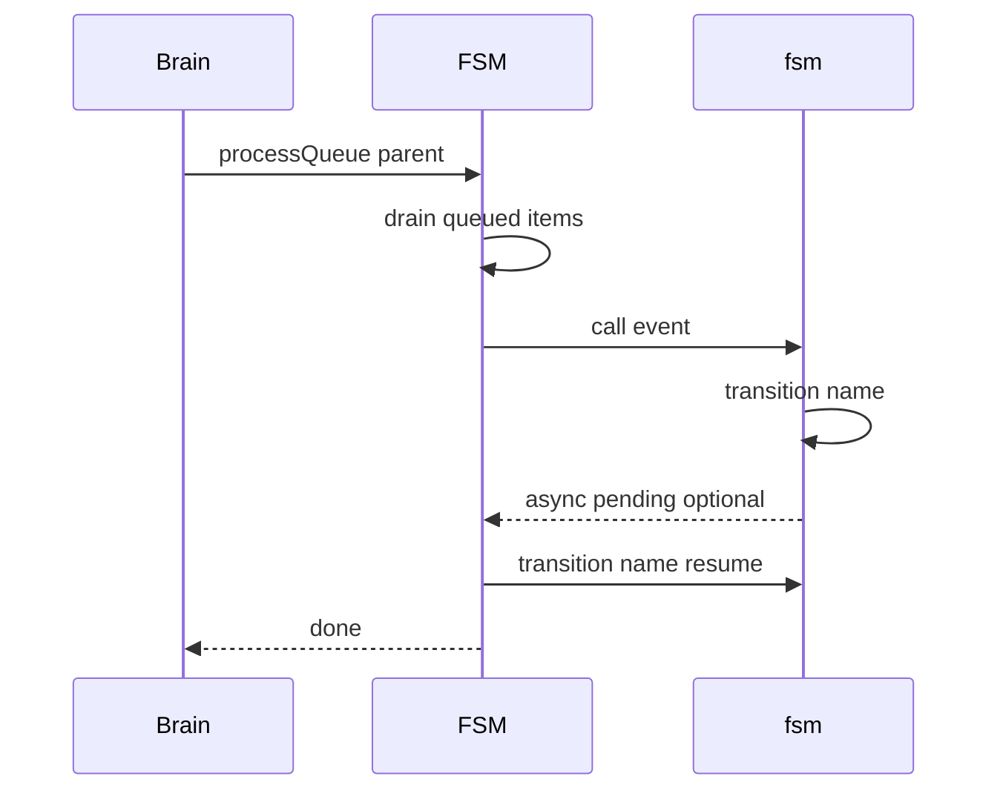

# FSM

Finite state machine for AETHR modules with async transitions and a queued manager for background progression.

### Source anchors
- [AETHR.FSM:create_transition()](https://github.com/Gh0st352/AETHR/blob/main/dev/FSM.lua#L104)
- [AETHR.FSM:New()](https://github.com/Gh0st352/AETHR/blob/main/dev/FSM.lua#L366)
- [AETHR.FSM:can()](https://github.com/Gh0st352/AETHR/blob/main/dev/FSM.lua#L407)
- [AETHR.FSM:transition()](https://github.com/Gh0st352/AETHR/blob/main/dev/FSM.lua#L451)
- [AETHR.FSM:cancelTransition()](https://github.com/Gh0st352/AETHR/blob/main/dev/FSM.lua#L461)
- [AETHR.FSM:enqueue()](https://github.com/Gh0st352/AETHR/blob/main/dev/FSM.lua#L501)
- [AETHR.FSM:processQueue()](https://github.com/Gh0st352/AETHR/blob/main/dev/FSM.lua#L515)
- [AETHR.FSM:todot()](https://github.com/Gh0st352/AETHR/blob/main/dev/FSM.lua#L427)

# Transition lifecycle flow

## Async semantics
- Return ASYNC from onLeave or onEnter to pause progression
- Resume by calling [AETHR.FSM:transition()](https://github.com/Gh0st352/AETHR/blob/main/dev/FSM.lua#L451) with the same event name
- Current async marker values are WaitingOnLeave and WaitingOnEnter inside [AETHR.FSM:create_transition()](https://github.com/Gh0st352/AETHR/blob/main/dev/FSM.lua#L104)

# Queue processor and integration

# Manager overview
- Enqueue items via [AETHR.FSM:enqueue()](https://github.com/Gh0st352/AETHR/blob/main/dev/FSM.lua#L501)
- Background progression in [AETHR.FSM:processQueue()](https://github.com/Gh0st352/AETHR/blob/main/dev/FSM.lua#L515)
- Used by BRAIN background loop through [AETHR.BRAIN:doRoutine()](https://github.com/Gh0st352/AETHR/blob/main/dev/BRAIN.lua#L176) and scheduled in [AETHR:BackgroundProcesses()](https://github.com/Gh0st352/AETHR/blob/main/dev/AETHR.lua#L267)

### Notes
- Guards and mapping of events are built in [AETHR.FSM:New()](https://github.com/Gh0st352/AETHR/blob/main/dev/FSM.lua#L366) and [AETHR.FSM:add_to_map()](https://github.com/Gh0st352/AETHR/blob/main/dev/FSM.lua#L200)
- Graph export available through [AETHR.FSM:todot()](https://github.com/Gh0st352/AETHR/blob/main/dev/FSM.lua#L427)

# Breakout documents

Detailed FSM analysis pages with Mermaid diagrams and sequence charts.

- Transition lifecycle and async: [transition_lifecycle.md](./transition_lifecycle.md)
- Creation and callbacks: [creation_and_callbacks.md](./creation_and_callbacks.md)
- Events and queries: [events_and_queries.md](./events_and_queries.md)
- Manager and queue: [manager.md](./manager.md)
- Export and tooling: [export_and_tooling.md](./export_and_tooling.md)