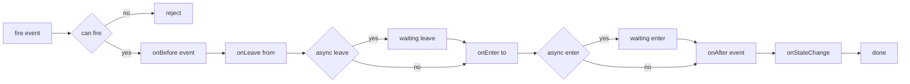
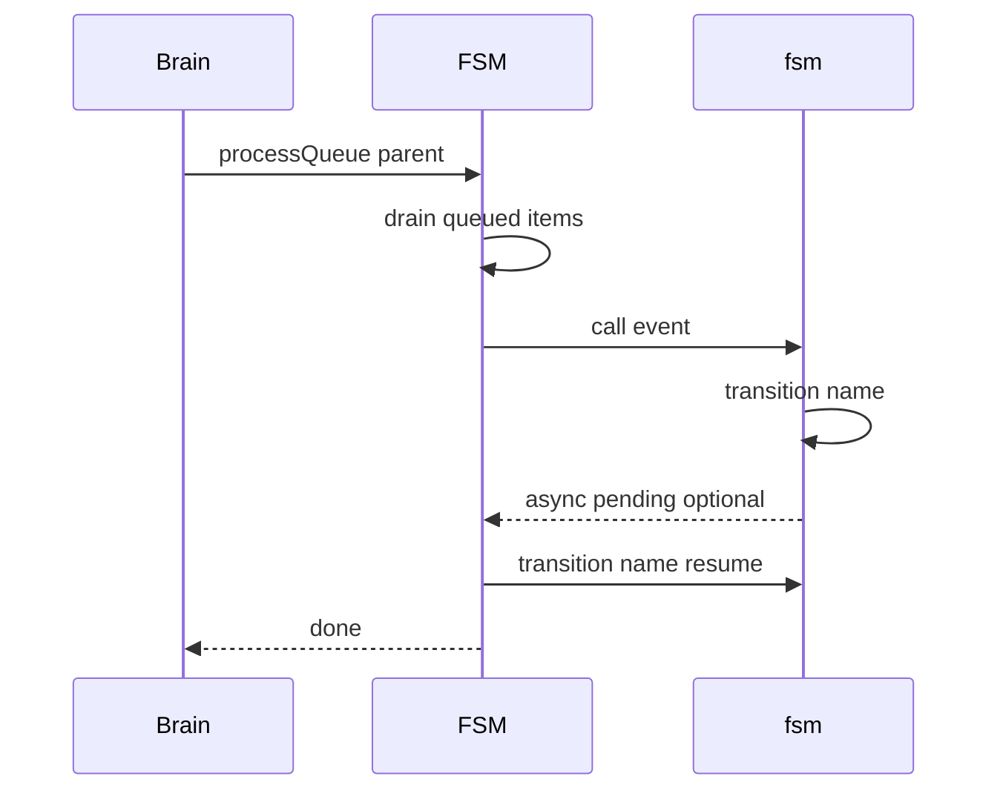

# FSM

Finite state machine for AETHR modules with async transitions and a queued manager for background progression.

Source anchors
- [AETHR.FSM:create_transition()](../../dev/FSM.lua:104)
- [AETHR.FSM:New()](../../dev/FSM.lua:366)
- [AETHR.FSM:can()](../../dev/FSM.lua:407)
- [AETHR.FSM:transition()](../../dev/FSM.lua:451)
- [AETHR.FSM:cancelTransition()](../../dev/FSM.lua:461)
- [AETHR.FSM:enqueue()](../../dev/FSM.lua:501)
- [AETHR.FSM:processQueue()](../../dev/FSM.lua:515)
- [AETHR.FSM:todot()](../../dev/FSM.lua:427)

Transition lifecycle flow

Async semantics
- Return ASYNC from onLeave or onEnter to pause progression
- Resume by calling [AETHR.FSM:transition()](../../dev/FSM.lua:451) with the same event name
- Current async marker values are WaitingOnLeave and WaitingOnEnter inside [AETHR.FSM:create_transition()](../../dev/FSM.lua:104)

Queue processor and integration

Manager overview
- Enqueue items via [AETHR.FSM:enqueue()](../../dev/FSM.lua:501)
- Background progression in [AETHR.FSM:processQueue()](../../dev/FSM.lua:515)
- Used by BRAIN background loop through [AETHR.BRAIN:doRoutine()](../../dev/BRAIN.lua:176) and scheduled in [AETHR:BackgroundProcesses()](../../dev/AETHR.lua:267)

Notes
- Guards and mapping of events are built in [AETHR.FSM:New()](../../dev/FSM.lua:366) and [AETHR.FSM:add_to_map()](../../dev/FSM.lua:200)
- Graph export available through [AETHR.FSM:todot()](../../dev/FSM.lua:427)

## Breakout documents

Detailed FSM analysis pages with Mermaid diagrams and sequence charts.

- Transition lifecycle and async: [transition_lifecycle.md](./transition_lifecycle.md)
- Creation and callbacks: [creation_and_callbacks.md](./creation_and_callbacks.md)
- Events and queries: [events_and_queries.md](./events_and_queries.md)
- Manager and queue: [manager.md](./manager.md)
- Export and tooling: [export_and_tooling.md](./export_and_tooling.md)