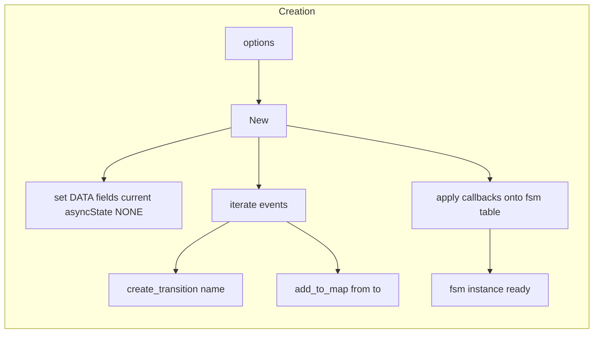
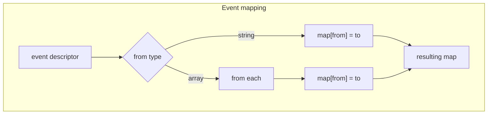
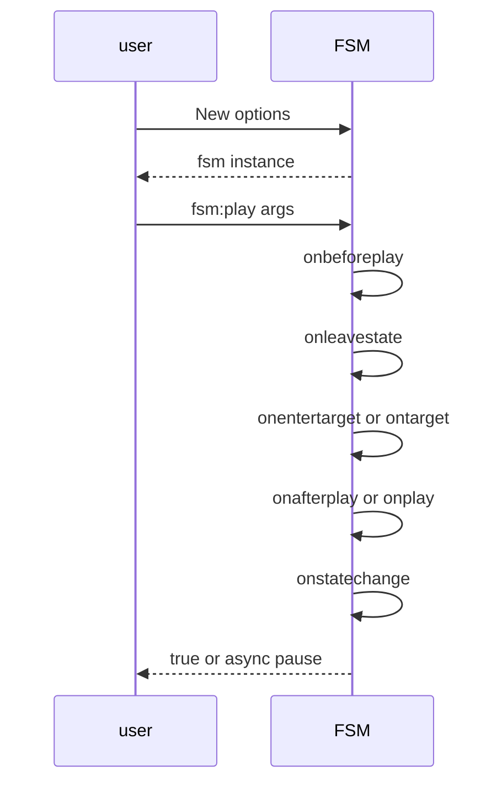

# FSM creation and callbacks

Constructing a state machine from options and wiring lifecycle callbacks. Covers options schema, event mapping, and callback name resolution implemented by [AETHR.FSM:New()](../../dev/FSM.lua:366), [AETHR.FSM:add_to_map()](../../dev/FSM.lua:200), and [AETHR.FSM:call_handler()](../../dev/FSM.lua:88).

Primary anchors

- Options class: [AETHR.FSM.DATA.Options](../../dev/FSM.lua:44)
- Builder: [AETHR.FSM:New()](../../dev/FSM.lua:366)
- Event map fill: [AETHR.FSM:add_to_map()](../../dev/FSM.lua:200)
- Handler wrapper: [AETHR.FSM:call_handler()](../../dev/FSM.lua:88)
- Async and none sentinels: [AETHR.FSM.ASYNC](../../dev/FSM.lua:23), [AETHR.FSM.NONE](../../dev/FSM.lua:22)

Options overview

- initial string optional, defaults to FSM.NONE
- events array of descriptors
  - name string
  - from string or string array, use * for wildcard
  - to string target state
- callbacks table with keys including:
  - onbefore<event>
  - onafter<event> or shorthand on<event>
  - onleave<state>
  - onenter<state> or shorthand on<state>
  - onstatechange generic for all transitions

# Creation flow

- DATA initialization
  - fsm.DATA.current is options.initial or NONE
  - fsm.DATA.asyncState set to NONE
  - fsm.DATA.events populated per event name as map of from to to
  - fsm.ASYNC and fsm.NONE mirrored from DATA for convenience

# Event mapping

# Callback resolution during transitions

- Order inside [AETHR.FSM:create_transition()](../../dev/FSM.lua:104):
  - onBefore<event> then onLeave<from>
  - onEnter<to> or on<to> then onAfter<event> or on<event> then onStateChange
- All invoked via [AETHR.FSM:call_handler()](../../dev/FSM.lua:88) to safely ignore non functions

# Example callback naming

- Event name play
  - onbeforeplay
  - onafterplay or onplay
- State name menu
  - onleavemenu
  - onentermenu or onmenu

Shorthands behavior

- State shorthand on<state> equals onenter<state>
- Event shorthand on<event> equals onafter<event>

# Sequence for creation and first event

# Validation checklist

- Options class doc: [AETHR.FSM.DATA.Options](../../dev/FSM.lua:44)
- Builder: [AETHR.FSM:New()](../../dev/FSM.lua:366)
- Map fill: [AETHR.FSM:add_to_map()](../../dev/FSM.lua:200)
- Handler wrapper: [AETHR.FSM:call_handler()](../../dev/FSM.lua:88)
- Transition implementation context: [AETHR.FSM:create_transition()](../../dev/FSM.lua:104)

# Related breakouts

- Transition lifecycle and async: [transition_lifecycle.md](./transition_lifecycle.md)
- Events and queries: [events_and_queries.md](./events_and_queries.md)
- Manager and queue: [manager.md](./manager.md)
- Export and tooling: [export_and_tooling.md](./export_and_tooling.md)

# Conventions

- Mermaid fenced blocks with GitHub parser
- Labels avoid double quotes and parentheses inside bracket text
- All links use relative paths for portability