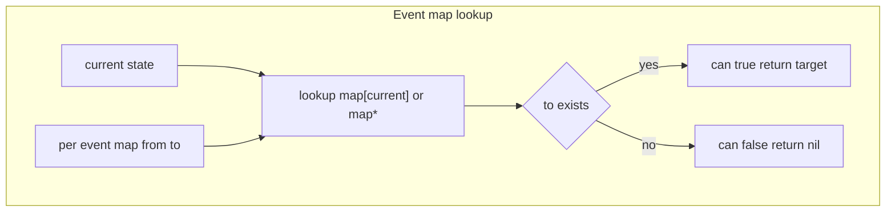
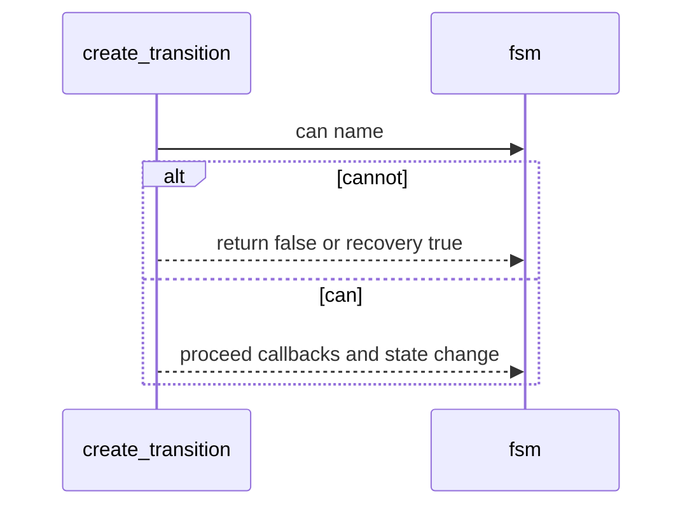

# FSM events and queries

Guards and state queries used to decide if an event can fire and to inspect current state. Documents [AETHR.FSM:is()](https://github.com/Gh0st352/AETHR/blob/main/dev/FSM.lua#L401), [AETHR.FSM:can()](https://github.com/Gh0st352/AETHR/blob/main/dev/FSM.lua#L407), and [AETHR.FSM:cannot()](https://github.com/Gh0st352/AETHR/blob/main/dev/FSM.lua#L421), and shows how the event map is used.

# Primary anchors

- Is current state: [AETHR.FSM:is()](https://github.com/Gh0st352/AETHR/blob/main/dev/FSM.lua#L401)
- Guard and target: [AETHR.FSM:can()](https://github.com/Gh0st352/AETHR/blob/main/dev/FSM.lua#L407)
- Inverse guard: [AETHR.FSM:cannot()](https://github.com/Gh0st352/AETHR/blob/main/dev/FSM.lua#L421)
- Event map fill: [AETHR.FSM:add_to_map()](https://github.com/Gh0st352/AETHR/blob/main/dev/FSM.lua#L200)
- Transition builder context: [AETHR.FSM:create_transition()](https://github.com/Gh0st352/AETHR/blob/main/dev/FSM.lua#L104)

# Event map and guard logic

- Each event has a map of from state to target state created during [AETHR.FSM:New()](https://github.com/Gh0st352/AETHR/blob/main/dev/FSM.lua#L366) via [add_to_map](https://github.com/Gh0st352/AETHR/blob/main/dev/FSM.lua#L200)
- Wildcard mapping * is supported and checked if an exact from is not found
- [can](https://github.com/Gh0st352/AETHR/blob/main/dev/FSM.lua#L407) returns two values: boolean can and the target to when can is true
- [cannot](https://github.com/Gh0st352/AETHR/blob/main/dev/FSM.lua#L421) simply negates can

# Usage inside transitions

# Query helpers

- [is](https://github.com/Gh0st352/AETHR/blob/main/dev/FSM.lua#L401) returns true when fsm.DATA.current equals the provided state string
- Useful for conditional logic outside transitions or to check completion

# Examples

- Defining events with multiple from states
  - [add_to_map](https://github.com/Gh0st352/AETHR/blob/main/dev/FSM.lua#L200) accepts a from string or an array of strings
- Wildcard
  - Provide from equal to * to allow the event to fire from any state not otherwise mapped

# Validation checklist

- Query helpers: [is](https://github.com/Gh0st352/AETHR/blob/main/dev/FSM.lua#L401), [can](https://github.com/Gh0st352/AETHR/blob/main/dev/FSM.lua#L407), [cannot](https://github.com/Gh0st352/AETHR/blob/main/dev/FSM.lua#L421)
- Map construction: [add_to_map](https://github.com/Gh0st352/AETHR/blob/main/dev/FSM.lua#L200)
- Transition use of guard: [create_transition](https://github.com/Gh0st352/AETHR/blob/main/dev/FSM.lua#L104)

# Related breakouts

- Transition lifecycle and async: [transition_lifecycle.md](./transition_lifecycle.md)
- Creation and callbacks: [creation_and_callbacks.md](./creation_and_callbacks.md)
- Manager and queue: [manager.md](./manager.md)
- Export and tooling: [export_and_tooling.md](./export_and_tooling.md)

# Conventions

- Mermaid fenced blocks with GitHub parser
- Labels avoid double quotes and parentheses inside bracket text
- All links use relative paths for portability