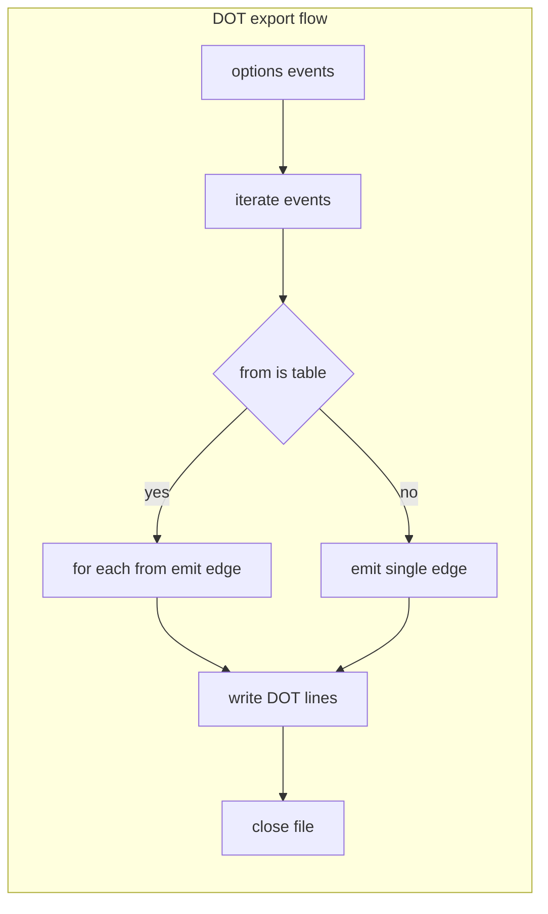

# FSM export and tooling

Graph export and external visualization for state machines created with [AETHR.FSM:New()](../../dev/FSM.lua:366). Documents the DOT exporter [AETHR.FSM:todot()](../../dev/FSM.lua:427) and shows how to integrate the output with Graphviz tooling.

# Primary anchors

- Export to DOT: [AETHR.FSM:todot()](../../dev/FSM.lua:427)
- Event descriptors used for edges: [AETHR.FSM.Event](../../dev/FSM.lua:26)
- Source of transitions: [AETHR.FSM:New()](../../dev/FSM.lua:366) and [AETHR.FSM:add_to_map()](../../dev/FSM.lua:200)

# Export flow



# Usage

- Create an FSM instance via [AETHR.FSM:New()](../../dev/FSM.lua:366) with your events map
- Call [AETHR.FSM:todot](../../dev/FSM.lua:427) with a filesystem path ending in .dot
- Use Graphviz to render the DOT file into SVG or PNG

# Example DOT snippet

```
digraph {
A -> B [label=go];
B -> A [label=back];
}
```

# Rendering commands

- Generate SVG: dot -Tsvg path/to/fsm.dot -o fsm.svg
- Generate PNG: dot -Tpng path/to/fsm.dot -o fsm.png

# Notes

- Labels avoid quotes in Mermaid diagrams; DOT labels are emitted using raw event names by the exporter at [AETHR.FSM:todot()](../../dev/FSM.lua:427)
- Writes one directed edge per from to to mapping; arrays in from produce multiple edges
- Ensure the destination directory exists before calling todot or use FILEOPS to create it

# Validation checklist

- Exporter: [dev/FSM.lua](../../dev/FSM.lua:427)
- Event iteration source: [dev/FSM.lua](../../dev/FSM.lua:435)
- Array from handling: [dev/FSM.lua](../../dev/FSM.lua:436)
- Single from handling: [dev/FSM.lua](../../dev/FSM.lua:441)

# Related breakouts

- Transition lifecycle and async: [transition_lifecycle.md](./transition_lifecycle.md)
- Creation and callbacks: [creation_and_callbacks.md](./creation_and_callbacks.md)
- Events and queries: [events_and_queries.md](./events_and_queries.md)
- Manager and queue: [manager.md](./manager.md)

# Conventions

- Mermaid fenced blocks with GitHub parser
- Labels avoid double quotes and parentheses inside bracket text
- All links use relative paths for portability