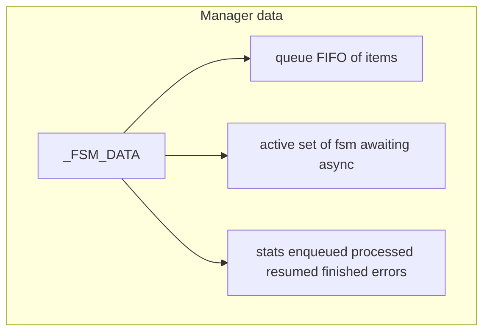
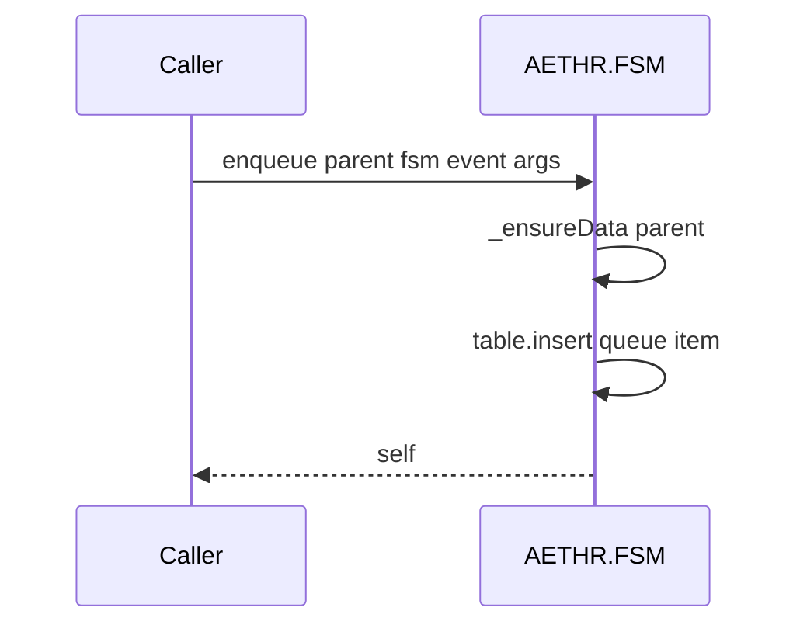
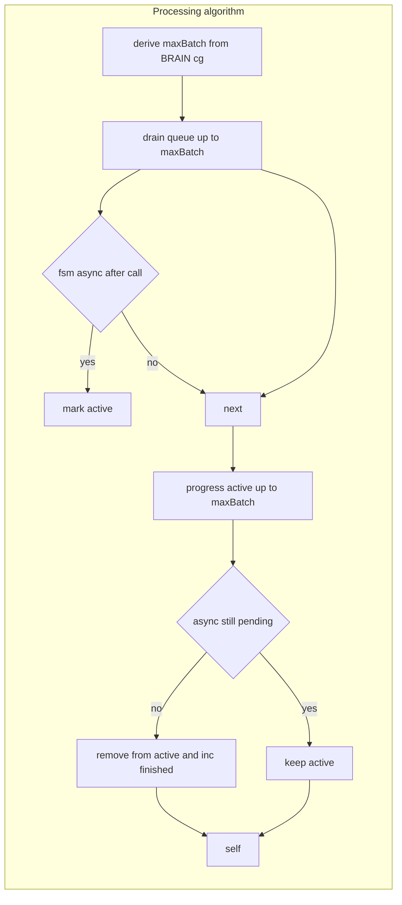
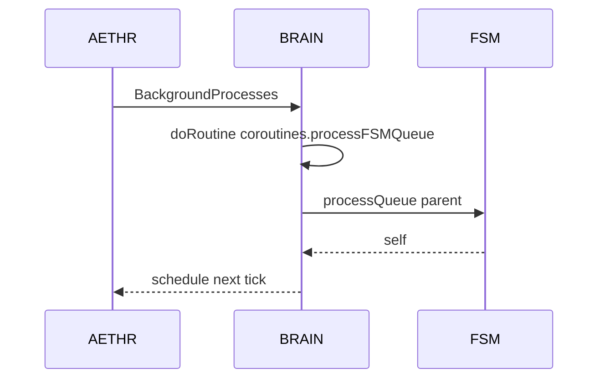

# FSM manager and background queue

Queueing and progressing FSM events across background ticks. Documents internal manager data via [_ensureData](../../dev/FSM.lua:479), queueing via [enqueue](../../dev/FSM.lua:501) and [queueEvent](../../dev/FSM.lua:593), and background advancement via [processQueue](../../dev/FSM.lua:515). Includes BRAIN integration and AETHR scheduling references.

# Primary anchors

- Ensure container: [AETHR.FSM:_ensureData()](../../dev/FSM.lua:479)
- Enqueue: [AETHR.FSM:enqueue()](../../dev/FSM.lua:501)
- Process queue: [AETHR.FSM:processQueue()](../../dev/FSM.lua:515)
- Convenience alias: [AETHR.FSM:queueEvent()](../../dev/FSM.lua:593)
- BRAIN coroutine descriptor: [AETHR.BRAIN.DATA.coroutines.processFSMQueue](../../dev/BRAIN.lua:139)
- BRAIN runner: [AETHR.BRAIN:doRoutine()](../../dev/BRAIN.lua:176)
- AETHR scheduling: [AETHR:BackgroundProcesses()](../../dev/AETHR.lua:267)

# Manager data layout

- Queue holds items with shape { fsm, event, args }
- Active holds FSMs with asyncState not NONE
- Stats counters are incremented during processing

# Enqueue flow

# Processing algorithm

- Queue draining:
  - If FSM is already mid transition, first attempts [transition](../../dev/FSM.lua:451) with currentTransitioningEvent
  - Else invokes fsm[event](fsm, unpack(args)) if defined
  - Errors are caught with pcall and counted in stats.errors
- Active progression:
  - Re-invokes [transition](../../dev/FSM.lua:451) for each active FSM
  - When asyncState equals NONE, removes from active and increments finished

# BRAIN integration sequence

# Tuning and batch size

- [processQueue](../../dev/FSM.lua:515) derives the batch size maxBatch from [BRAIN.DATA.coroutines.processFSMQueue.yieldThreshold](../../dev/BRAIN.lua:144) or defaults to 10
- Active and queued phases each cap work by maxBatch to avoid long blocking loops

# Item structure

- Queue item: { fsm = fsm, event = string, args = { ... } }
- Active key: fsm table set to true in data.active

# Error handling

- All fsm invocations are wrapped in pcall
- stats.errors increments on any pcall failure
- Robust against missing event functions on the FSM

# Validation checklist

- Ensure container: [dev/FSM.lua](../../dev/FSM.lua:479)
- Enqueue: [dev/FSM.lua](../../dev/FSM.lua:501)
- Process queue: [dev/FSM.lua](../../dev/FSM.lua:515)
- Alias: [dev/FSM.lua](../../dev/FSM.lua:593)
- BRAIN runner: [dev/BRAIN.lua](../../dev/BRAIN.lua:176)
- Scheduling hook: [dev/AETHR.lua](../../dev/AETHR.lua:267), [dev/AETHR.lua](../../dev/AETHR.lua:323)

# Related breakouts

- Transition lifecycle and async: [transition_lifecycle.md](./transition_lifecycle.md)
- Creation and callbacks: [creation_and_callbacks.md](./creation_and_callbacks.md)
- Events and queries: [events_and_queries.md](./events_and_queries.md)
- Export and tooling: [export_and_tooling.md](./export_and_tooling.md)

# Conventions

- Mermaid fenced blocks with GitHub parser
- Labels avoid double quotes and parentheses inside bracket text
- All links use relative paths for portability