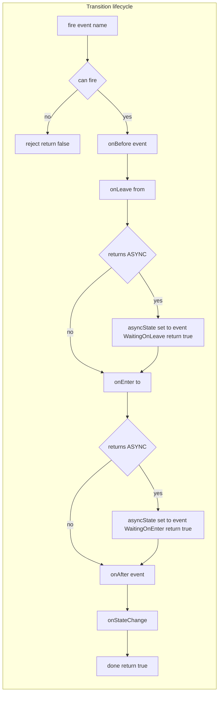
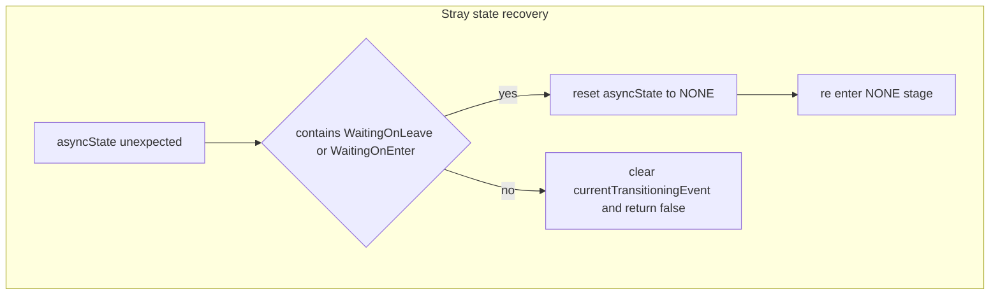

# FSM transition lifecycle and async semantics

Detailed walkthrough of event firing, lifecycle callbacks, and async progression logic implemented by [AETHR.FSM:create_transition()](https://github.com/Gh0st352/AETHR/blob/main/dev/FSM.lua#L104). Includes resume and cancel semantics via [AETHR.FSM:transition()](https://github.com/Gh0st352/AETHR/blob/main/dev/FSM.lua#L451) and [AETHR.FSM:cancelTransition()](https://github.com/Gh0st352/AETHR/blob/main/dev/FSM.lua#L461).

# Primary anchors

- Transition builder: [AETHR.FSM:create_transition()](https://github.com/Gh0st352/AETHR/blob/main/dev/FSM.lua#L104)
- Resume progression: [AETHR.FSM:transition()](https://github.com/Gh0st352/AETHR/blob/main/dev/FSM.lua#L451)
- Cancel in flight: [AETHR.FSM:cancelTransition()](https://github.com/Gh0st352/AETHR/blob/main/dev/FSM.lua#L461)
- Call wrapper for lifecycle hooks: [AETHR.FSM:call_handler()](https://github.com/Gh0st352/AETHR/blob/main/dev/FSM.lua#L88)
- State query and guards: [AETHR.FSM:can()](https://github.com/Gh0st352/AETHR/blob/main/dev/FSM.lua#L407)
- Async sentinels: [AETHR.FSM.ASYNC](https://github.com/Gh0st352/AETHR/blob/main/dev/FSM.lua#L23), [AETHR.FSM.NONE](https://github.com/Gh0st352/AETHR/blob/main/dev/FSM.lua#L22)

# Lifecycle order and branching

- When can returns false the transition is rejected. If the code is performing a stray state recovery, it will return true, otherwise false. See recovery notes below.
- The event name drives async marker labels constructed as name plus suffix values from ENUMS FSM fields.

# Sequence for async resume

# Key implementation notes

- Waiting markers
  - [AETHR.FSM:create_transition()](https://github.com/Gh0st352/AETHR/blob/main/dev/FSM.lua#L104) constructs
    - waitingLeave = name .. FSM.WaitingOnLeave
    - waitingEnter = name .. FSM.WaitingOnEnter
  - These suffix constants are defined in [AETHR.ENUMS.FSM](../../dev/ENUMS.lua) and are concatenated to the event name.
- Async and none sentinels
  - [AETHR.FSM.ASYNC](https://github.com/Gh0st352/AETHR/blob/main/dev/FSM.lua#L23) and [AETHR.FSM.NONE](https://github.com/Gh0st352/AETHR/blob/main/dev/FSM.lua#L22) fall back to string defaults when ENUMS is unavailable.
- Callback invocation
  - All lifecycle callbacks are invoked through [AETHR.FSM:call_handler()](https://github.com/Gh0st352/AETHR/blob/main/dev/FSM.lua#L88) which safely no-ops for non functions.
  - Order inside the NONE stage: onBefore<event> then onLeave<from> then possibly pause.
  - In waitingLeave stage, current is switched to target state and onEnter<to> or on<to> is invoked.
  - In waitingEnter stage, onAfter<event> or on<event> followed by onStateChange are invoked.
- Guards and target resolution
  - [AETHR.FSM:can()](https://github.com/Gh0st352/AETHR/blob/main/dev/FSM.lua#L407) returns can, to using current state and the per event from map.
- Return semantics
  - Returning false from onBefore or onLeave cancels transition and returns false.
  - Returning ASYNC from onLeave or onEnter pauses and returns true. Caller must later call [AETHR.FSM:transition()](https://github.com/Gh0st352/AETHR/blob/main/dev/FSM.lua#L451) with the same event.
  - Completed transitions return true.

# Stray state recovery

- If asyncState contains a partial transition marker string but does not match expected stage, the code resets it to NONE and continues once in recovery mode.
- When recovering, attempts that would otherwise return false will return true to avoid breaking calling sequences.

# Cancellation

- [AETHR.FSM:cancelTransition()](https://github.com/Gh0st352/AETHR/blob/main/dev/FSM.lua#L461)
  - If the active event matches the provided name, clears asyncState to NONE and currentTransitioningEvent to nil.
  - Subsequent calls to [AETHR.FSM:transition()](https://github.com/Gh0st352/AETHR/blob/main/dev/FSM.lua#L451) for that event will be ignored until a new event is fired.

# Validation checklist

- Builder and core: [create_transition](https://github.com/Gh0st352/AETHR/blob/main/dev/FSM.lua#L104)
- Resume and cancel: [transition](https://github.com/Gh0st352/AETHR/blob/main/dev/FSM.lua#L451), [cancelTransition](https://github.com/Gh0st352/AETHR/blob/main/dev/FSM.lua#L461)
- Handler wrapper: [call_handler](https://github.com/Gh0st352/AETHR/blob/main/dev/FSM.lua#L88)
- Sentinel constants: [FSM.NONE](https://github.com/Gh0st352/AETHR/blob/main/dev/FSM.lua#L22), [FSM.ASYNC](https://github.com/Gh0st352/AETHR/blob/main/dev/FSM.lua#L23)
- Guard and target: [can](https://github.com/Gh0st352/AETHR/blob/main/dev/FSM.lua#L407)

# Related breakouts

- Creation and callbacks: [creation_and_callbacks.md](./creation_and_callbacks.md)
- Events and queries: [events_and_queries.md](./events_and_queries.md)
- Manager and queue: [manager.md](./manager.md)
- Export and tooling: [export_and_tooling.md](./export_and_tooling.md)

# Conventions

- Mermaid fenced blocks with GitHub parser
- Labels avoid double quotes and parentheses inside bracket text
- All links use relative paths for portability