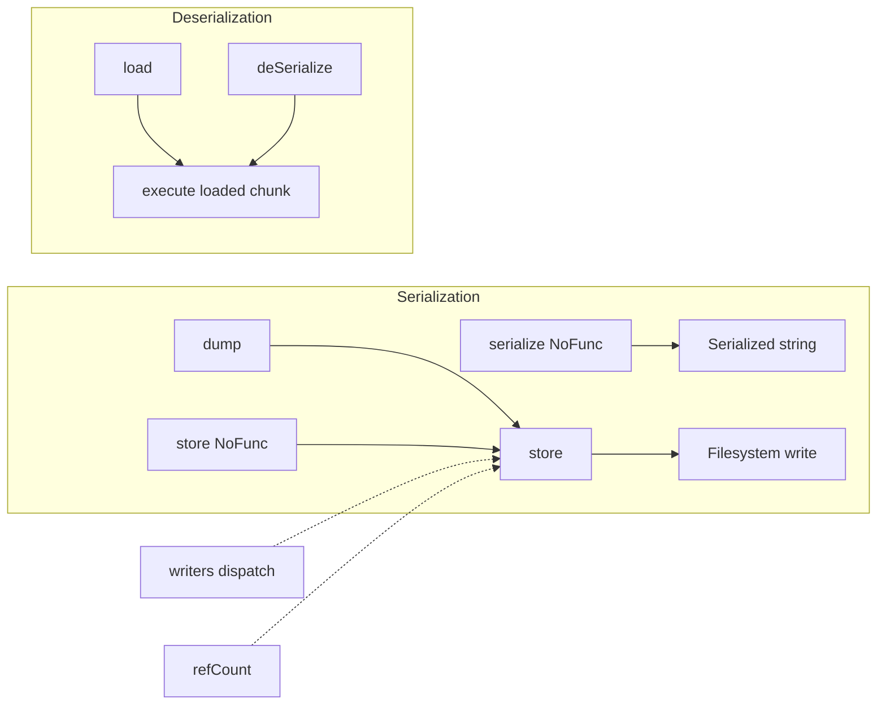
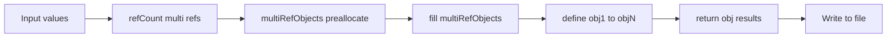
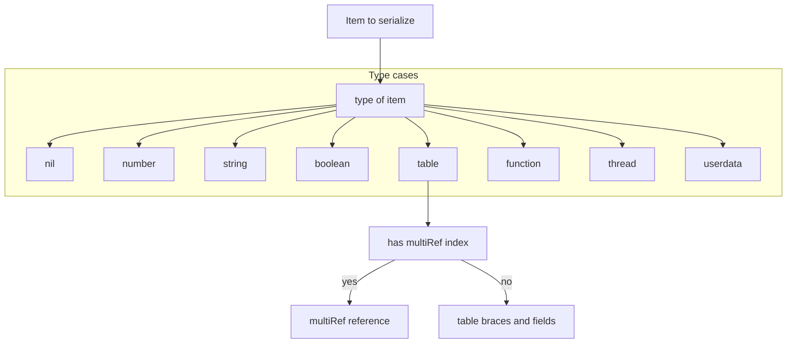
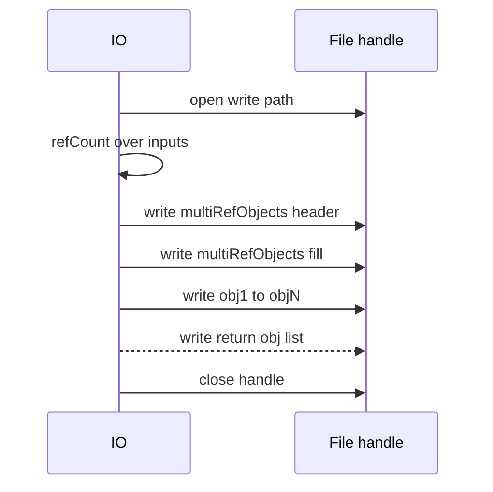
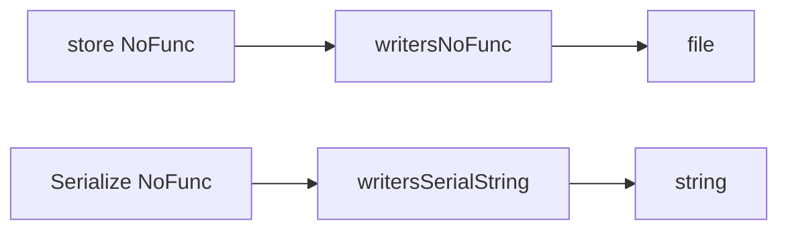
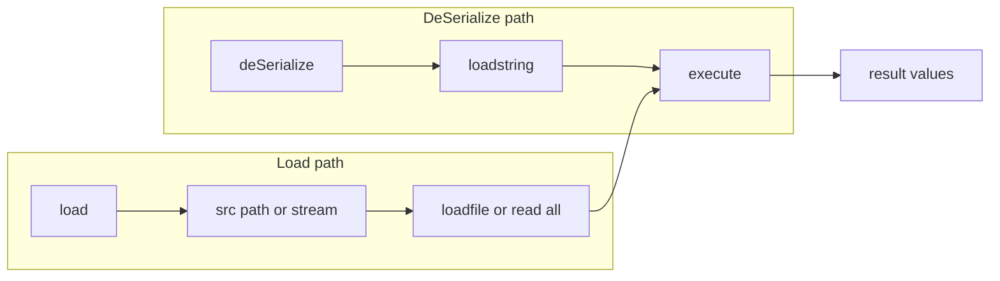
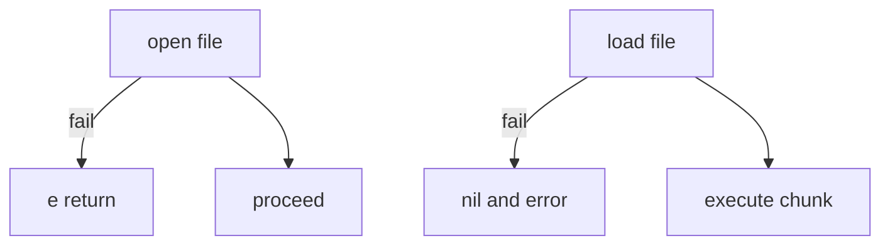

# AETHR IO diagrams and flows

Primary anchors
- [AETHR.IO.dump()](../../dev/IO.lua:35)
- [AETHR.IO.store()](../../dev/IO.lua:63)
- [AETHR.IO.storeNoFunc()](../../dev/IO.lua:134)
- [AETHR.IO.serializeNoFunc()](../../dev/IO.lua:199)
- [AETHR.IO.deSerialize()](../../dev/IO.lua:281)
- [AETHR.IO.load()](../../dev/IO.lua:310)

Related code anchors
- Writers dispatch: [write()](../../dev/IO.lua:337), [writeNoFunc()](../../dev/IO.lua:349), [writeSerialString()](../../dev/IO.lua:361)
- Writer tables: [writers](../../dev/IO.lua:422), [writersNoFunc](../../dev/IO.lua:488), [writersSerialString](../../dev/IO.lua:546)
- Helpers: [writeIndent()](../../dev/IO.lua:377), [writeIndentSerial()](../../dev/IO.lua:383), [refCount()](../../dev/IO.lua:401)
- FILEOPS usage: [AETHR.FILEOPS:saveData()](../../dev/FILEOPS_.lua:155), [AETHR.FILEOPS:loadData()](../../dev/FILEOPS_.lua:173)

Documents and indices
- Master diagrams index: [docs/README.md](../README.md)
- FILEOPS: [docs/fileops/README.md](../fileops/README.md)
- AETHR overview: [docs/aethr/README.md](../aethr/README.md)

## Breakout documents

- Store and variants: [store_and_variants.md](./store_and_variants.md)
- Load and deSerialize: [load_and_deserialize.md](./load_and_deserialize.md)
- Writers and refCount internals: [writers_and_refcount.md](./writers_and_refcount.md)
- Serialize NoFunc: [serialize_nofunc.md](./serialize_nofunc.md)
- Dump helper: [dump.md](./dump.md)

# Overview relationships

# Serialization pipeline

# Writers dispatch resolution

# Store sequence

# NoFunc variants and string serialization

# Deserialization and load flows

# Error and guard behavior

# Key anchors
- Entry points
  - [AETHR.IO.store()](../../dev/IO.lua:63), [AETHR.IO.storeNoFunc()](../../dev/IO.lua:134), [AETHR.IO.serializeNoFunc()](../../dev/IO.lua:199)
  - [AETHR.IO.deSerialize()](../../dev/IO.lua:281), [AETHR.IO.load()](../../dev/IO.lua:310)
- Writers and helpers
  - [write()](../../dev/IO.lua:337), [writeNoFunc()](../../dev/IO.lua:349), [writeSerialString()](../../dev/IO.lua:361)
  - [writers](../../dev/IO.lua:422), [writersNoFunc](../../dev/IO.lua:488), [writersSerialString](../../dev/IO.lua:546)
  - [writeIndent()](../../dev/IO.lua:377), [writeIndentSerial()](../../dev/IO.lua:383), [refCount()](../../dev/IO.lua:401)

# Cross-module anchors
- FILEOPS persist and retrieve: [AETHR.FILEOPS:saveData()](../../dev/FILEOPS_.lua:155), [AETHR.FILEOPS:loadData()](../../dev/FILEOPS_.lua:173)

# Notes
- Mermaid labels avoid double quotes and parentheses to satisfy renderer constraints.
- All diagrams use GitHub Mermaid fenced blocks.