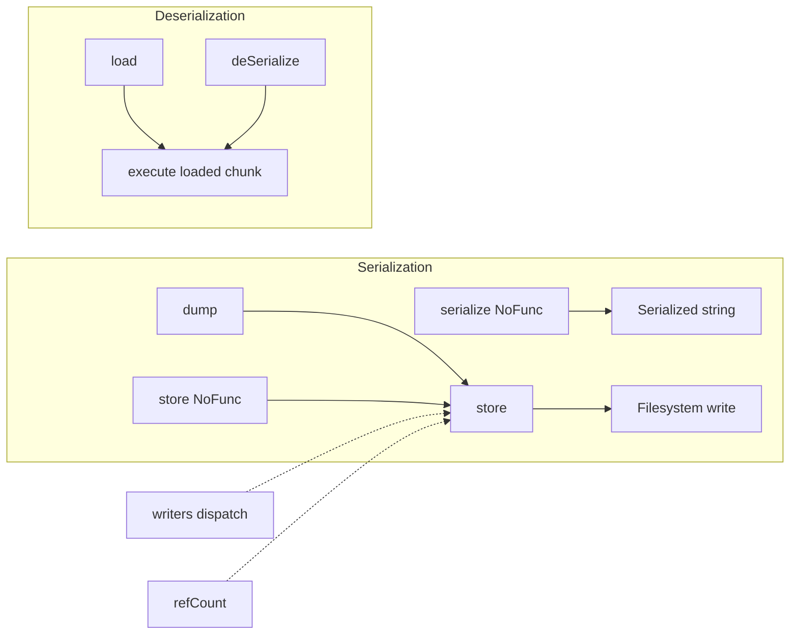
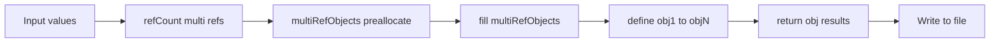
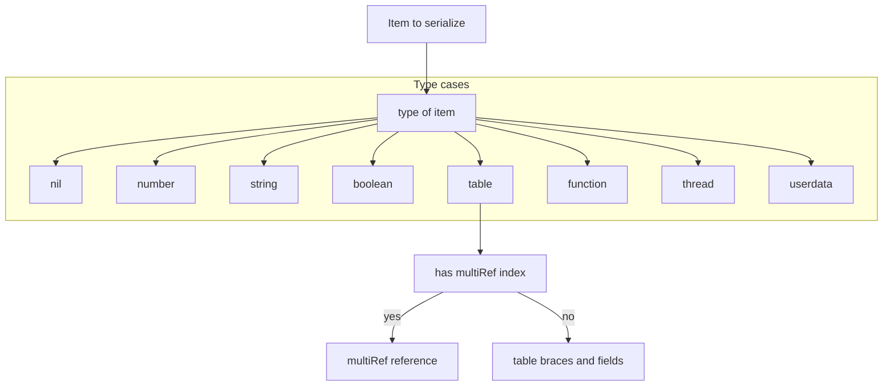
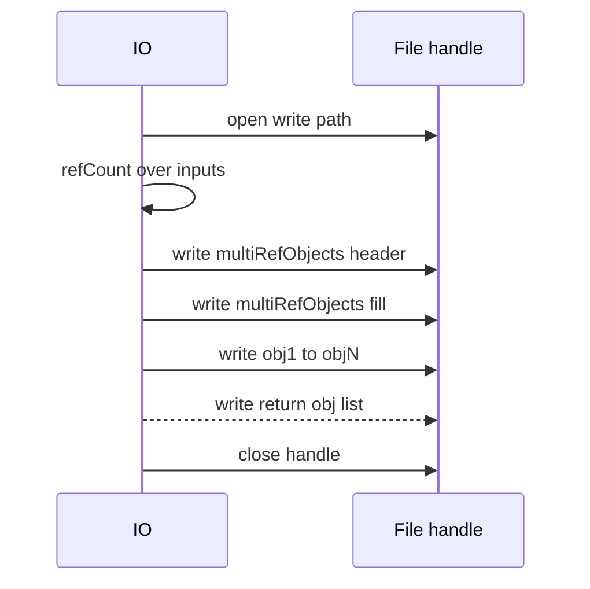
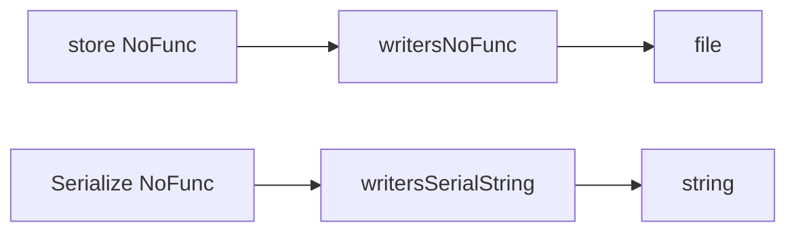
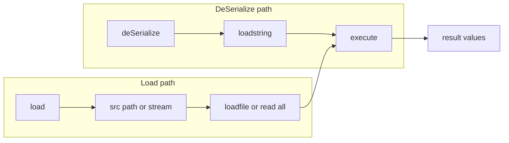
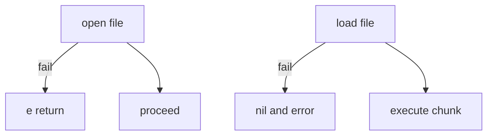

# AETHR IO diagrams and flows

Primary anchors
- [AETHR.IO.dump()](https://github.com/Gh0st352/AETHR/blob/main/dev/IO.lua#L35)
- [AETHR.IO.store()](https://github.com/Gh0st352/AETHR/blob/main/dev/IO.lua#L63)
- [AETHR.IO.storeNoFunc()](https://github.com/Gh0st352/AETHR/blob/main/dev/IO.lua#L134)
- [AETHR.IO.serializeNoFunc()](https://github.com/Gh0st352/AETHR/blob/main/dev/IO.lua#L199)
- [AETHR.IO.deSerialize()](https://github.com/Gh0st352/AETHR/blob/main/dev/IO.lua#L281)
- [AETHR.IO.load()](https://github.com/Gh0st352/AETHR/blob/main/dev/IO.lua#L310)

Related code anchors
- Writers dispatch: [write()](https://github.com/Gh0st352/AETHR/blob/main/dev/IO.lua#L337), [writeNoFunc()](https://github.com/Gh0st352/AETHR/blob/main/dev/IO.lua#L349), [writeSerialString()](https://github.com/Gh0st352/AETHR/blob/main/dev/IO.lua#L361)
- Writer tables: [writers](https://github.com/Gh0st352/AETHR/blob/main/dev/IO.lua#L422), [writersNoFunc](https://github.com/Gh0st352/AETHR/blob/main/dev/IO.lua#L488), [writersSerialString](https://github.com/Gh0st352/AETHR/blob/main/dev/IO.lua#L546)
- Helpers: [writeIndent()](https://github.com/Gh0st352/AETHR/blob/main/dev/IO.lua#L377), [writeIndentSerial()](https://github.com/Gh0st352/AETHR/blob/main/dev/IO.lua#L383), [refCount()](https://github.com/Gh0st352/AETHR/blob/main/dev/IO.lua#L401)
- FILEOPS usage: [AETHR.FILEOPS:saveData()](https://github.com/Gh0st352/AETHR/blob/main/dev/FILEOPS_.lua#L155), [AETHR.FILEOPS:loadData()](https://github.com/Gh0st352/AETHR/blob/main/dev/FILEOPS_.lua#L173)

Documents and indices
- Master diagrams index: [docs/README.md](../README.md)
- FILEOPS: [docs/fileops/README.md](../fileops/README.md)
- AETHR overview: [docs/aethr/README.md](../aethr/README.md)

## Breakout documents

- Store and variants: [store_and_variants.md](./store_and_variants.md)
- Load and deSerialize: [load_and_deserialize.md](./load_and_deserialize.md)
- Writers and refCount internals: [writers_and_refcount.md](./writers_and_refcount.md)
- Serialize NoFunc: [serialize_nofunc.md](./serialize_nofunc.md)
- Dump helper: [dump.md](./dump.md)

# Overview relationships

# Serialization pipeline

# Writers dispatch resolution

# Store sequence

# NoFunc variants and string serialization

# Deserialization and load flows

# Error and guard behavior

# Key anchors
- Entry points
  - [AETHR.IO.store()](https://github.com/Gh0st352/AETHR/blob/main/dev/IO.lua#L63), [AETHR.IO.storeNoFunc()](https://github.com/Gh0st352/AETHR/blob/main/dev/IO.lua#L134), [AETHR.IO.serializeNoFunc()](https://github.com/Gh0st352/AETHR/blob/main/dev/IO.lua#L199)
  - [AETHR.IO.deSerialize()](https://github.com/Gh0st352/AETHR/blob/main/dev/IO.lua#L281), [AETHR.IO.load()](https://github.com/Gh0st352/AETHR/blob/main/dev/IO.lua#L310)
- Writers and helpers
  - [write()](https://github.com/Gh0st352/AETHR/blob/main/dev/IO.lua#L337), [writeNoFunc()](https://github.com/Gh0st352/AETHR/blob/main/dev/IO.lua#L349), [writeSerialString()](https://github.com/Gh0st352/AETHR/blob/main/dev/IO.lua#L361)
  - [writers](https://github.com/Gh0st352/AETHR/blob/main/dev/IO.lua#L422), [writersNoFunc](https://github.com/Gh0st352/AETHR/blob/main/dev/IO.lua#L488), [writersSerialString](https://github.com/Gh0st352/AETHR/blob/main/dev/IO.lua#L546)
  - [writeIndent()](https://github.com/Gh0st352/AETHR/blob/main/dev/IO.lua#L377), [writeIndentSerial()](https://github.com/Gh0st352/AETHR/blob/main/dev/IO.lua#L383), [refCount()](https://github.com/Gh0st352/AETHR/blob/main/dev/IO.lua#L401)

# Cross-module anchors
- FILEOPS persist and retrieve: [AETHR.FILEOPS:saveData()](https://github.com/Gh0st352/AETHR/blob/main/dev/FILEOPS_.lua#L155), [AETHR.FILEOPS:loadData()](https://github.com/Gh0st352/AETHR/blob/main/dev/FILEOPS_.lua#L173)

# Notes
- Mermaid labels avoid double quotes and parentheses to satisfy renderer constraints.
- All diagrams use GitHub Mermaid fenced blocks.