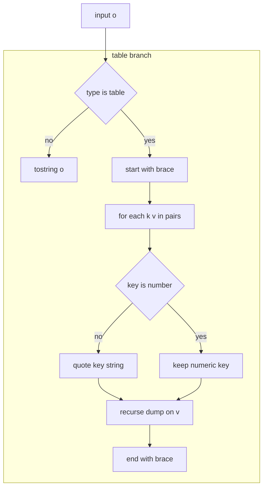

# IO dump helper

Human readable string conversion for Lua tables and values. Documents [AETHR.IO.dump()](https://github.com/Gh0st352/AETHR/blob/main/dev/IO.lua#L35) behavior, including key quoting and recursive formatting.

# Primary anchor

- Dump: [AETHR.IO.dump()](https://github.com/Gh0st352/AETHR/blob/main/dev/IO.lua#L35)

# Overview

- Produces a string form for a value or table
- For tables:
  - Iterates pairs and emits key value assignments
  - Non numeric keys are quoted as strings
  - Values are recursively formatted via dump

# Example

```
local t = { a = 1, b = { c = 2 } }
local s = AETHR.IO.dump(t)
-- s might look like:
-- { ["a"] = 1,["b"] = { ["c"] = 2,}, }
```

# Flow



# Notes

- Intended for readability and quick inspection, not round trip serialization
- For robust persistence prefer [AETHR.IO.store()](https://github.com/Gh0st352/AETHR/blob/main/dev/IO.lua#L63) and friends

# Validation checklist

- Entry: [dev/IO.lua](https://github.com/Gh0st352/AETHR/blob/main/dev/IO.lua#L35)

# Related breakouts

- Store and variants: [store_and_variants.md](./store_and_variants.md)
- Load and deSerialize: [load_and_deserialize.md](./load_and_deserialize.md)
- Writers and refcount internals: [writers_and_refcount.md](./writers_and_refcount.md)
- Serialize NoFunc: [serialize_nofunc.md](./serialize_nofunc.md)

# Conventions

- Mermaid fenced blocks with GitHub parser
- Labels avoid double quotes and parentheses inside bracket text
- All links use relative paths for portability