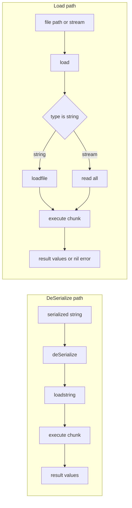
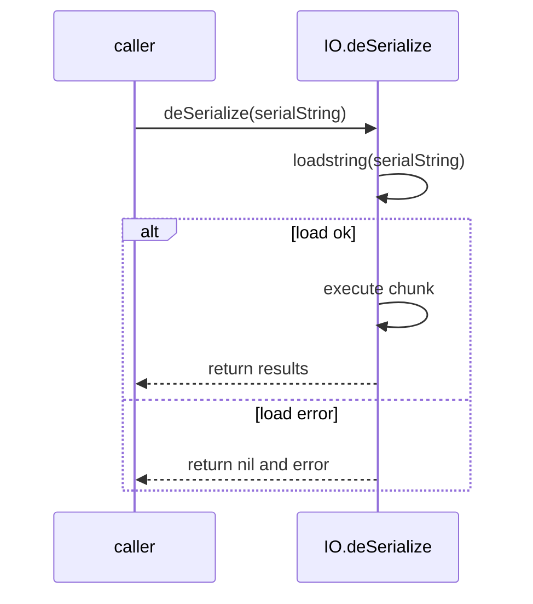
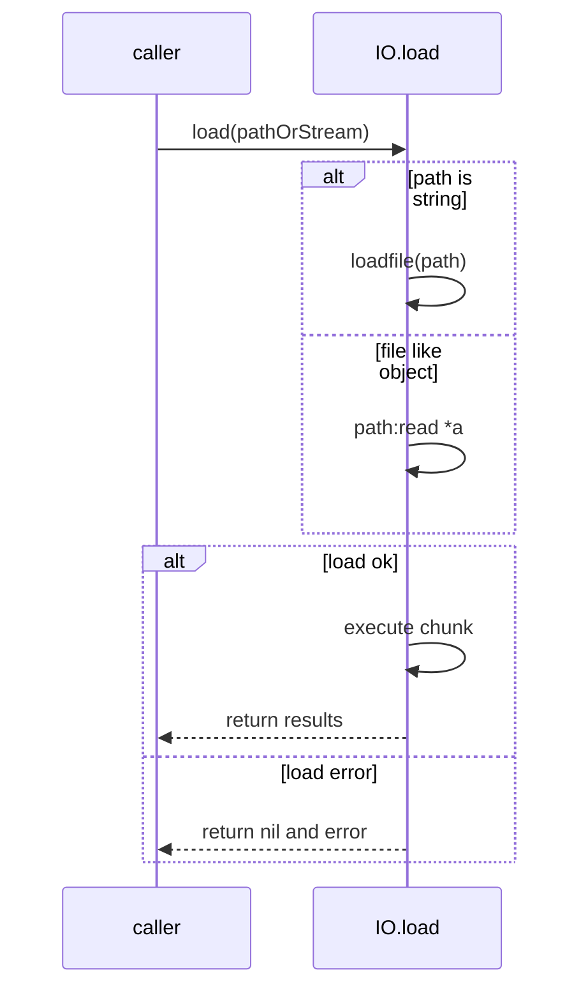
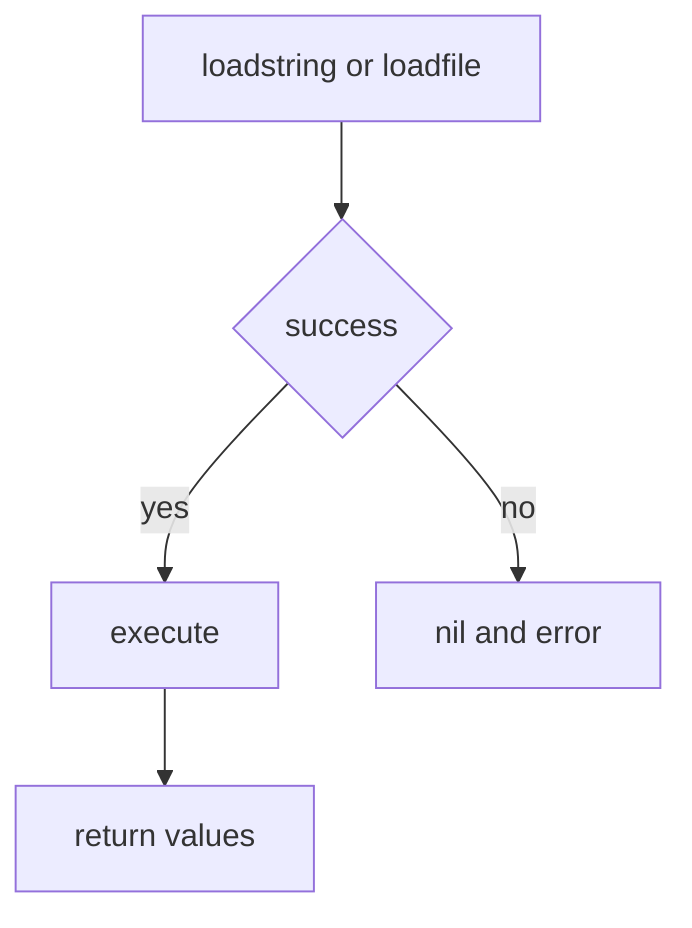

# IO load and deSerialize

Loading and executing persisted Lua chunks from files or serialized strings. Covers [AETHR.IO.deSerialize()](../../dev/IO.lua:281) and [AETHR.IO.load()](../../dev/IO.lua:310), including error paths, file vs stream sources, and result semantics.

Primary anchors

- DeSerialize from string: [AETHR.IO.deSerialize()](../../dev/IO.lua:281)
- Load from path or stream: [AETHR.IO.load()](../../dev/IO.lua:310)

# Overview flows

# DeSerialize sequence

# Load sequence file or stream

# Behavior and errors

- [AETHR.IO.deSerialize()](../../dev/IO.lua:281)
  - Uses loadstring then executes the compiled chunk
  - Returns results of execution on success, or nil and error message on failure
- [AETHR.IO.load()](../../dev/IO.lua:310)
  - When given a string path uses loadfile; otherwise expects a stream supporting read '*a'
  - Returns results of execution on success, or nil and error message on failure

## Integration notes

- These functions pair with serialization output produced by [AETHR.IO.store()](../../dev/IO.lua:63), [AETHR.IO.storeNoFunc()](../../dev/IO.lua:134), and [AETHR.IO.serializeNoFunc()](../../dev/IO.lua:199)
- FILEOPS uses them under the hood in [AETHR.FILEOPS:saveData()](../../dev/FILEOPS_.lua:155) and [AETHR.FILEOPS:loadData()](../../dev/FILEOPS_.lua:173)

# Guard and result patterns

# Usage examples

- DeSerialize a string chunk
  - local data = [AETHR.IO.deSerialize()](../../dev/IO.lua:281)(serializedString)
- Load from disk
  - local data = [AETHR.IO.load()](../../dev/IO.lua:310)(path)

# Validation checklist

- deSerialize entry: [dev/IO.lua](../../dev/IO.lua:281)
- load entry: [dev/IO.lua](../../dev/IO.lua:310)
- FILEOPS callers: [dev/FILEOPS_.lua saveData](../../dev/FILEOPS_.lua:155), [dev/FILEOPS_.lua loadData](../../dev/FILEOPS_.lua:173)

# Related breakouts

- Store and multiref encoding: [store_and_variants.md](./store_and_variants.md)
- Writers and refcount internals: [writers_and_refcount.md](./writers_and_refcount.md)
- Serialize to string without functions: [serialize_nofunc.md](./serialize_nofunc.md)

# Conventions

- Mermaid fenced blocks with GitHub parser
- Labels avoid double quotes and parentheses inside bracket text
- All links use relative paths for portability