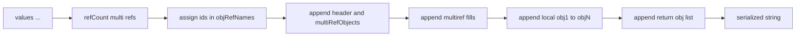
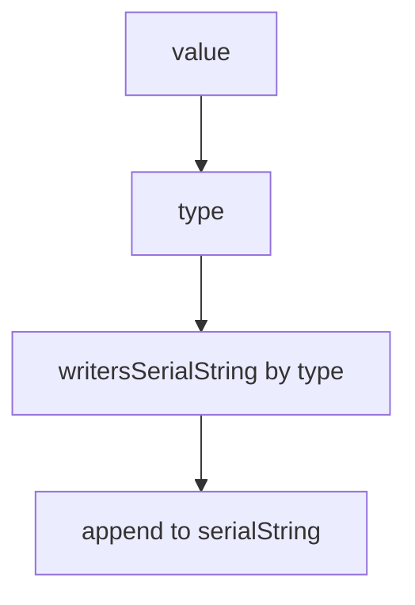
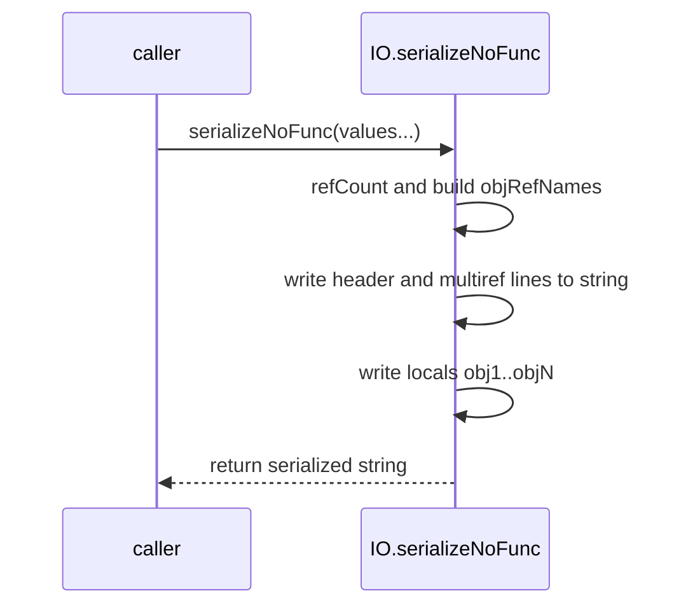

# IO serialize NoFunc

Produce an executable Lua chunk string without attempting to serialize functions. Documents [AETHR.IO.serializeNoFunc()](../../dev/IO.lua:199) and the supporting string writer table [writersSerialString](../../dev/IO.lua:546), with flow and sequence diagrams.

Primary anchors

- Serialize to string: [AETHR.IO.serializeNoFunc()](../../dev/IO.lua:199)
- String writers dispatch: [writeSerialString](../../dev/IO.lua:361), [writersSerialString](../../dev/IO.lua:546)
- Helpers: [writeIndentSerial](../../dev/IO.lua:383), [refCount](../../dev/IO.lua:401)

High level flow

String writer selection

- [writeSerialString](../../dev/IO.lua:361) routes values to [writersSerialString](../../dev/IO.lua:546)
- Functions are intentionally emitted as nil placeholders to keep output executable

Sequence

Emitted structure

- Header with multiRefObjects table
- Assignments to fill multiref table entries
- Local objN definitions for each input value
- Final return statement returning the list of objN values

Error and edge behavior

- No file IO is performed; returns a string
- Tables with shared references are deduplicated via multiref encoding
- Function values become placeholder nil entries to avoid non portable bytecode

Validation checklist

- Entry: [dev/IO.lua](../../dev/IO.lua:199)
- String writer dispatch: [dev/IO.lua](../../dev/IO.lua:361), [dev/IO.lua](../../dev/IO.lua:546)
- Indentation helper: [dev/IO.lua](../../dev/IO.lua:383)
- refCount: [dev/IO.lua](../../dev/IO.lua:401)

Related breakouts

- Store and variants: [store_and_variants.md](./store_and_variants.md)
- Load and deSerialize: [load_and_deserialize.md](./load_and_deserialize.md)
- Writers and refcount internals: [writers_and_refcount.md](./writers_and_refcount.md)
- Dump helper: [dump.md](./dump.md)

Conventions

- Mermaid fenced blocks with GitHub parser
- Labels avoid double quotes and parentheses inside bracket text
- All links use relative paths for portability