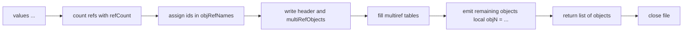
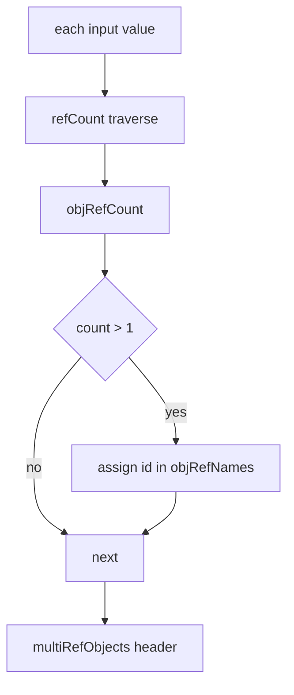
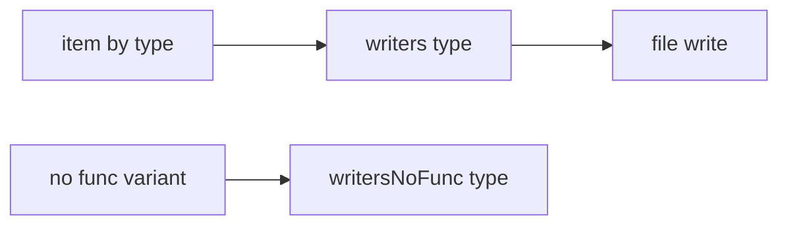
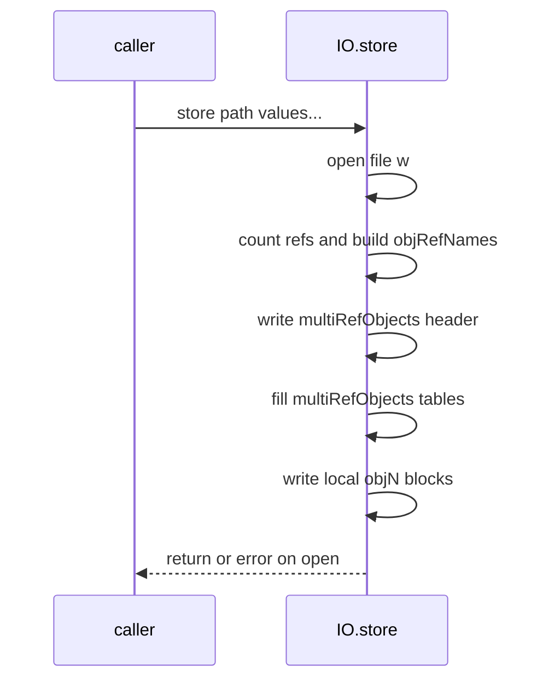

# IO store variants and multiref encoding

Persist multiple Lua values to disk with reference deduplication. Covers [AETHR.IO.store()](../../dev/IO.lua:63) and [AETHR.IO.storeNoFunc()](../../dev/IO.lua:134), the multiref table construction, and the writer dispatch helpers.

Primary anchors

- Store: [AETHR.IO.store()](../../dev/IO.lua:63)
- Store no function: [AETHR.IO.storeNoFunc()](../../dev/IO.lua:134)
- Reference counter: [refCount](../../dev/IO.lua:401)
- Writer dispatch: [write](../../dev/IO.lua:337), [writeNoFunc](../../dev/IO.lua:349), [writeIndent](../../dev/IO.lua:377)
- Writers: [writers](../../dev/IO.lua:422), [writersNoFunc](../../dev/IO.lua:488)

High level flow

Multiref construction logic

- [refCount](../../dev/IO.lua:401) traverses tables recursively and counts references
- Tables with count greater than 1 receive an index in objRefNames and an empty table slot in multiRefObjects

Writer selection

- [write](../../dev/IO.lua:337) selects from [writers](../../dev/IO.lua:422) by Lua type
- [writeNoFunc](../../dev/IO.lua:349) selects from [writersNoFunc](../../dev/IO.lua:488) that replaces function values with placeholders
- Functions with upvalues or non Lua are emitted as nil markers in writers

Store sequence

StoreNoFunc differences

- Uses [writeNoFunc](../../dev/IO.lua:349) to avoid serializing functions
- Places explicit INTENDEDSKIP markers in the serialized output via [writersNoFunc function handler](../../dev/IO.lua:528)

Edge cases and errors

- File open failure yields error via return error(e) inside [store](../../dev/IO.lua:63) and [storeNoFunc](../../dev/IO.lua:134)
- Circular references are handled by multiref encoding and refCount traversal

Validation checklist

- Store: [dev/IO.lua](../../dev/IO.lua:63)
- StoreNoFunc: [dev/IO.lua](../../dev/IO.lua:134)
- Reference counter: [dev/IO.lua](../../dev/IO.lua:401)
- Writers: [dev/IO.lua](../../dev/IO.lua:422), [dev/IO.lua](../../dev/IO.lua:488)

Related breakouts

- Load and deSerialize: [load_and_deserialize.md](./load_and_deserialize.md)
- Writers and refcount: [writers_and_refcount.md](./writers_and_refcount.md)
- Serialize to string: see [load_and_deserialize.md](./load_and_deserialize.md) for deSerialize pairing