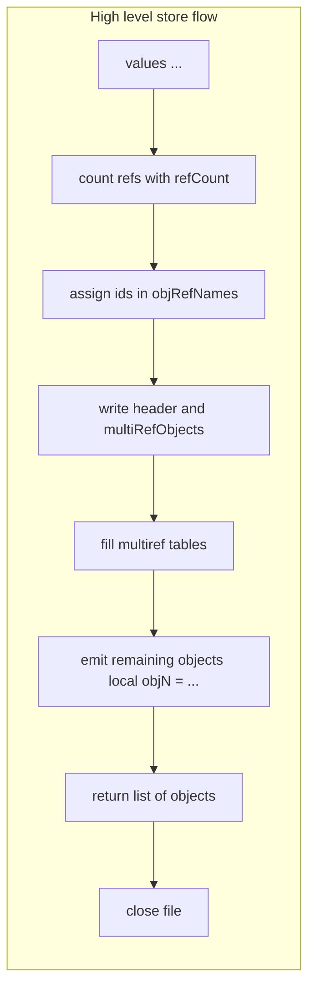
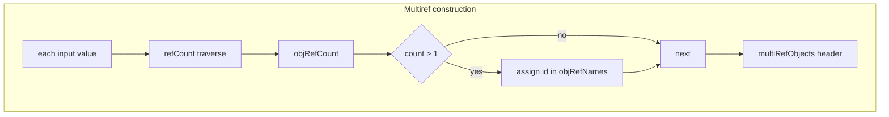
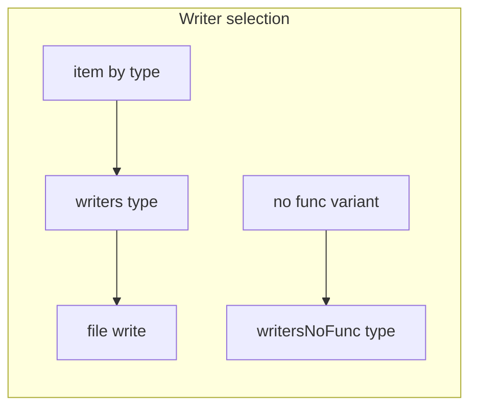

# IO store variants and multiref encoding

Persist multiple Lua values to disk with reference deduplication. Covers [AETHR.IO.store()](https://github.com/Gh0st352/AETHR/blob/main/dev/IO.lua#L63) and [AETHR.IO.storeNoFunc()](https://github.com/Gh0st352/AETHR/blob/main/dev/IO.lua#L134), the multiref table construction, and the writer dispatch helpers.

Primary anchors

- Store: [AETHR.IO.store()](https://github.com/Gh0st352/AETHR/blob/main/dev/IO.lua#L63)
- Store no function: [AETHR.IO.storeNoFunc()](https://github.com/Gh0st352/AETHR/blob/main/dev/IO.lua#L134)
- Reference counter: [refCount](https://github.com/Gh0st352/AETHR/blob/main/dev/IO.lua#L401)
- Writer dispatch: [write](https://github.com/Gh0st352/AETHR/blob/main/dev/IO.lua#L337), [writeNoFunc](https://github.com/Gh0st352/AETHR/blob/main/dev/IO.lua#L349), [writeIndent](https://github.com/Gh0st352/AETHR/blob/main/dev/IO.lua#L377)
- Writers: [writers](https://github.com/Gh0st352/AETHR/blob/main/dev/IO.lua#L422), [writersNoFunc](https://github.com/Gh0st352/AETHR/blob/main/dev/IO.lua#L488)

# High level flow

# Multiref construction logic

- [refCount](https://github.com/Gh0st352/AETHR/blob/main/dev/IO.lua#L401) traverses tables recursively and counts references
- Tables with count greater than 1 receive an index in objRefNames and an empty table slot in multiRefObjects

# Writer selection

- [write](https://github.com/Gh0st352/AETHR/blob/main/dev/IO.lua#L337) selects from [writers](https://github.com/Gh0st352/AETHR/blob/main/dev/IO.lua#L422) by Lua type
- [writeNoFunc](https://github.com/Gh0st352/AETHR/blob/main/dev/IO.lua#L349) selects from [writersNoFunc](https://github.com/Gh0st352/AETHR/blob/main/dev/IO.lua#L488) that replaces function values with placeholders
- Functions with upvalues or non Lua are emitted as nil markers in writers

# Store sequence

# StoreNoFunc differences

- Uses [writeNoFunc](https://github.com/Gh0st352/AETHR/blob/main/dev/IO.lua#L349) to avoid serializing functions
- Places explicit INTENDEDSKIP markers in the serialized output via [writersNoFunc function handler](https://github.com/Gh0st352/AETHR/blob/main/dev/IO.lua#L528)

# Edge cases and errors

- File open failure yields error via return error(e) inside [store](https://github.com/Gh0st352/AETHR/blob/main/dev/IO.lua#L63) and [storeNoFunc](https://github.com/Gh0st352/AETHR/blob/main/dev/IO.lua#L134)
- Circular references are handled by multiref encoding and refCount traversal

# Validation checklist

- Store: [dev/IO.lua](https://github.com/Gh0st352/AETHR/blob/main/dev/IO.lua#L63)
- StoreNoFunc: [dev/IO.lua](https://github.com/Gh0st352/AETHR/blob/main/dev/IO.lua#L134)
- Reference counter: [dev/IO.lua](https://github.com/Gh0st352/AETHR/blob/main/dev/IO.lua#L401)
- Writers: [dev/IO.lua](https://github.com/Gh0st352/AETHR/blob/main/dev/IO.lua#L422), [dev/IO.lua](https://github.com/Gh0st352/AETHR/blob/main/dev/IO.lua#L488)

# Related breakouts

- Load and deSerialize: [load_and_deserialize.md](./load_and_deserialize.md)
- Writers and refcount: [writers_and_refcount.md](./writers_and_refcount.md)
- Serialize to string: see [load_and_deserialize.md](./load_and_deserialize.md) for deSerialize pairing