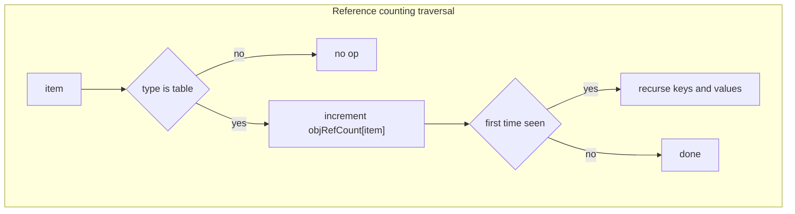
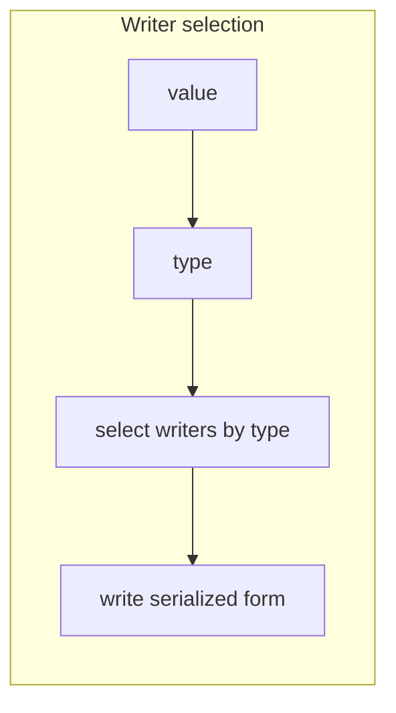
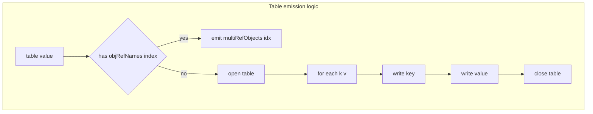
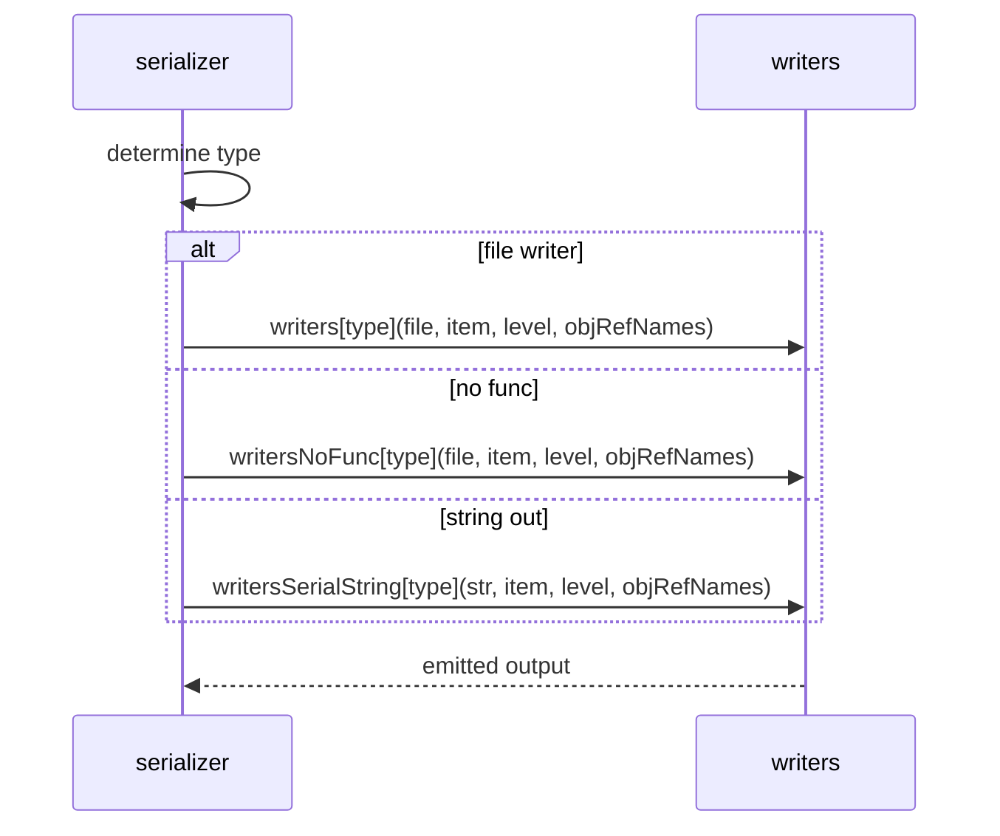

# IO writers and refCount internals

Details of the reference counting pass and the writer dispatch tables for serializing Lua values. Explains how tables are deduplicated via multiref encoding and how each Lua type is emitted, including function handling strategies.

Primary anchors

- Reference counting: [refCount](https://github.com/Gh0st352/AETHR/blob/main/dev/IO.lua#L401)
- Writer dispatch helpers: [write](https://github.com/Gh0st352/AETHR/blob/main/dev/IO.lua#L337), [writeNoFunc](https://github.com/Gh0st352/AETHR/blob/main/dev/IO.lua#L349), [writeSerialString](https://github.com/Gh0st352/AETHR/blob/main/dev/IO.lua#L361)
- Writer tables by type:
  - File writers: [writers](https://github.com/Gh0st352/AETHR/blob/main/dev/IO.lua#L422)
  - File writers no functions: [writersNoFunc](https://github.com/Gh0st352/AETHR/blob/main/dev/IO.lua#L488)
  - String writers no functions: [writersSerialString](https://github.com/Gh0st352/AETHR/blob/main/dev/IO.lua#L546)
- Indentation helpers: [writeIndent](https://github.com/Gh0st352/AETHR/blob/main/dev/IO.lua#L377), [writeIndentSerial](https://github.com/Gh0st352/AETHR/blob/main/dev/IO.lua#L383)

# Reference counting traversal

- Only tables are counted; primitives are not tracked
- First-time table encounters recurse into both keys and values to capture nested structures and shared subgraphs

# Writer selection

- [write](https://github.com/Gh0st352/AETHR/blob/main/dev/IO.lua#L337) uses [writers](https://github.com/Gh0st352/AETHR/blob/main/dev/IO.lua#L422)
- [writeNoFunc](https://github.com/Gh0st352/AETHR/blob/main/dev/IO.lua#L349) uses [writersNoFunc](https://github.com/Gh0st352/AETHR/blob/main/dev/IO.lua#L488)
- [writeSerialString](https://github.com/Gh0st352/AETHR/blob/main/dev/IO.lua#L361) uses [writersSerialString](https://github.com/Gh0st352/AETHR/blob/main/dev/IO.lua#L546)

# Table emission logic

# Function handling

- writers (file):
  - If function has upvalues or is not Lua, emits a nil marker with explanatory comment
  - If dumpable, emits loadstring with dumped bytecode
- writersNoFunc (file):
  - Emits explicit placeholder nil marker INTENDEDSKIP for all functions
- writersSerialString (string):
  - Emits placeholder nil marker for functions to keep output executable

Indentation helpers

- [writeIndent](https://github.com/Gh0st352/AETHR/blob/main/dev/IO.lua#L377) writes tabs to file for pretty formatting
- [writeIndentSerial](https://github.com/Gh0st352/AETHR/blob/main/dev/IO.lua#L383) writes two spaces per level into the serialized string

# Sequence for writer dispatch

# Validation checklist

- refCount recursion: [dev/IO.lua](https://github.com/Gh0st352/AETHR/blob/main/dev/IO.lua#L401)
- File writers: [dev/IO.lua](https://github.com/Gh0st352/AETHR/blob/main/dev/IO.lua#L422)
- File writers no func: [dev/IO.lua](https://github.com/Gh0st352/AETHR/blob/main/dev/IO.lua#L488)
- String writers no func: [dev/IO.lua](https://github.com/Gh0st352/AETHR/blob/main/dev/IO.lua#L546)
- Dispatch helpers: [dev/IO.lua](https://github.com/Gh0st352/AETHR/blob/main/dev/IO.lua#L337), [dev/IO.lua](https://github.com/Gh0st352/AETHR/blob/main/dev/IO.lua#L349), [dev/IO.lua](https://github.com/Gh0st352/AETHR/blob/main/dev/IO.lua#L361)

# Related breakouts

- Store and variants: [store_and_variants.md](./store_and_variants.md)
- Load and deSerialize: [load_and_deserialize.md](./load_and_deserialize.md)
- Serialize to string NoFunc: [serialize_nofunc.md](./serialize_nofunc.md)

# Conventions

- Mermaid fenced blocks with GitHub parser
- Labels avoid double quotes and parentheses inside bracket text
- All links use relative paths for portability