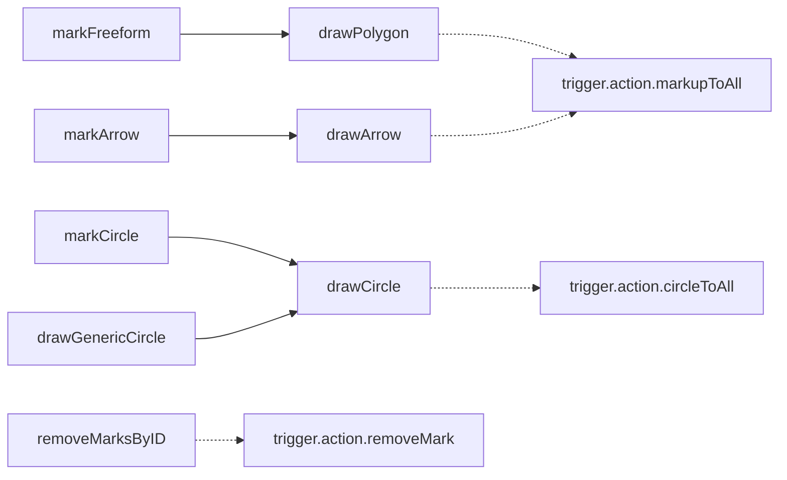
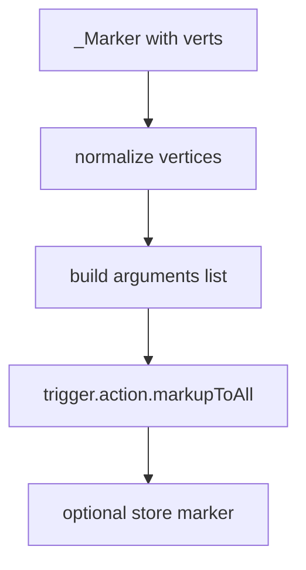
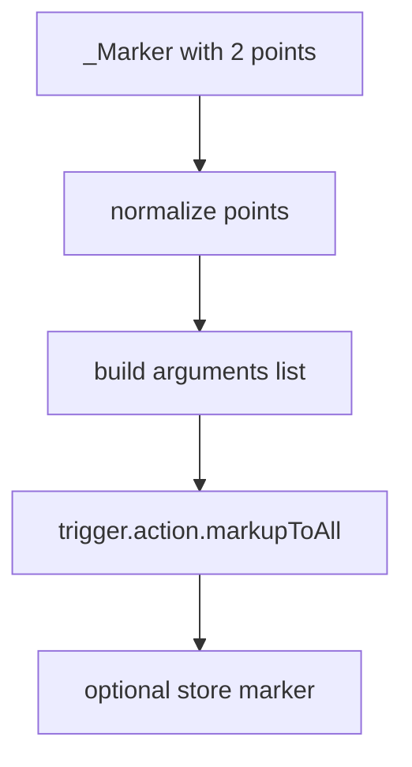
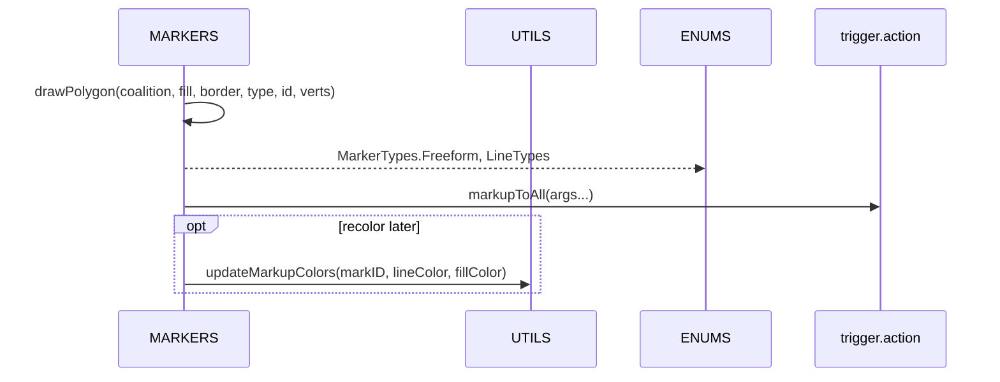
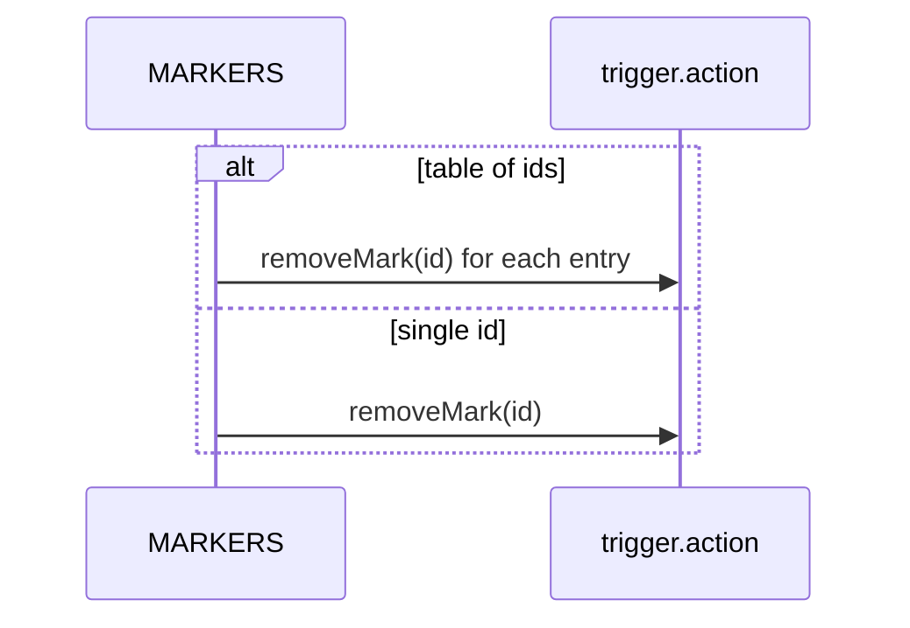

# AETHR MARKERS diagrams and flows

Primary anchors
- [AETHR.MARKERS:markFreeform()](../../dev/MARKERS.lua:43)
- [AETHR.MARKERS:drawPolygon()](../../dev/MARKERS.lua:85)
- [AETHR.MARKERS:markArrow()](../../dev/MARKERS.lua:139)
- [AETHR.MARKERS:drawArrow()](../../dev/MARKERS.lua:176)
- [AETHR.MARKERS:markCircle()](../../dev/MARKERS.lua:229)
- [AETHR.MARKERS:drawCircle()](../../dev/MARKERS.lua:269)
- [AETHR.MARKERS:drawGenericCircle()](../../dev/MARKERS.lua:299)
- [AETHR.MARKERS:removeMarksByID()](../../dev/MARKERS.lua:318)

Related anchors
- ENUM constants: [AETHR.ENUMS.MarkerTypes](../../dev/ENUMS.lua:461), [AETHR.ENUMS.LineTypes](../../dev/ENUMS.lua:452)
- Update colors: [AETHR.UTILS:updateMarkupColors()](../../dev/UTILS.lua:188)

Documents and indices
- Master diagrams index: [docs/README.md](docs/README.md)
- ZONE_MANAGER: [docs/zone_manager/README.md](../zone_manager/README.md)
- WORLD: [docs/world/README.md](../world/README.md)

Overview relationships

Freeform polygon flow

Arrow flow

Circle flow

Runtime sequence for drawing polygon

Remove marks sequence

Key anchors
- Freeform: [AETHR.MARKERS:markFreeform()](../../dev/MARKERS.lua:43), [AETHR.MARKERS:drawPolygon()](../../dev/MARKERS.lua:85)
- Arrow: [AETHR.MARKERS:markArrow()](../../dev/MARKERS.lua:139), [AETHR.MARKERS:drawArrow()](../../dev/MARKERS.lua:176)
- Circle: [AETHR.MARKERS:markCircle()](../../dev/MARKERS.lua:229), [AETHR.MARKERS:drawCircle()](../../dev/MARKERS.lua:269), [AETHR.MARKERS:drawGenericCircle()](../../dev/MARKERS.lua:299)
- Removal: [AETHR.MARKERS:removeMarksByID()](../../dev/MARKERS.lua:318)

Notes
- Mermaid labels avoid double quotes and parentheses.
- All diagrams use GitHub Mermaid fenced blocks.