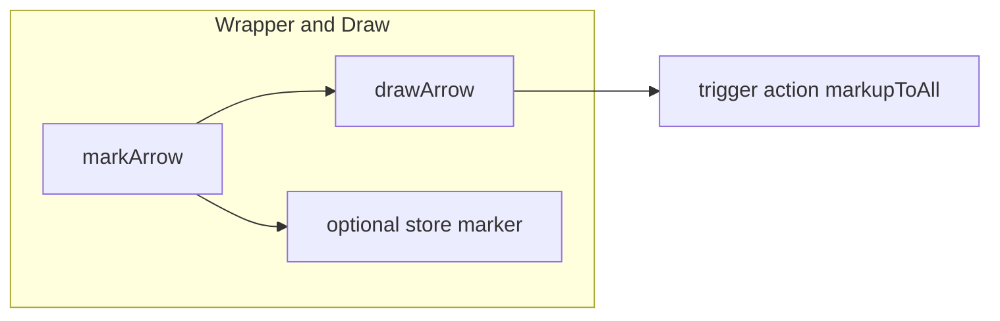
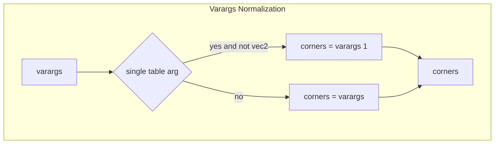
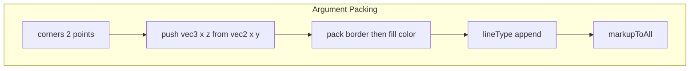
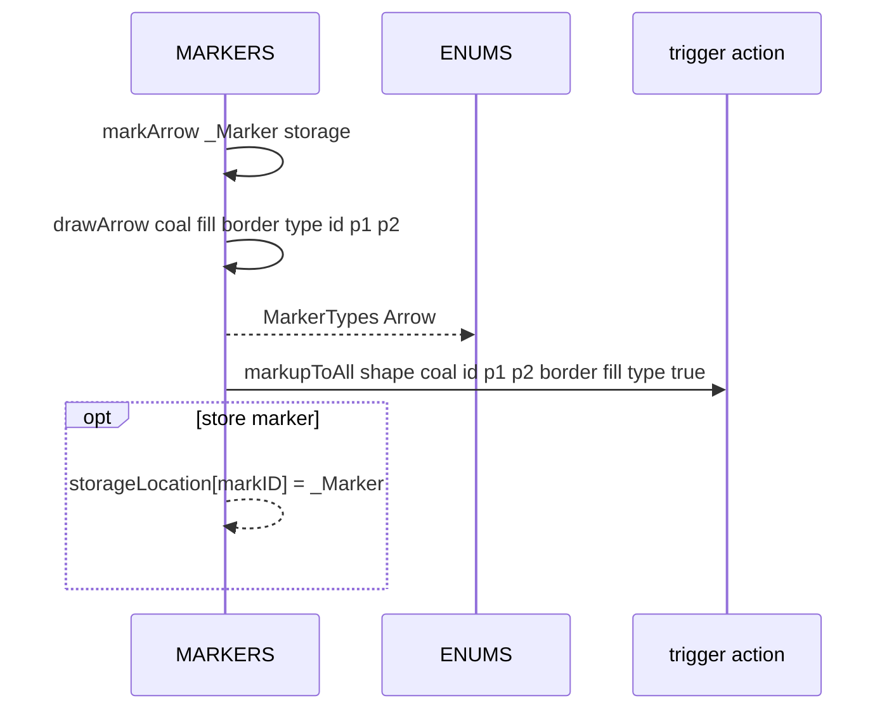

# MARKERS arrows

Arrow drawing wrapper and core function. Documents [AETHR.MARKERS:markArrow()](https://github.com/Gh0st352/AETHR/blob/main/dev/MARKERS.lua#L139) and [AETHR.MARKERS:drawArrow()](https://github.com/Gh0st352/AETHR/blob/main/dev/MARKERS.lua#L176), including varargs normalization, color packing, and trigger calls.

# Primary anchors

- Wrapper arrow: [AETHR.MARKERS:markArrow()](https://github.com/Gh0st352/AETHR/blob/main/dev/MARKERS.lua#L139)
- Draw arrow core: [AETHR.MARKERS:drawArrow()](https://github.com/Gh0st352/AETHR/blob/main/dev/MARKERS.lua#L176)

# Overview flow

# markArrow behavior

- Guards on _Marker table
- Defaults
  - coalition -1
  - fillColor and lineColor default black with alpha 0
  - lineType 0
  - markID 0
  - freeFormVec2Table used as two point list
- Calls [drawArrow](https://github.com/Gh0st352/AETHR/blob/main/dev/MARKERS.lua#L176) then optionally stores _Marker by markID

# Varargs normalization

- Accepts either a single array like table of vec2 or two vec2 arguments
- Requires exactly 2 points; returns early otherwise

# Argument packing

- Arrow uses MarkerTypes Arrow as shape identifier
  - shapeTypeID = [AETHR.ENUMS.MarkerTypes.Arrow](https://github.com/Gh0st352/AETHR/blob/main/dev/ENUMS.lua#L465)
- Note: Unlike polygon, arrow points are inserted in forward order (no reverse)

# Sequence

# Validation checklist

- Wrapper: [dev/MARKERS.lua](https://github.com/Gh0st352/AETHR/blob/main/dev/MARKERS.lua#L139)
- Draw core: [dev/MARKERS.lua](https://github.com/Gh0st352/AETHR/blob/main/dev/MARKERS.lua#L176)
- Packing and call: [dev/MARKERS.lua](https://github.com/Gh0st352/AETHR/blob/main/dev/MARKERS.lua#L213)

# Related breakouts

- Polygons and freeform: [polygons.md](./polygons.md)
- Circles and generic circle: [circles.md](./circles.md)
- Removal helpers: [removal.md](./removal.md)

# Conventions

- Mermaid fenced blocks with GitHub parser
- Labels avoid double quotes and parentheses inside bracket text
- All links use relative paths for portability