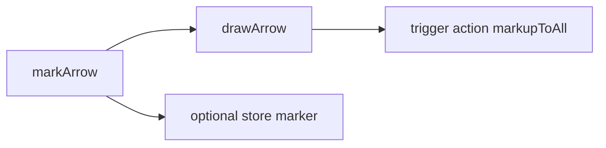
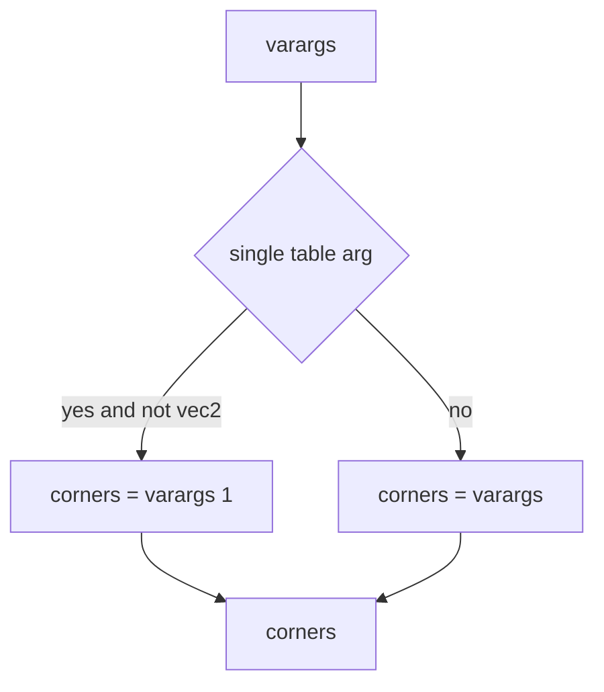
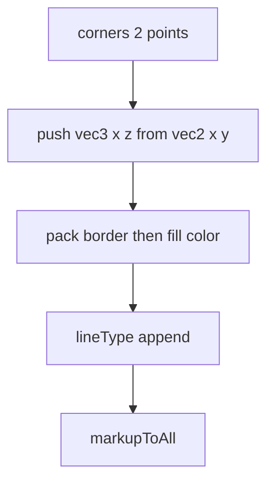
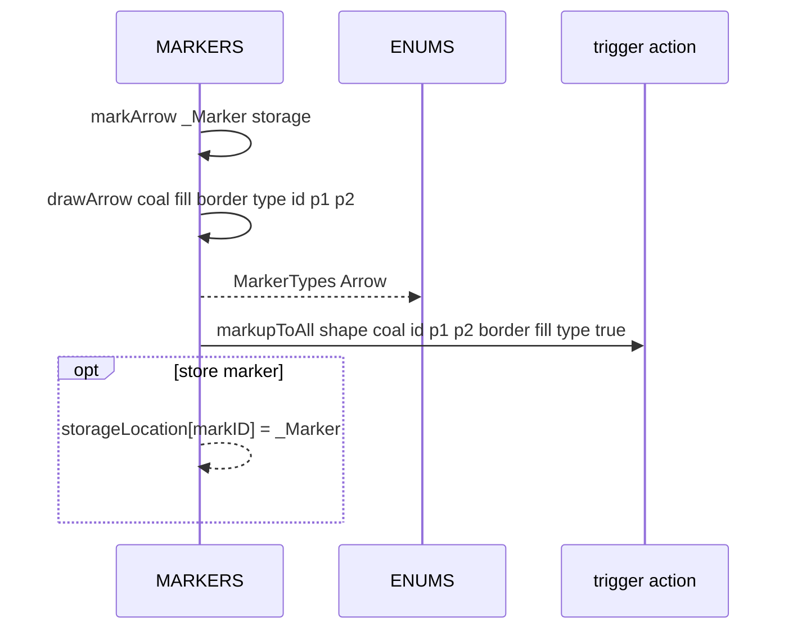

# MARKERS arrows

Arrow drawing wrapper and core function. Documents [AETHR.MARKERS:markArrow()](../../dev/MARKERS.lua:139) and [AETHR.MARKERS:drawArrow()](../../dev/MARKERS.lua:176), including varargs normalization, color packing, and trigger calls.

Primary anchors

- Wrapper arrow: [AETHR.MARKERS:markArrow()](../../dev/MARKERS.lua:139)
- Draw arrow core: [AETHR.MARKERS:drawArrow()](../../dev/MARKERS.lua:176)

Overview flow

markArrow behavior

- Guards on _Marker table
- Defaults
  - coalition -1
  - fillColor and lineColor default black with alpha 0
  - lineType 0
  - markID 0
  - freeFormVec2Table used as two point list
- Calls [drawArrow](../../dev/MARKERS.lua:176) then optionally stores _Marker by markID

Varargs normalization

- Accepts either a single array like table of vec2 or two vec2 arguments
- Requires exactly 2 points; returns early otherwise

Argument packing

- Arrow uses MarkerTypes Arrow as shape identifier
  - shapeTypeID = [AETHR.ENUMS.MarkerTypes.Arrow](../../dev/ENUMS.lua:465)
- Note: Unlike polygon, arrow points are inserted in forward order (no reverse)

Sequence

Validation checklist

- Wrapper: [dev/MARKERS.lua](../../dev/MARKERS.lua:139)
- Draw core: [dev/MARKERS.lua](../../dev/MARKERS.lua:176)
- Packing and call: [dev/MARKERS.lua](../../dev/MARKERS.lua:213)

Related breakouts

- Polygons and freeform: [polygons.md](./polygons.md)
- Circles and generic circle: [circles.md](./circles.md)
- Removal helpers: [removal.md](./removal.md)

Conventions

- Mermaid fenced blocks with GitHub parser
- Labels avoid double quotes and parentheses inside bracket text
- All links use relative paths for portability