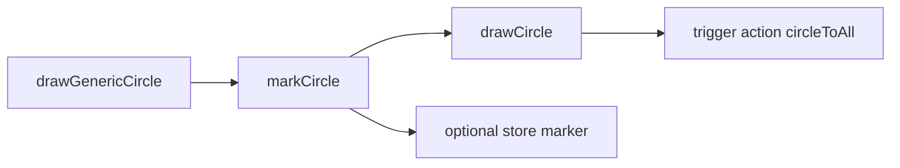
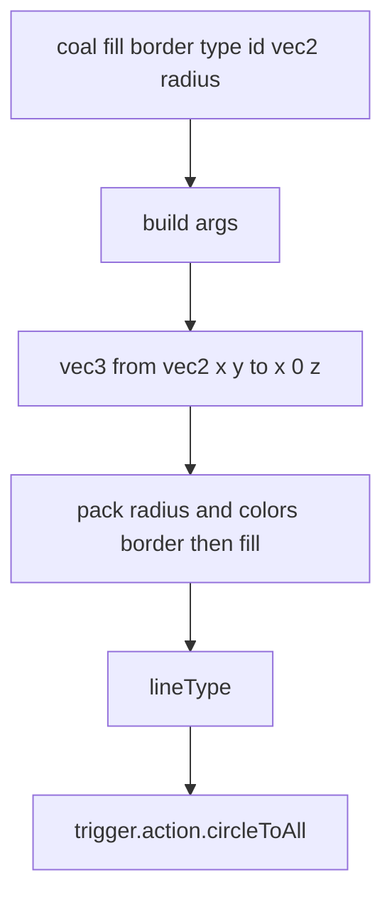
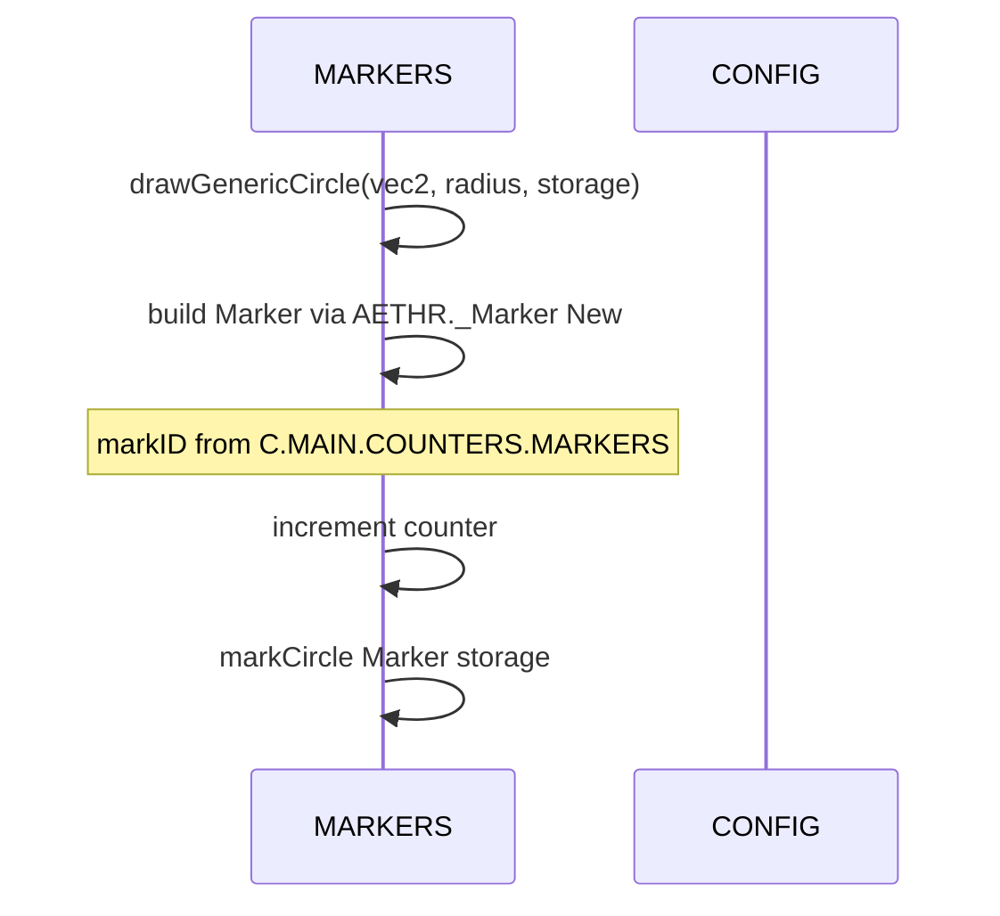
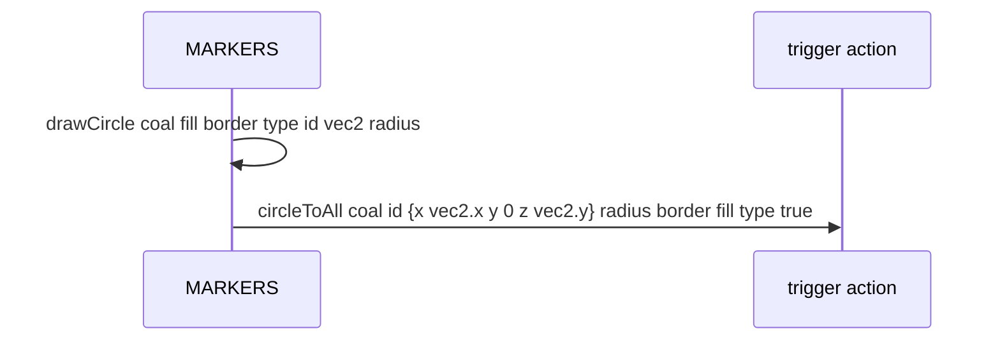

# MARKERS circles

Circle marker wrapper, core draw API, and generic neutral helper. Documents [AETHR.MARKERS:markCircle()](../../dev/MARKERS.lua:229), [AETHR.MARKERS:drawCircle()](../../dev/MARKERS.lua:269), and [AETHR.MARKERS:drawGenericCircle()](../../dev/MARKERS.lua:299).

Primary anchors

- Wrapper circle: [AETHR.MARKERS:markCircle()](../../dev/MARKERS.lua:229)
- Draw circle core: [AETHR.MARKERS:drawCircle()](../../dev/MARKERS.lua:269)
- Generic neutral: [AETHR.MARKERS:drawGenericCircle()](../../dev/MARKERS.lua:299)

Overview flow

markCircle behavior

- Guards on _Marker table
- Defaults
  - coalition -1
  - fillColor and lineColor default black with alpha 0
  - lineType 0
  - markID 0
  - vec2Origin required center point table with x and y
  - radius defaults to 1000 if not in _Marker
- Calls [drawCircle](../../dev/MARKERS.lua:269) then optionally stores _Marker by markID into storageLocation

drawCircle argument packing

- Note that drawCircle builds margs without an explicit shape type id
- Final call ordering:
  - coalition, markerID
  - vec3 center
  - radius
  - border color array { r g b a }
  - fill color array { r g b a }
  - lineType
  - true
- See call site: [AETHR.MARKERS:drawCircle](../../dev/MARKERS.lua:269) and final call at [circleToAll](../../dev/MARKERS.lua:286)

Generic neutral circle

- Uses neutral paint settings from CONFIG
  - Line type: [CONFIG.MAIN.Zone.paintColors.lineType](../../dev/CONFIG_.lua:317)
  - Circle colors: [CONFIG.MAIN.Zone.paintColors.CircleColors](../../dev/CONFIG_.lua:312)
- Marker id sourced from [CONFIG.MAIN.COUNTERS.MARKERS](../../dev/CONFIG_.lua:192) and incremented each call

Circle sequence

Validation checklist

- markCircle wrapper: [dev/MARKERS.lua](../../dev/MARKERS.lua:229)
- drawCircle core: [dev/MARKERS.lua](../../dev/MARKERS.lua:269)
- circleToAll call: [dev/MARKERS.lua](../../dev/MARKERS.lua:286)
- drawGenericCircle helper: [dev/MARKERS.lua](../../dev/MARKERS.lua:299)
- CONFIG references for colors and counters: [dev/CONFIG_.lua](../../dev/CONFIG_.lua:192), [dev/CONFIG_.lua](../../dev/CONFIG_.lua:312), [dev/CONFIG_.lua](../../dev/CONFIG_.lua:317)

Related breakouts

- Polygons and freeform: [polygons.md](./polygons.md)
- Arrows: [arrows.md](./arrows.md)
- Removal helpers: [removal.md](./removal.md)

Conventions

- Mermaid fenced blocks with GitHub parser
- Labels avoid double quotes and parentheses inside bracket text
- All links use relative paths for portability