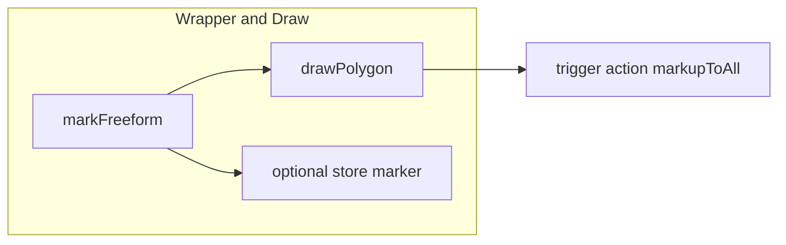
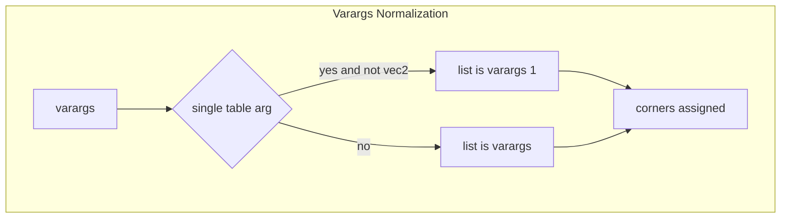
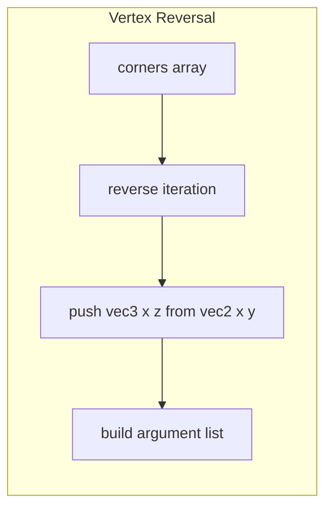
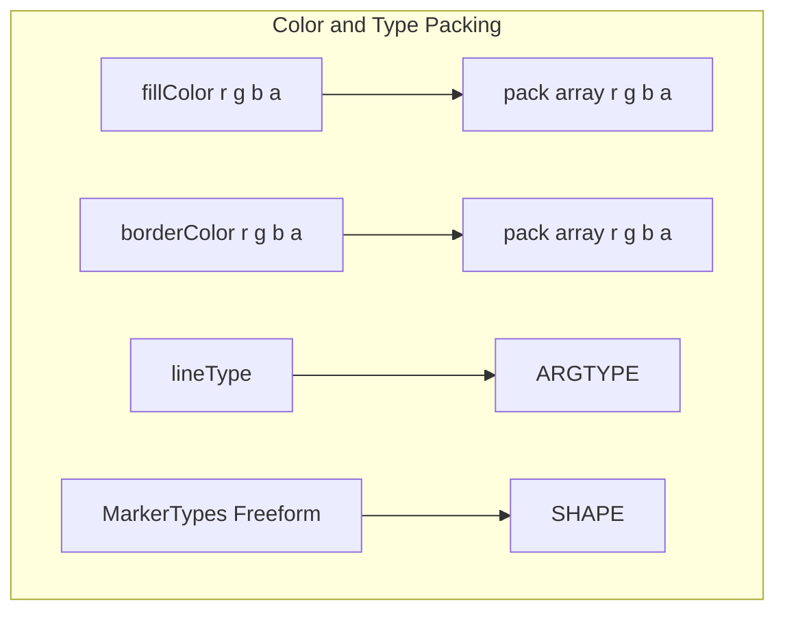
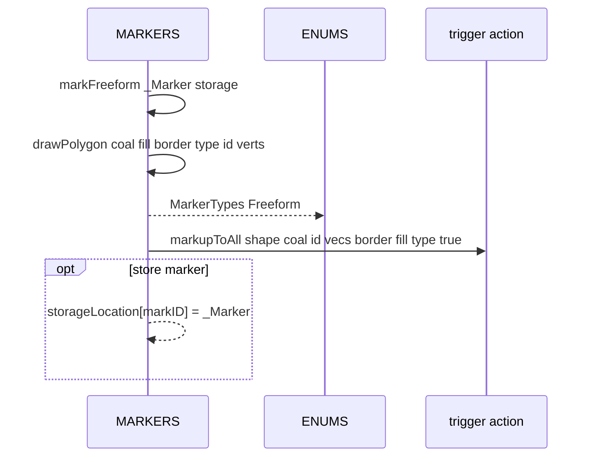

# MARKERS polygons and freeform

Freeform polygon drawing and its convenience wrapper. Documents [AETHR.MARKERS:markFreeform()](https://github.com/Gh0st352/AETHR/blob/main/dev/MARKERS.lua#L43) and [AETHR.MARKERS:drawPolygon()](https://github.com/Gh0st352/AETHR/blob/main/dev/MARKERS.lua#L85), including varargs normalization, vertex order, color packing, and trigger calls.

Primary anchors

- Wrapper freeform: [AETHR.MARKERS:markFreeform()](https://github.com/Gh0st352/AETHR/blob/main/dev/MARKERS.lua#L43)
- Draw polygon core: [AETHR.MARKERS:drawPolygon()](https://github.com/Gh0st352/AETHR/blob/main/dev/MARKERS.lua#L85)

# Overview flow

# markFreeform behavior

- Guards on _Marker table
- Fields with defaults
  - coalition default -1
  - fillColor and lineColor defaults to black with alpha 0
  - lineType default 0
  - markID default 0
  - freeFormVec2Table passed as verts
- Calls [drawPolygon](https://github.com/Gh0st352/AETHR/blob/main/dev/MARKERS.lua#L85) then optionally stores _Marker by markID into storageLocation

# Varargs normalization

- Single array like table of vec2 is accepted
- Or multiple vec2 arguments are accepted

# Vertex order reversal

- For polygons, vertices are pushed in reverse order to preserve original orientation from prior flows
- Each vec2 v yields vec3 { x v.x, y 0, z v.y }

# Color and type packing

- Border color is inserted before fill color per API order used by draw functions
- Shape type id uses MarkerTypes Freeform

# Sequence

# Arguments layout for markupToAll

- shapeTypeID, coalition, markerID
- vec3 points in order
- border color array
- fill color array
- line type
- true

# Validation checklist

- Wrapper: [dev/MARKERS.lua](https://github.com/Gh0st352/AETHR/blob/main/dev/MARKERS.lua#L43)
- Draw core: [dev/MARKERS.lua](https://github.com/Gh0st352/AETHR/blob/main/dev/MARKERS.lua#L85)
- Reverse order push loop: [dev/MARKERS.lua](https://github.com/Gh0st352/AETHR/blob/main/dev/MARKERS.lua#L117)
- Color packing and final call: [dev/MARKERS.lua](https://github.com/Gh0st352/AETHR/blob/main/dev/MARKERS.lua#L122)

# Related breakouts

- Arrows wrapper and draw: [arrows.md](./arrows.md)
- Circles and generic circle: [circles.md](./circles.md)
- Removal helpers: [removal.md](./removal.md)

# Conventions

- Mermaid fenced blocks with GitHub parser
- Labels avoid double quotes and parentheses inside bracket text
- All links use relative paths for portability