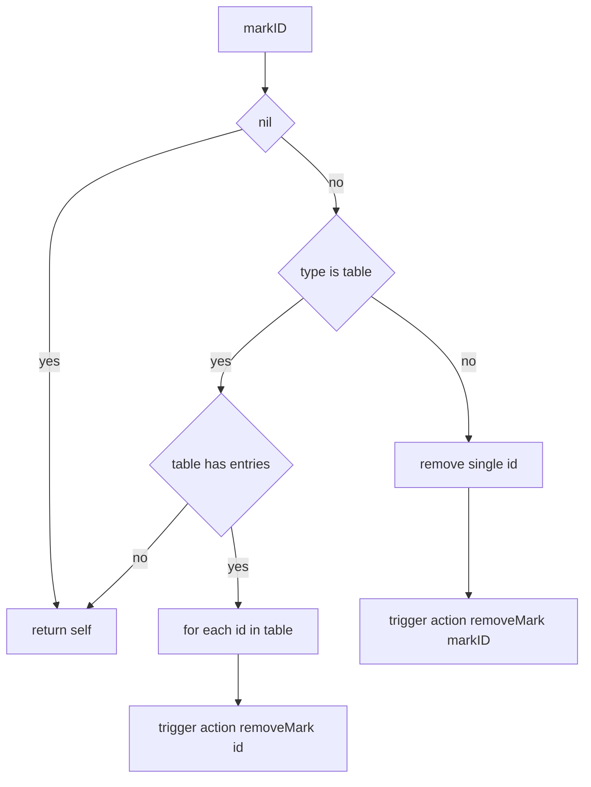
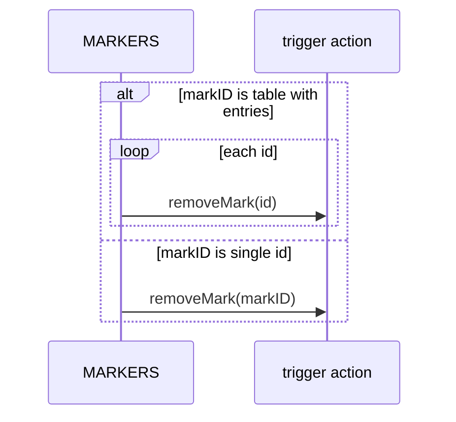

# MARKERS removal

Remove one or multiple map marks by id. Documents [AETHR.MARKERS:removeMarksByID()](../../dev/MARKERS.lua:318) behavior for single numeric id and table of ids, with guard conditions.

Primary anchor

- Remove marks: [AETHR.MARKERS:removeMarksByID()](../../dev/MARKERS.lua:318)

Overview

- Accepts either:
  - a single marker id number
  - a table of ids as keys or numeric list
- Guards:
  - If markID is nil, returns self
  - If markID is a table and empty, returns self
- Calls trigger.action.removeMark(id) for each id

Flow

Sequence

Usage notes

- Works with both key sets and array lists
- No error is raised on missing ids; DCS handles silently

Validation checklist

- Entry point: [dev/MARKERS.lua](../../dev/MARKERS.lua:318)
- Table guard and loop: [dev/MARKERS.lua](../../dev/MARKERS.lua:322)
- Single id path: [dev/MARKERS.lua](../../dev/MARKERS.lua:329)

Related breakouts

- Polygons and freeform: [polygons.md](./polygons.md)
- Arrows: [arrows.md](./arrows.md)
- Circles and generic circle: [circles.md](./circles.md)

Conventions

- Mermaid fenced blocks with GitHub parser
- Labels avoid double quotes and parentheses inside bracket text
- All links use relative paths for portability