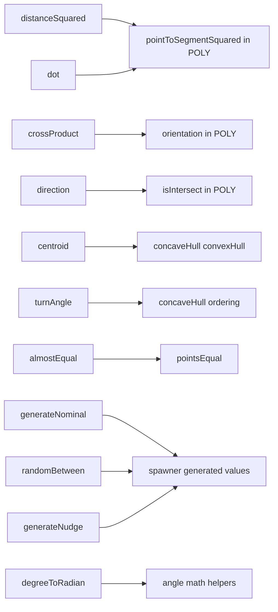
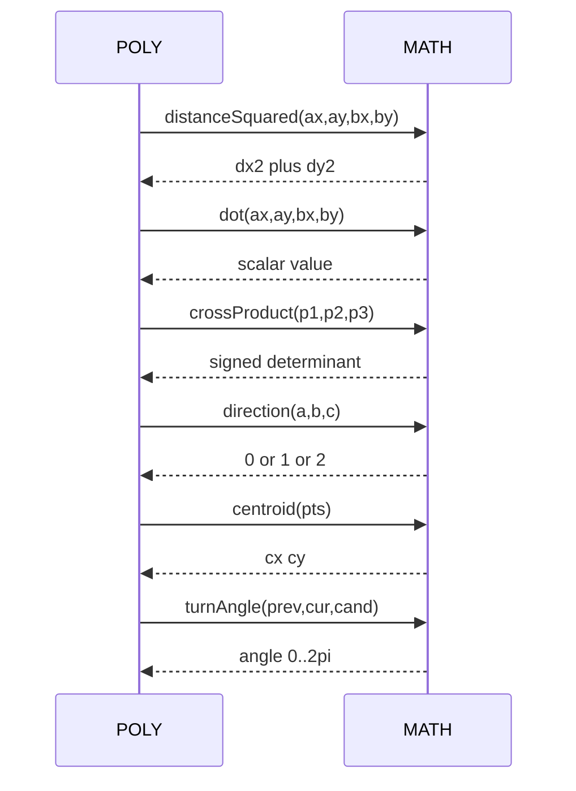
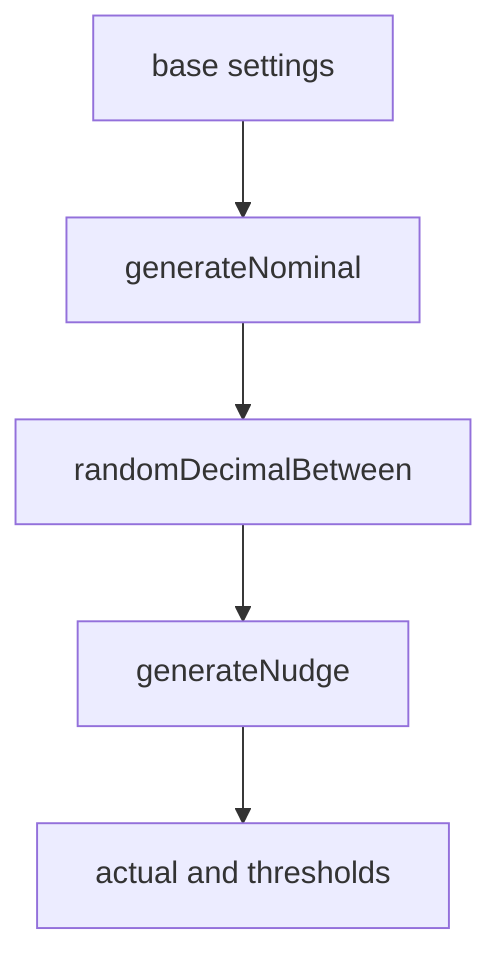
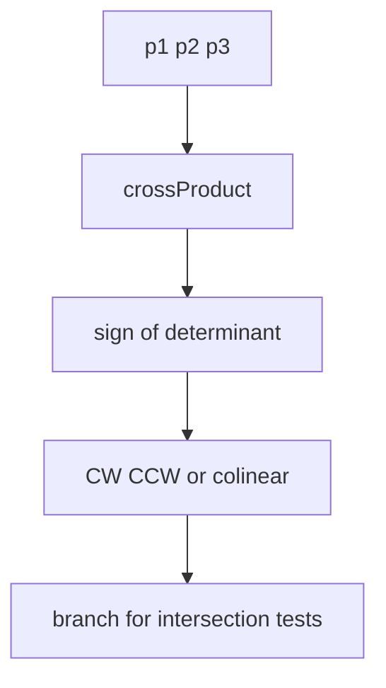
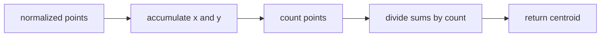

# AETHR MATH diagrams and flows

## Primary anchors
- [AETHR.MATH:crossProduct()](https://github.com/Gh0st352/AETHR/blob/main/dev/MATH_.lua#L29)
- [AETHR.MATH:computeRatio()](https://github.com/Gh0st352/AETHR/blob/main/dev/MATH_.lua#L43)
- [AETHR.MATH:distanceSquared()](https://github.com/Gh0st352/AETHR/blob/main/dev/MATH_.lua#L58)
- [AETHR.MATH:dot()](https://github.com/Gh0st352/AETHR/blob/main/dev/MATH_.lua#L75)
- [AETHR.MATH:direction()](https://github.com/Gh0st352/AETHR/blob/main/dev/MATH_.lua#L96)
- [AETHR.MATH:almostEqual()](https://github.com/Gh0st352/AETHR/blob/main/dev/MATH_.lua#L118)
- [AETHR.MATH:pointsEqual()](https://github.com/Gh0st352/AETHR/blob/main/dev/MATH_.lua#L129)
- [AETHR.MATH:turnAngle()](https://github.com/Gh0st352/AETHR/blob/main/dev/MATH_.lua#L142)
- [AETHR.MATH:centroid()](https://github.com/Gh0st352/AETHR/blob/main/dev/MATH_.lua#L157)
- [AETHR.MATH:generateNominal()](https://github.com/Gh0st352/AETHR/blob/main/dev/MATH_.lua#L181)
- [AETHR.MATH:randomDecimalBetween()](https://github.com/Gh0st352/AETHR/blob/main/dev/MATH_.lua#L215)
- [AETHR.MATH:generateNudge()](https://github.com/Gh0st352/AETHR/blob/main/dev/MATH_.lua#L233)
- [AETHR.MATH:degreeToRadian()](https://github.com/Gh0st352/AETHR/blob/main/dev/MATH_.lua#L252)

## Breakout documents
- Orientation: [docs/math/orientation.md](orientation.md)
- Vectors and angles: [docs/math/vectors.md](vectors.md)
- Equality and centroid: [docs/math/equality_and_centroid.md](equality_and_centroid.md)
- Randomization helpers: [docs/math/randomization.md](randomization.md)
- Degree and turn angle notes: [docs/math/angles.md](angles.md)

## Documents and indices
- Master diagrams index: [docs/README.md](../README.md)
- POLY: [docs/poly/README.md](../poly/README.md)
- SPAWNER: [docs/spawner/README.md](../spawner/README.md)
- ZONE_MANAGER: [docs/zone_manager/README.md](../zone_manager/README.md)

# Overview relationships

# Geometry helper usage

# Spawner numeric generation

# Algorithm sketches

## - Orientation and intersection

## - Centroid of point set

# Key anchors in consumers
- POLY: [pointToSegmentSquared](https://github.com/Gh0st352/AETHR/blob/main/dev/POLY.lua#L1149), [getEquallySpacedPoints](https://github.com/Gh0st352/AETHR/blob/main/dev/POLY.lua#L1074), [isWithinOffset](https://github.com/Gh0st352/AETHR/blob/main/dev/POLY.lua#L1106), [concaveHull](https://github.com/Gh0st352/AETHR/blob/main/dev/POLY.lua#L1309), [convexHull](https://github.com/Gh0st352/AETHR/blob/main/dev/POLY.lua#L1461)
- SPAWNER types and counts: see [docs/spawner/types_and_counts.md](../spawner/types_and_counts.md) and [docs/spawner/pipeline.md](../spawner/pipeline.md)

# Notes
- Mermaid labels avoid double quotes and parentheses.
- All diagrams use GitHub Mermaid fenced blocks.