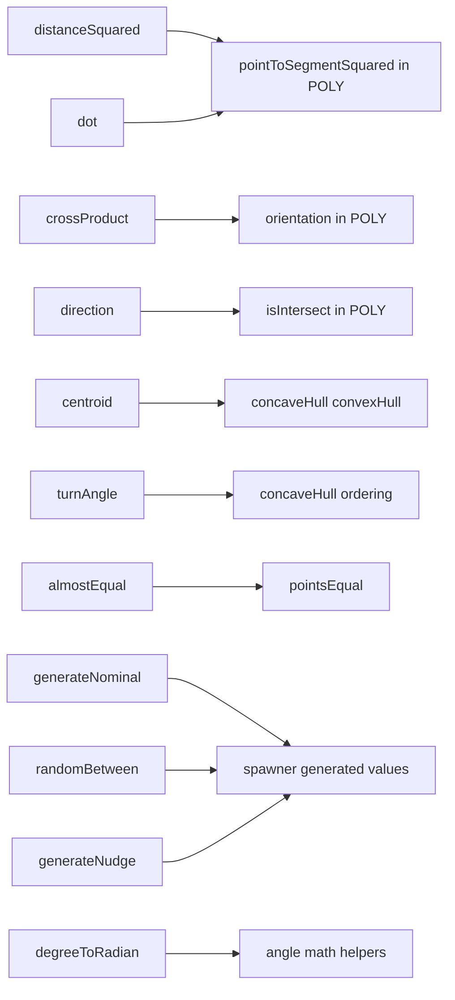
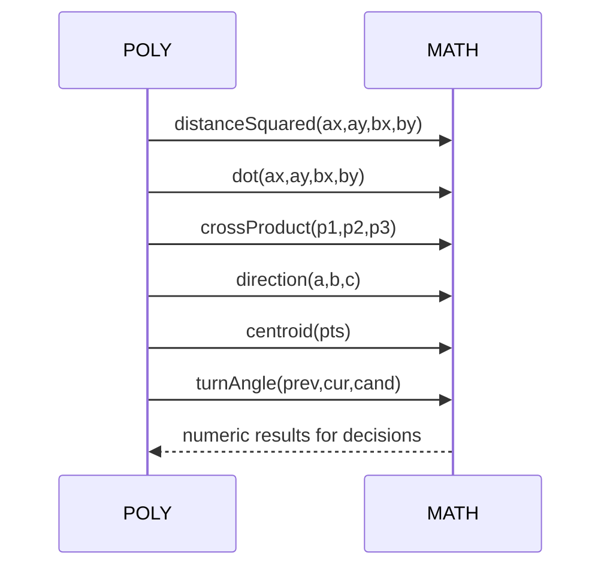
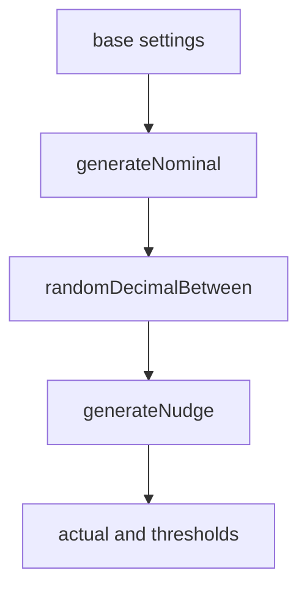
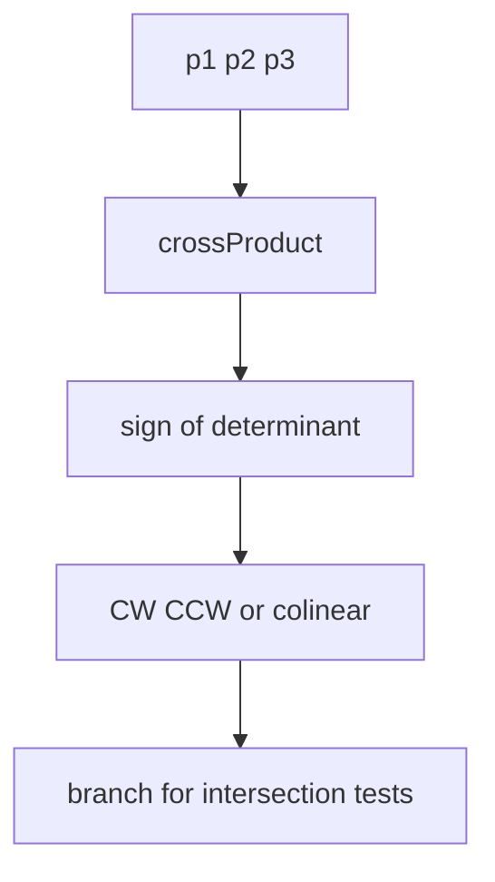
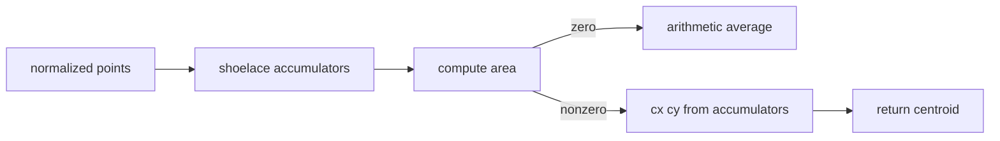

# AETHR MATH diagrams and flows

Primary anchors
- [AETHR.MATH:crossProduct()](../../dev/MATH_.lua:29)
- [AETHR.MATH:computeRatio()](../../dev/MATH_.lua:44)
- [AETHR.MATH:distanceSquared()](../../dev/MATH_.lua:59)
- [AETHR.MATH:dot()](../../dev/MATH_.lua:76)
- [AETHR.MATH:direction()](../../dev/MATH_.lua:96)
- [AETHR.MATH:almostEqual()](../../dev/MATH_.lua:119)
- [AETHR.MATH:pointsEqual()](../../dev/MATH_.lua:130)
- [AETHR.MATH:turnAngle()](../../dev/MATH_.lua:143)
- [AETHR.MATH:centroid()](../../dev/MATH_.lua:157)
- [AETHR.MATH:generateNominal()](../../dev/MATH_.lua:182)
- [AETHR.MATH:randomDecimalBetween()](../../dev/MATH_.lua:215)
- [AETHR.MATH:generateNudge()](../../dev/MATH_.lua:234)
- [AETHR.MATH:degreeToRadian()](../../dev/MATH_.lua:253)

Documents and indices
- Master diagrams index: [docs/README.md](../README.md)
- POLY: [docs/poly/README.md](../poly/README.md)
- SPAWNER: [docs/spawner/README.md](../spawner/README.md)
- ZONE_MANAGER: [docs/zone_manager/README.md](../zone_manager/README.md)

Overview relationships

Geometry helper usage

Spawner numeric generation

Algorithm sketches

- Orientation and intersection

- Centroid of polygon

Key anchors in consumers
- POLY: [pointToSegmentSquared](../../dev/POLY.lua:1149), [getEquallySpacedPoints](../../dev/POLY.lua:1074), [isWithinOffset](../../dev/POLY.lua:1107), [concaveHull](../../dev/POLY.lua:1309), [convexHull](../../dev/POLY.lua:1461)
- SPAWNER types and counts: see [docs/spawner/types_and_counts.md](../spawner/types_and_counts.md) and [docs/spawner/pipeline.md](../spawner/pipeline.md)

Notes
- Mermaid labels avoid double quotes and parentheses.
- All diagrams use GitHub Mermaid fenced blocks.