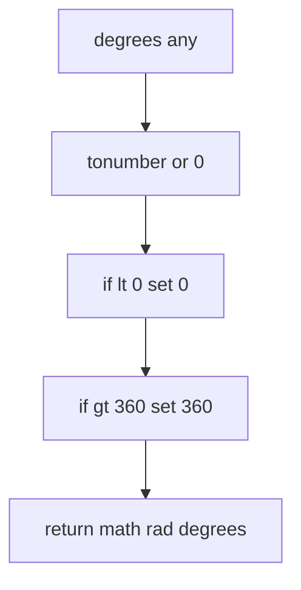
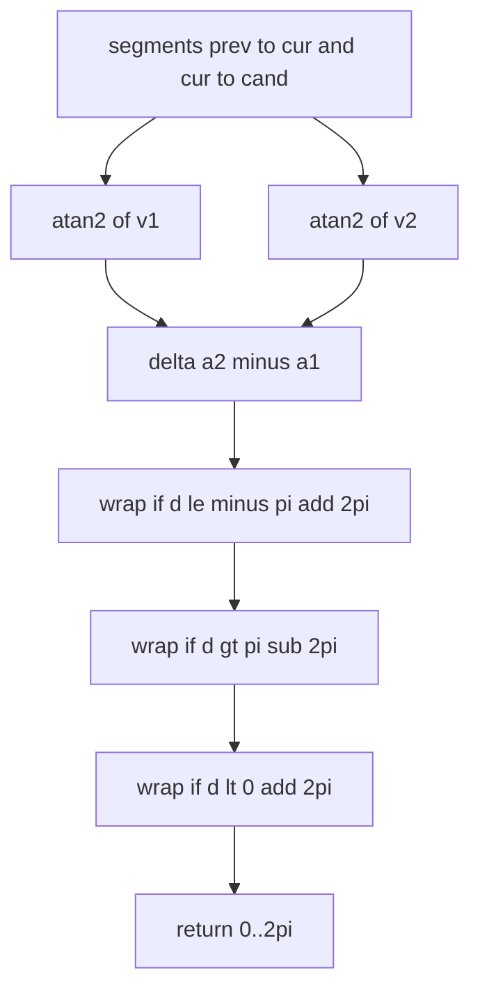
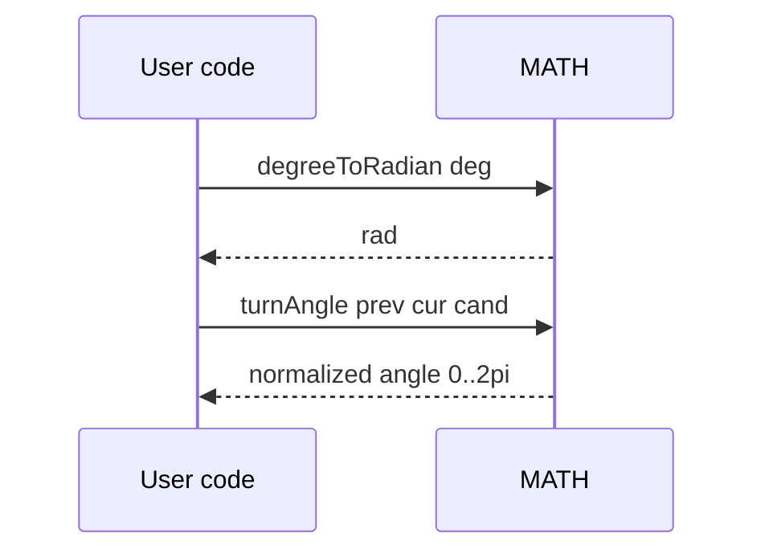

# MATH angles

Degree to radian conversion and relation to turn angle normalization.

Source anchors
- [AETHR.MATH:degreeToRadian()](../../dev/MATH_.lua:252)
- Reference for wrap logic: [AETHR.MATH:turnAngle()](../../dev/MATH_.lua:142)

Overview

- degreeToRadian converts a degree value to radians with input coercion and clamping to 0..360
- turnAngle returns a positive normalized angle in 0..2pi via wrapping steps after atan2 differences

degreeToRadian flow

Relation to turnAngle

Sequence usage

Implementation notes

- degreeToRadian
  - Coerces arbitrary input to number and defaults to 0 when invalid
  - Clamps to 0..360 range before applying math rad
- turnAngle
  - Normalizes delta of direction angles to a positive range using three wrap conditions
  - Produces angles suitable for ordering and sweep decisions

Validation checklist

- degreeToRadian: [dev/MATH_.lua](../../dev/MATH_.lua:252)
- turnAngle reference: [dev/MATH_.lua](../../dev/MATH_.lua:142)

Related docs

- Vectors and angle delta: [docs/math/vectors.md](./vectors.md)
- Orientation helpers: [docs/math/orientation.md](./orientation.md)

Conventions

- Mermaid fenced blocks use GitHub Mermaid parser
- Labels inside brackets avoid double quotes and parentheses
- Links use relative paths for repository portability