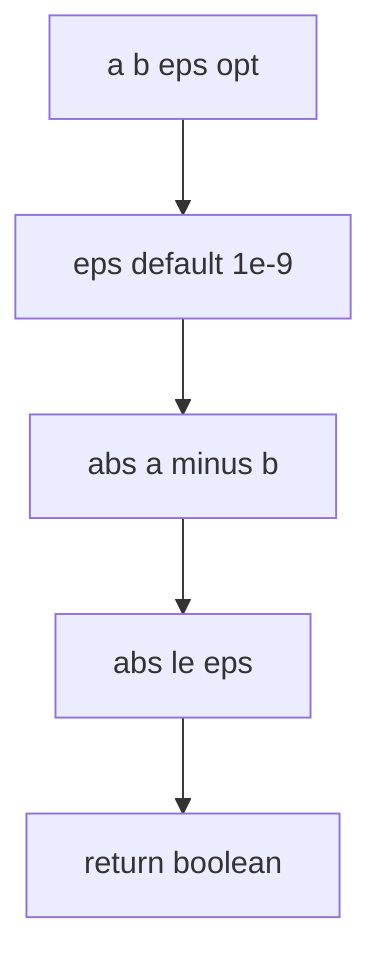
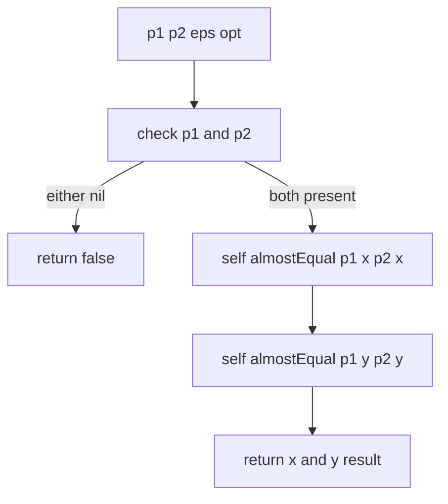
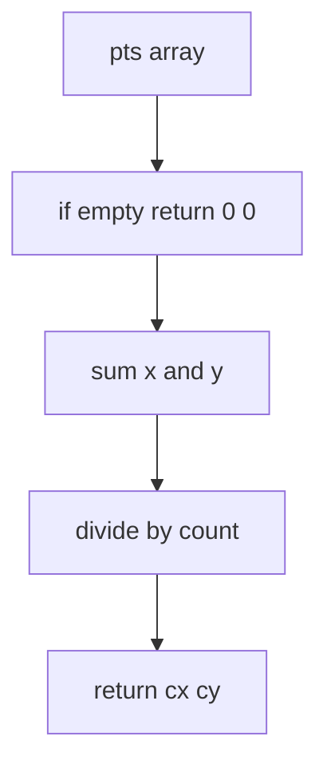
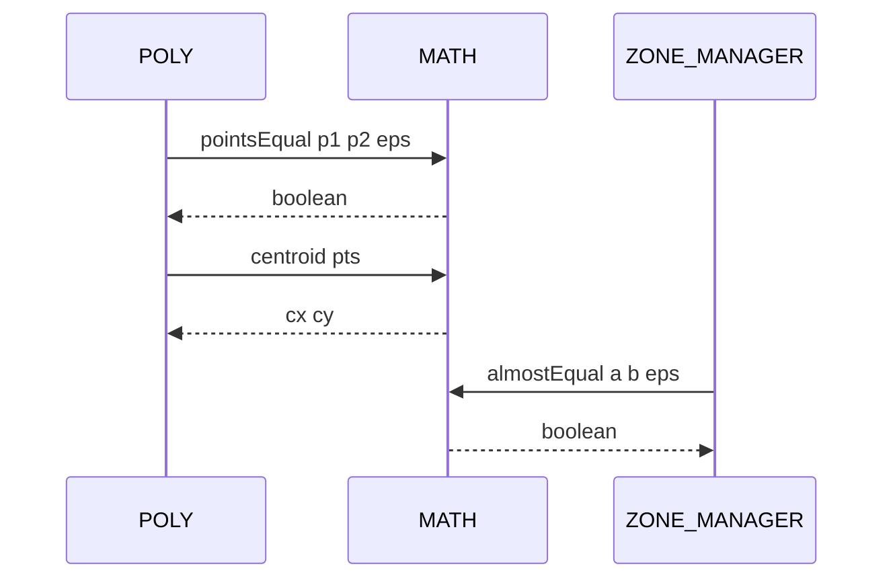

# MATH equality and centroid

Tolerance based equality for numbers and points, and centroid computation for point sets.

Source anchors
- [AETHR.MATH:almostEqual()](../../dev/MATH_.lua:118)
- [AETHR.MATH:pointsEqual()](../../dev/MATH_.lua:129)
- [AETHR.MATH:centroid()](../../dev/MATH_.lua:157)

Overview

- almostEqual compares two numbers within an absolute epsilon tolerance
- pointsEqual uses almostEqual on x and y to compare two points
- centroid computes arithmetic mean of a set of points

almostEqual flow

pointsEqual flow

centroid flow

Sequence usage in POLY and ZONE_MANAGER

Implementation notes

- eps tolerance
  - Default epsilon is 1e-9 which is adequate for typical map scale units
  - For larger scale or accumulated sums use a slightly larger epsilon
- centroid
  - Implements arithmetic mean not polygon area centroid
  - For polygon centroid by area use a shoelace based method in geometry code

Validation checklist

- almostEqual: [dev/MATH_.lua](../../dev/MATH_.lua:118)
- pointsEqual: [dev/MATH_.lua](../../dev/MATH_.lua:129)
- centroid: [dev/MATH_.lua](../../dev/MATH_.lua:157)

Related docs

- Geometry consumers and hulls: [docs/poly/README.md](../poly/README.md)
- Orientation helpers: [docs/math/orientation.md](./orientation.md)

Conventions

- Mermaid fenced blocks use GitHub Mermaid parser
- Labels inside brackets avoid double quotes and parentheses
- Links use relative paths for repository portability