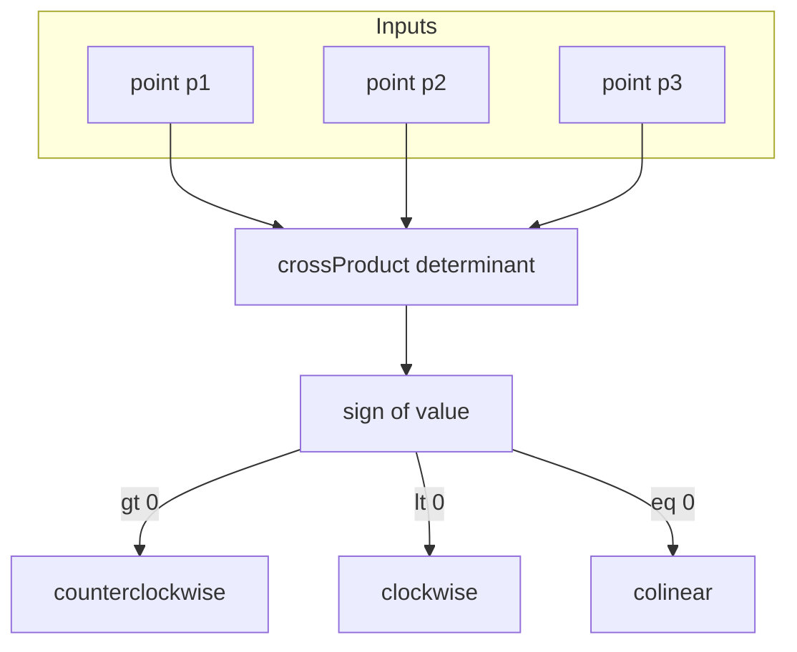
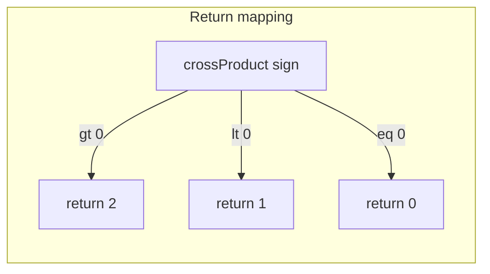
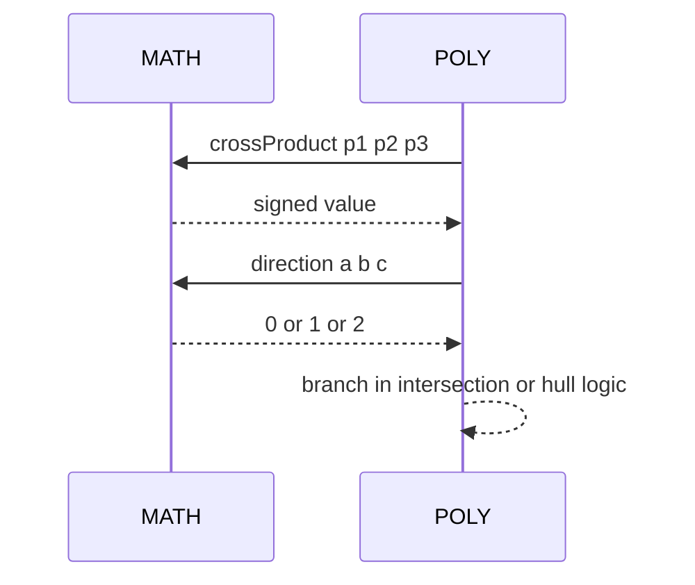
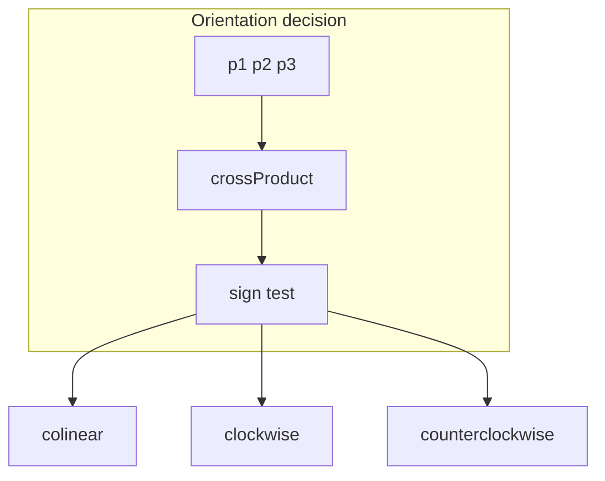
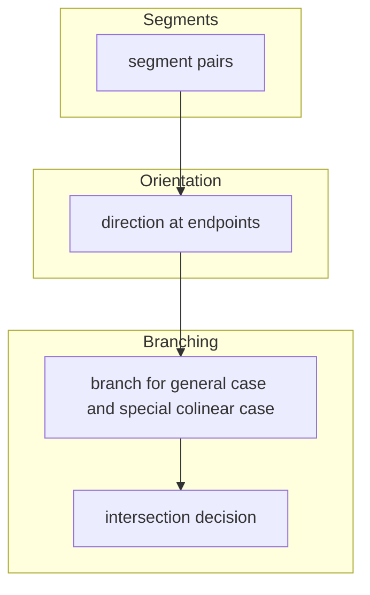

# MATH orientation

Cross product and orientation helpers used by geometry and intersection logic.

Source anchors
- [AETHR.MATH:crossProduct()](../../dev/MATH_.lua:29)
- [AETHR.MATH:direction()](../../dev/MATH_.lua:96)

# Overview

- crossProduct returns the signed area determinant in 2D for three points
  - positive means counterclockwise
  - negative means clockwise
  - zero means colinear
- direction wraps the classic orientation test and maps the sign to codes
  - 0 collinear
  - 1 clockwise
  - 2 counterclockwise

# Flow of orientation

# direction return mapping

# Sequence of use in geometry

# Implementation notes

- Coordinate convention
  - crossProduct accepts tables with x and z or x and y
  - for each point z is preferred and y is used as fallback
  - implementation computes determinant using x and z or y mapping
- Numerical stability
  - Very small magnitudes are not explicitly epsilon clamped in direction
  - If robust colinearity is needed, consider pre scaling or using an epsilon compare on the returned crossProduct value
- Return codes
  - direction returns integer codes instead of boolean flags to simplify branching
  - 0 collinear, 1 clockwise, 2 counterclockwise

# Mermaid sketches

## - Orientation decision

## - Integration point with polygon intersection

# Validation checklist

- cross product anchor: [dev/MATH_.lua](../../dev/MATH_.lua:29)
- direction anchor: [dev/MATH_.lua](../../dev/MATH_.lua:96)

# Related docs

- POLY overview and geometry flows: [docs/poly/README.md](../poly/README.md)

# Conventions

- Mermaid fenced blocks use GitHub Mermaid parser
- Labels inside brackets avoid double quotes and parentheses
- Links use relative paths for repository portability