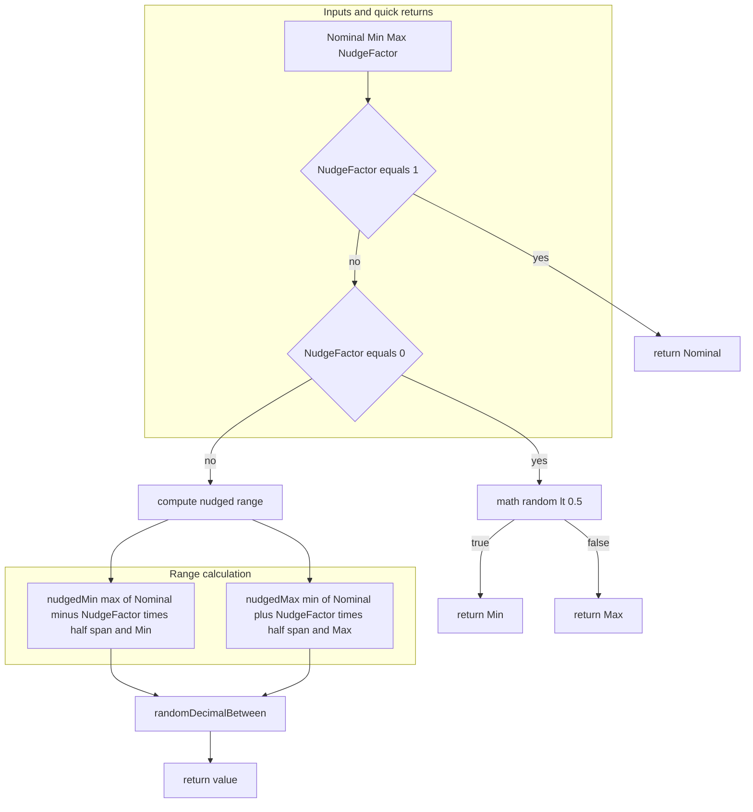
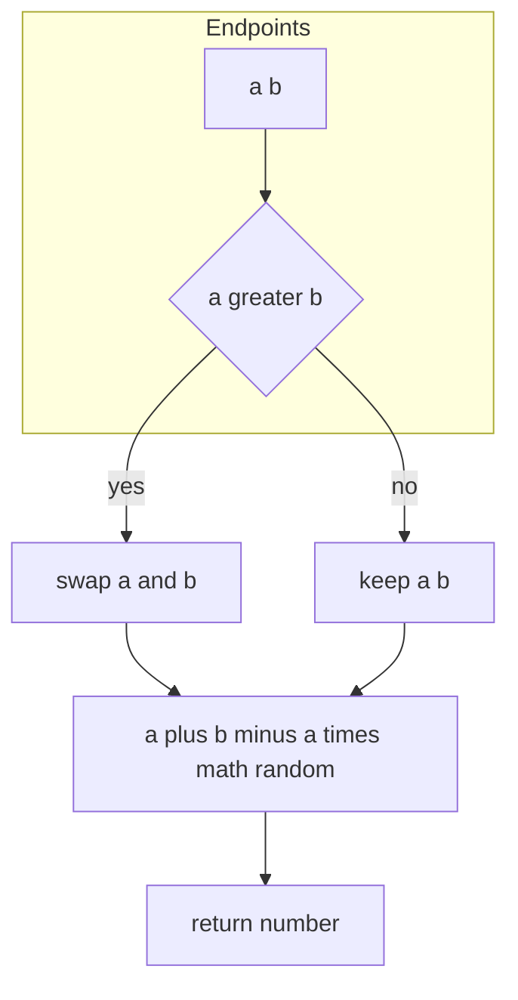
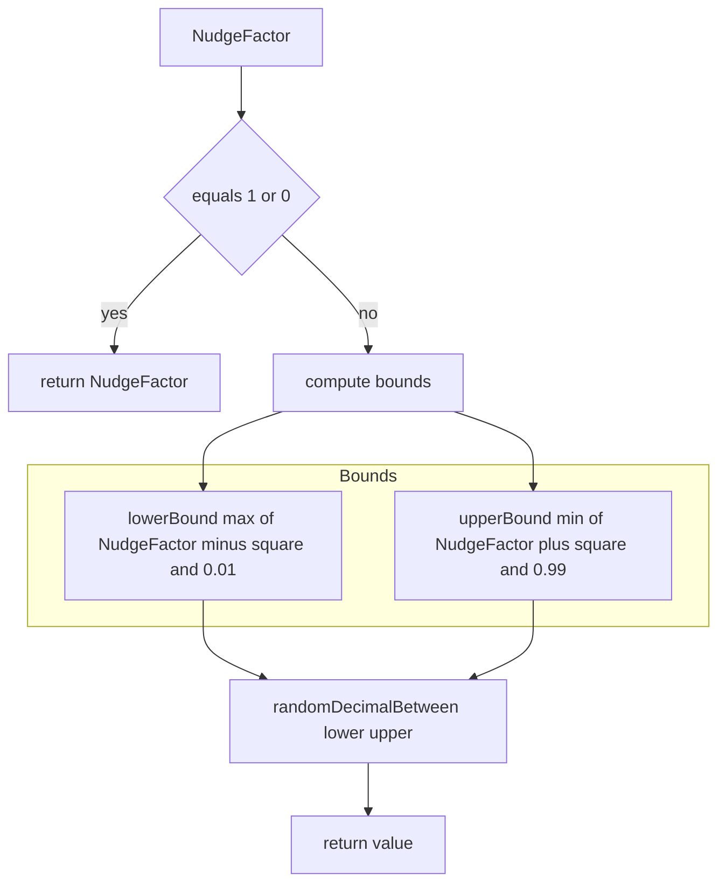
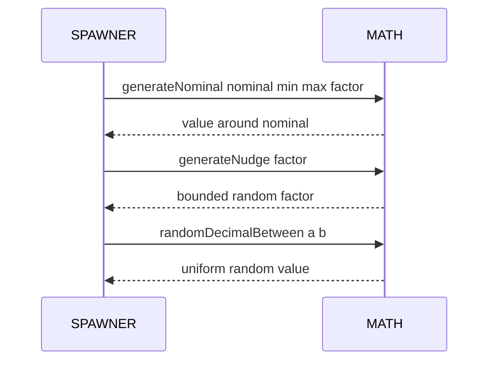

# MATH randomization

Nominal value generation, random decimal, and nudge helpers used by SPAWNER and other systems.

Source anchors
- [AETHR.MATH:generateNominal()](../../dev/MATH_.lua:181)
- [AETHR.MATH:randomDecimalBetween()](../../dev/MATH_.lua:215)
- [AETHR.MATH:generateNudge()](../../dev/MATH_.lua:233)

# Overview

- generateNominal returns a value around a nominal with a controllable nudge factor and min max bounds
- randomDecimalBetween returns a uniform random decimal in a..b inclusive of ends in expectation
- generateNudge returns a randomized factor around NudgeFactor with bounds derived from its square

# generateNominal flow

# randomDecimalBetween flow

# generateNudge flow

# Sequence usage in SPAWNER

# Implementation notes

- generateNominal
  - For factor 1 returns the nominal value deterministically
  - For factor 0 returns either bound using a coin flip
  - Otherwise computes a half span around nominal scaled by factor and constrained to Min Max
  - Uses [AETHR.MATH:randomDecimalBetween()](../../dev/MATH_.lua:215) to sample the range
- randomDecimalBetween
  - Ensures proper ordering by swapping endpoints when a greater than b
  - Returns a plus b minus a times math random which is uniform in the interval
- generateNudge
  - Uses a square term to widen bounds for mid range factors and narrow near edges
  - Clamps to 0.01 and 0.99 to avoid degenerate extremes

# Validation checklist

- generateNominal: [dev/MATH_.lua](../../dev/MATH_.lua:181)
- randomDecimalBetween: [dev/MATH_.lua](../../dev/MATH_.lua:215)
- generateNudge: [dev/MATH_.lua](../../dev/MATH_.lua:233)

# Related docs

- SPAWNER pipeline and types: [docs/spawner/pipeline.md](../spawner/pipeline.md), [docs/spawner/types_and_counts.md](../spawner/types_and_counts.md)

# Conventions

- Mermaid fenced blocks use GitHub Mermaid parser
- Labels inside brackets avoid double quotes and parentheses
- Links use relative paths for repository portability