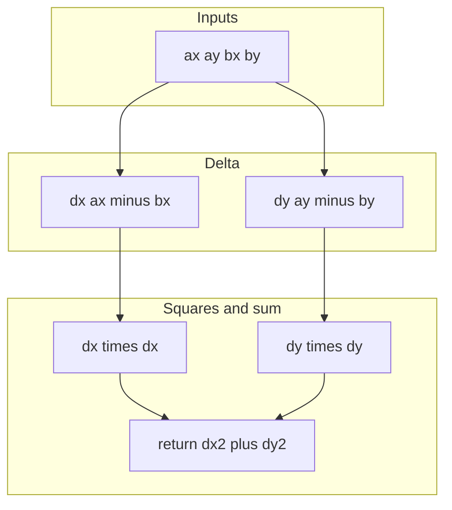
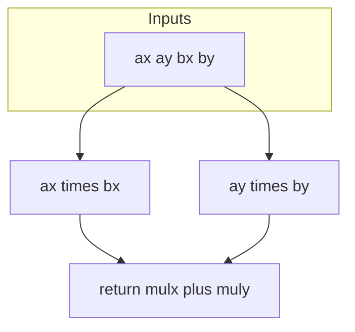
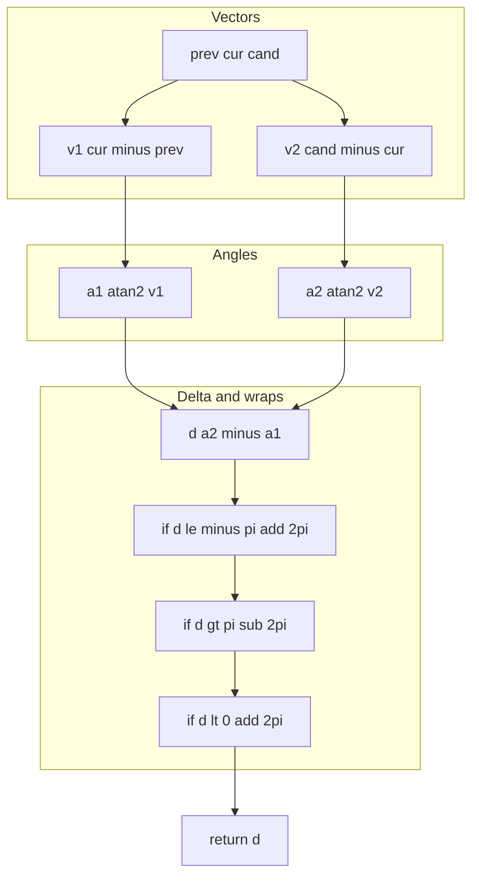
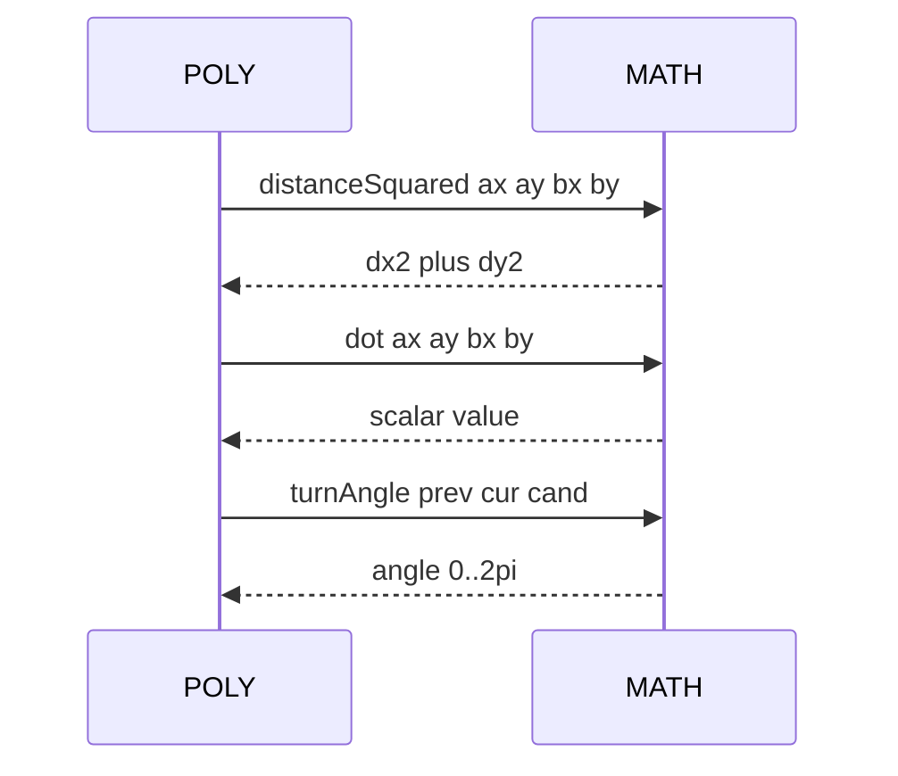
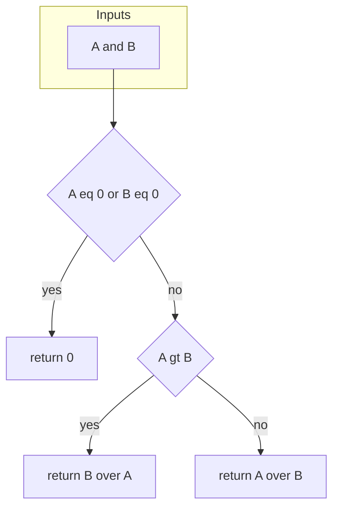
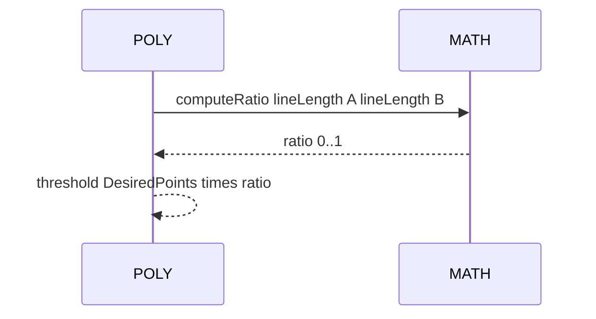

# MATH vectors

Distance, dot product, and turn angle helpers used by geometry flows.

Source anchors
- [AETHR.MATH:distanceSquared()](../../dev/MATH_.lua:58)
- [AETHR.MATH:dot()](../../dev/MATH_.lua:75)
- [AETHR.MATH:turnAngle()](../../dev/MATH_.lua:142)

Overview

- distanceSquared computes squared Euclidean distance without square root
- dot computes scalar projection magnitude between two vectors
- turnAngle returns a positive normalized angle from segment prev to cur to candidate cand in radians 0 to 2 pi

# distanceSquared flow

# dot flow

# turnAngle flow

# Sequence usage in POLY

# Implementation notes

- distanceSquared avoids sqrt for ordering comparisons and threshold checks
- dot is used for projections, angle tests, and segment relations
- turnAngle normalization
  - compute raw difference a2 minus a1
  - wrap to minus pi to pi
  - if negative add full turn to get 0..2pi

# Validation checklist

- distanceSquared: [dev/MATH_.lua](../../dev/MATH_.lua:58)
- dot: [dev/MATH_.lua](../../dev/MATH_.lua:75)
- turnAngle: [dev/MATH_.lua](../../dev/MATH_.lua:142)

# Related docs

- Orientation helpers: [docs/math/orientation.md](./orientation.md)
- POLY consumers: [docs/poly/README.md](../poly/README.md)

# Conventions

- Mermaid fenced blocks use GitHub Mermaid parser
- Labels inside brackets avoid double quotes and parentheses
- Links use relative paths for repository portability
## Ratio helper computeRatio

Anchor
- [AETHR.MATH:computeRatio()](../../dev/MATH_.lua:43)

Purpose
- Returns a normalized ratio in 0..1 between two magnitudes, guarding zero
- Used by POLY offset checks to scale confirmation thresholds by line length similarity

# Flow

# Sequence usage in POLY isWithinOffset

# Validation checklist
- computeRatio: [dev/MATH_.lua](../../dev/MATH_.lua:43)
- isWithinOffset usage: [dev/POLY.lua](../../dev/POLY.lua:1109)