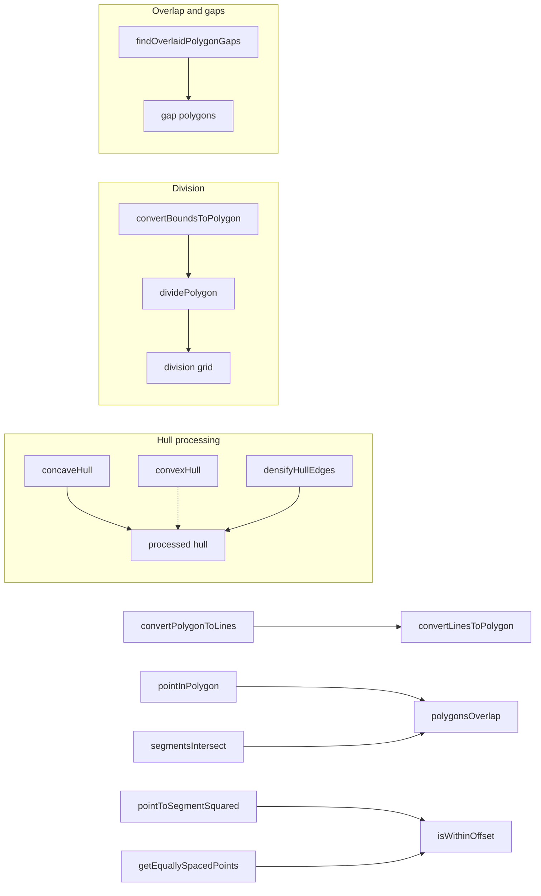
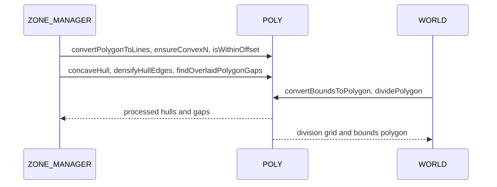
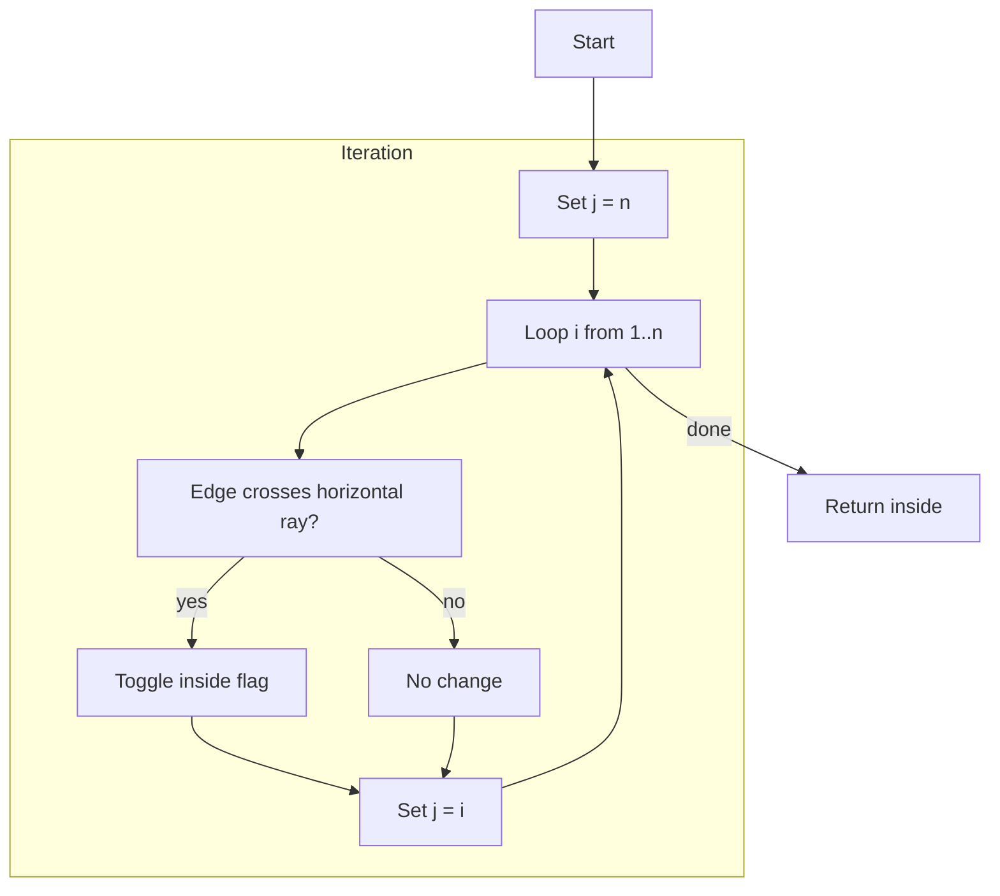
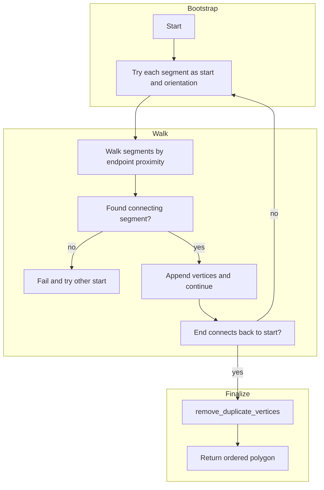
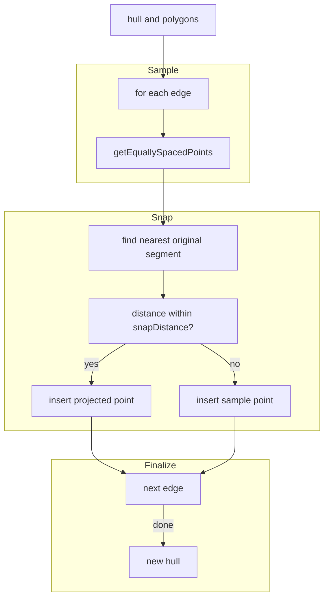
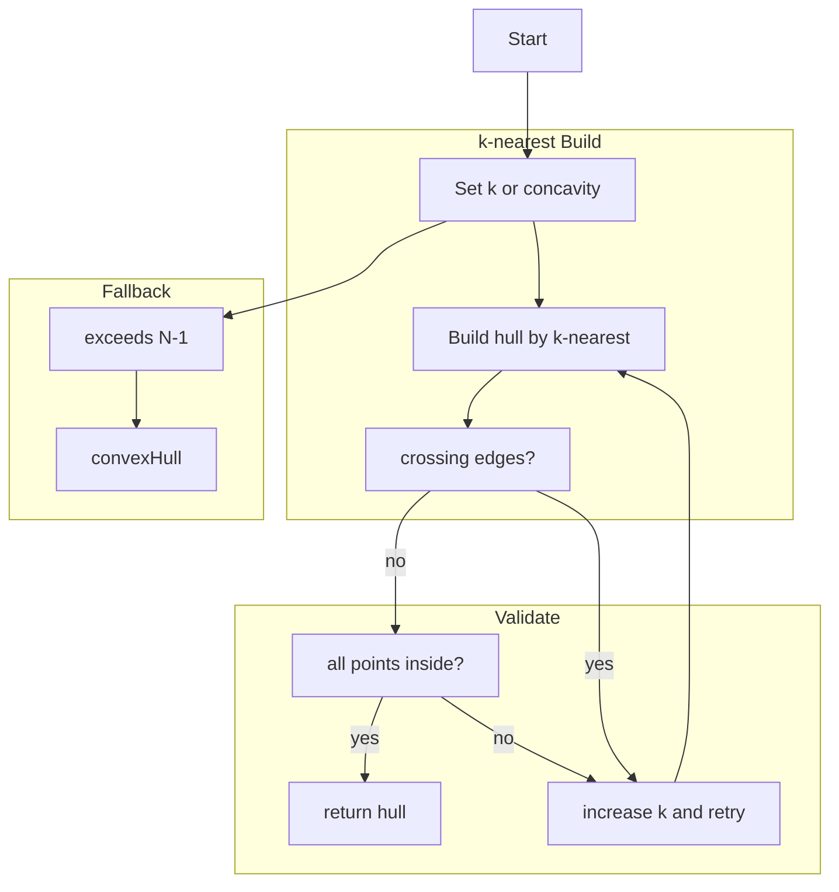
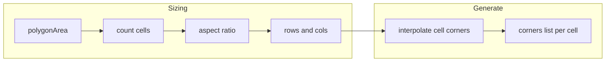

# AETHR POLY diagrams and flows

### Primary anchors
- [AETHR.POLY:segmentsIntersect()](https://github.com/Gh0st352/AETHR/blob/main/dev/POLY.lua#L44)
- [AETHR.POLY:pointInPolygon()](https://github.com/Gh0st352/AETHR/blob/main/dev/POLY.lua#L66)
- [AETHR.POLY:polygonsOverlap()](https://github.com/Gh0st352/AETHR/blob/main/dev/POLY.lua#L92)
- [AETHR.POLY:circleOverlapPoly()](https://github.com/Gh0st352/AETHR/blob/main/dev/POLY.lua#L120)
- [AETHR.POLY:orientation()](https://github.com/Gh0st352/AETHR/blob/main/dev/POLY.lua#L180)
- [AETHR.POLY:onSegment()](https://github.com/Gh0st352/AETHR/blob/main/dev/POLY.lua#L193)
- [AETHR.POLY:convertLinesToPolygon()](https://github.com/Gh0st352/AETHR/blob/main/dev/POLY.lua#L582)
- [AETHR.POLY:convertPolygonToLines()](https://github.com/Gh0st352/AETHR/blob/main/dev/POLY.lua#L737)
- [AETHR.POLY:dividePolygon()](https://github.com/Gh0st352/AETHR/blob/main/dev/POLY.lua#L753)
- [AETHR.POLY:polygonArea()](https://github.com/Gh0st352/AETHR/blob/main/dev/POLY.lua#L826)
- [AETHR.POLY:ensureConvexN()](https://github.com/Gh0st352/AETHR/blob/main/dev/POLY.lua#L863)
- [AETHR.POLY:getEquallySpacedPoints()](https://github.com/Gh0st352/AETHR/blob/main/dev/POLY.lua#L1074)
- [AETHR.POLY:isWithinOffset()](https://github.com/Gh0st352/AETHR/blob/main/dev/POLY.lua#L1106)
- [AETHR.POLY:pointToSegmentSquared()](https://github.com/Gh0st352/AETHR/blob/main/dev/POLY.lua#L1148)
- [AETHR.POLY:getMidpoint()](https://github.com/Gh0st352/AETHR/blob/main/dev/POLY.lua#L1171)
- [AETHR.POLY:calculateLineSlope()](https://github.com/Gh0st352/AETHR/blob/main/dev/POLY.lua#L1188)
- [AETHR.POLY:isIntersect()](https://github.com/Gh0st352/AETHR/blob/main/dev/POLY.lua#L1249)
- [AETHR.POLY:concaveHull()](https://github.com/Gh0st352/AETHR/blob/main/dev/POLY.lua#L1308)
- [AETHR.POLY:convexHull()](https://github.com/Gh0st352/AETHR/blob/main/dev/POLY.lua#L1461)
- [AETHR.POLY:intersectRayToBounds()](https://github.com/Gh0st352/AETHR/blob/main/dev/POLY.lua#L1491)
- [AETHR.POLY:densifyHullEdges()](https://github.com/Gh0st352/AETHR/blob/main/dev/POLY.lua#L1556)
- [AETHR.POLY:findOverlaidPolygonGaps()](https://github.com/Gh0st352/AETHR/blob/main/dev/POLY.lua#L1618)
- [AETHR.POLY:reorderSlaveToMaster()](https://github.com/Gh0st352/AETHR/blob/main/dev/POLY.lua#L1705)
- [AETHR.POLY:reverseVertOrder()](https://github.com/Gh0st352/AETHR/blob/main/dev/POLY.lua#L1761)
- [AETHR.POLY:getCenterPoint()](https://github.com/Gh0st352/AETHR/blob/main/dev/POLY.lua#L1779)
- [AETHR.POLY:getCentroidPoint()](https://github.com/Gh0st352/AETHR/blob/main/dev/POLY.lua#L1830)
- [AETHR.POLY:convertBoundsToPolygon()](https://github.com/Gh0st352/AETHR/blob/main/dev/POLY.lua#L1039)
- [AETHR.POLY:pointInCircle()](https://github.com/Gh0st352/AETHR/blob/main/dev/POLY.lua#L248)
- [AETHR.POLY:getRandomVec2inCircle()](https://github.com/Gh0st352/AETHR/blob/main/dev/POLY.lua#L276)
- [AETHR.POLY:getRandomVec2inPolygon()](https://github.com/Gh0st352/AETHR/blob/main/dev/POLY.lua#L343)

### Breakout documents
- Intersections and orientation: [docs/poly/intersections_and_orientation.md](intersections_and_orientation.md)
- Point in polygon and overlap: [docs/poly/point_in_polygon_and_overlap.md](point_in_polygon_and_overlap.md)
- Distance, projection, and offset: [docs/poly/distance_projection_and_offset.md](distance_projection_and_offset.md)
- Random points and sampling: [docs/poly/random_points_and_sampling.md](random_points_and_sampling.md)
- Convert and order: [docs/poly/convert_and_order.md](convert_and_order.md)
- Bounds and divisions: [docs/poly/bounds_and_divisions.md](bounds_and_divisions.md)
- Hulls densify and gaps: [docs/poly/hulls_densify_and_gaps.md](hulls_densify_and_gaps.md)
- Rays, midpoints, and slopes: [docs/poly/rays_midpoints_and_slopes.md](rays_midpoints_and_slopes.md)

### Documents and indices
- Master diagrams index: [docs/README.md](../README.md)
- ZONE_MANAGER: [docs/zone_manager/README.md](../zone_manager/README.md)
- WORLD: [docs/world/README.md](../world/README.md)

# Core geometry relationships

# Module interactions

# Algorithm: pointInPolygon

# Algorithm: convertLinesToPolygon

# Algorithm: densifyHullEdges

# Algorithm: concaveHull with convex fallback

# Algorithm: dividePolygon into grid

# Key anchors
- Bounds conversion: [AETHR.POLY:convertBoundsToPolygon()](https://github.com/Gh0st352/AETHR/blob/main/dev/POLY.lua#L1039)
- Hull processing: [AETHR.POLY:concaveHull()](https://github.com/Gh0st352/AETHR/blob/main/dev/POLY.lua#L1308), [AETHR.POLY:convexHull()](https://github.com/Gh0st352/AETHR/blob/main/dev/POLY.lua#L1461), [AETHR.POLY:densifyHullEdges()](https://github.com/Gh0st352/AETHR/blob/main/dev/POLY.lua#L1556)
- Gap detection: [AETHR.POLY:findOverlaidPolygonGaps()](https://github.com/Gh0st352/AETHR/blob/main/dev/POLY.lua#L1618)
- Grid division: [AETHR.POLY:dividePolygon()](https://github.com/Gh0st352/AETHR/blob/main/dev/POLY.lua#L753)
- Distance helpers: [AETHR.POLY:pointToSegmentSquared()](https://github.com/Gh0st352/AETHR/blob/main/dev/POLY.lua#L1148), [AETHR.POLY:getEquallySpacedPoints()](https://github.com/Gh0st352/AETHR/blob/main/dev/POLY.lua#L1074), [AETHR.POLY:isWithinOffset()](https://github.com/Gh0st352/AETHR/blob/main/dev/POLY.lua#L1106)

# Notes
- Subgraph labels use double quotes per [docs/_mermaid/README.md](../_mermaid/README.md).
- All diagrams use GitHub Mermaid fenced blocks.