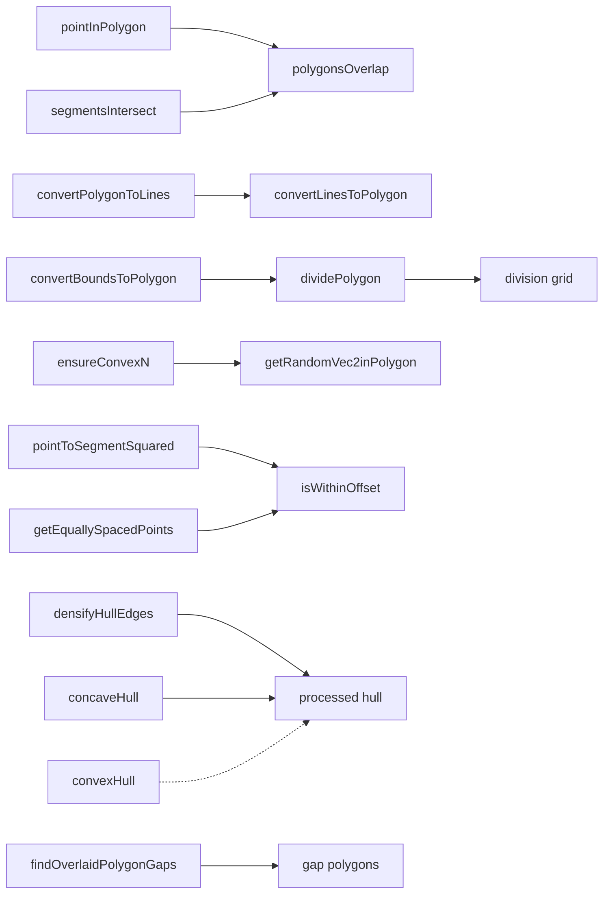
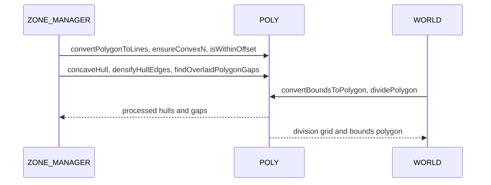
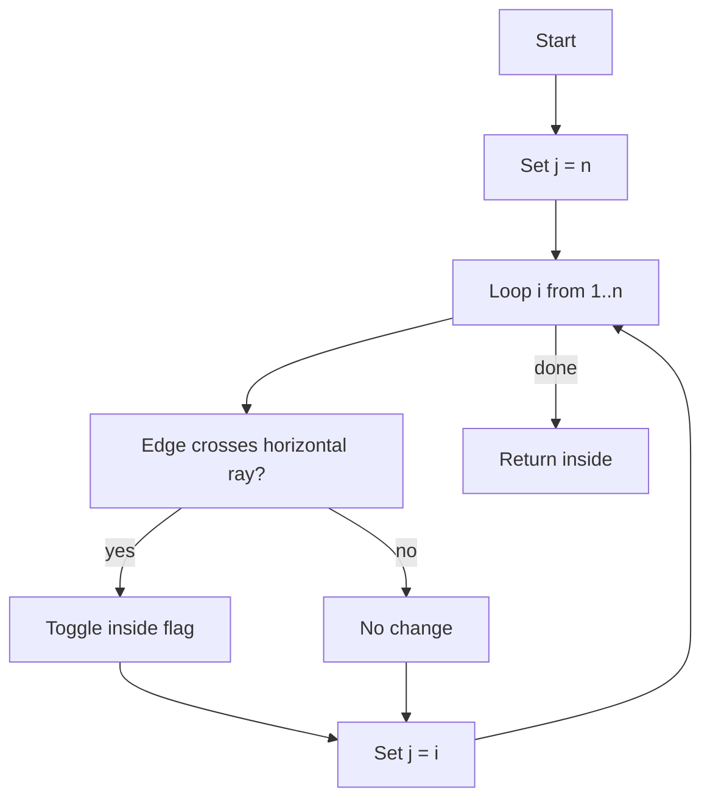
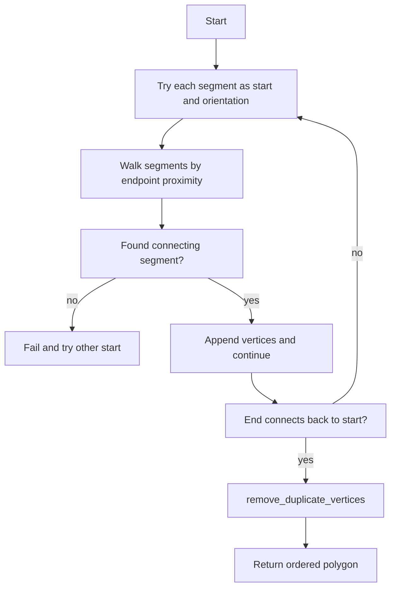
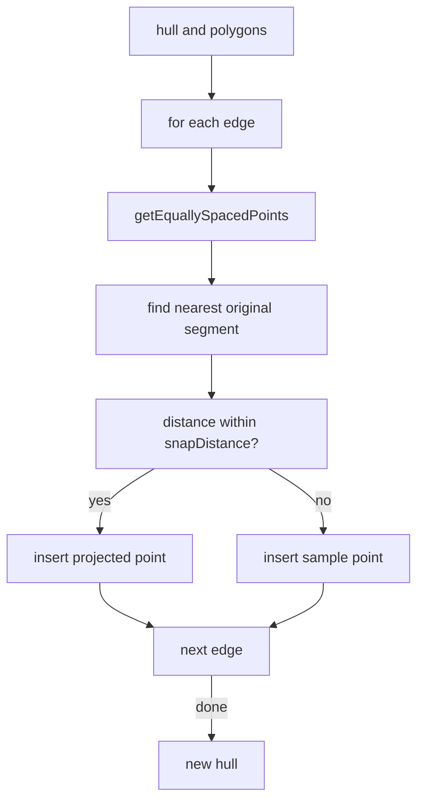
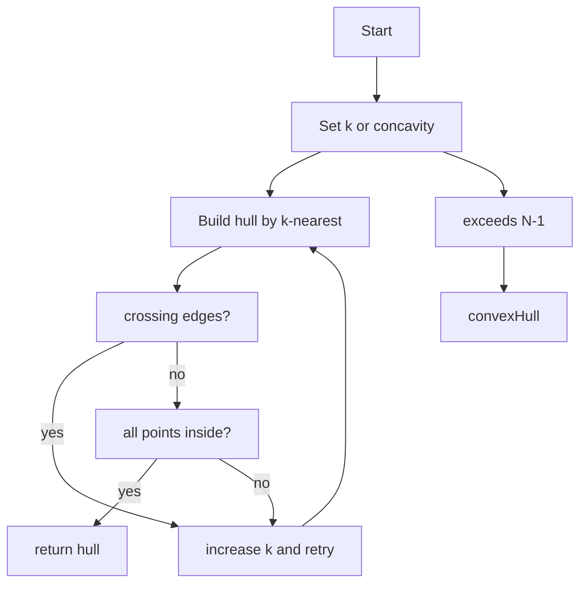

# AETHR POLY diagrams and flows

Primary anchors
- [AETHR.POLY:segmentsIntersect()](../../dev/POLY.lua:44)
- [AETHR.POLY:pointInPolygon()](../../dev/POLY.lua:66)
- [AETHR.POLY:polygonsOverlap()](../../dev/POLY.lua:93)
- [AETHR.POLY:circleOverlapPoly()](../../dev/POLY.lua:121)
- [AETHR.POLY:orientation()](../../dev/POLY.lua:181)
- [AETHR.POLY:onSegment()](../../dev/POLY.lua:193)
- [AETHR.POLY:convertLinesToPolygon()](../../dev/POLY.lua:583)
- [AETHR.POLY:convertPolygonToLines()](../../dev/POLY.lua:737)
- [AETHR.POLY:dividePolygon()](../../dev/POLY.lua:753)
- [AETHR.POLY:polygonArea()](../../dev/POLY.lua:827)
- [AETHR.POLY:ensureConvexN()](../../dev/POLY.lua:863)
- [AETHR.POLY:getEquallySpacedPoints()](../../dev/POLY.lua:1074)
- [AETHR.POLY:isWithinOffset()](../../dev/POLY.lua:1107)
- [AETHR.POLY:pointToSegmentSquared()](../../dev/POLY.lua:1149)
- [AETHR.POLY:getMidpoint()](../../dev/POLY.lua:1172)
- [AETHR.POLY:calculateLineSlope()](../../dev/POLY.lua:1189)
- [AETHR.POLY:findPerpendicularEndpoints()](../../dev/POLY.lua:1219)
- [AETHR.POLY:isIntersect()](../../dev/POLY.lua:1250)
- [AETHR.POLY:concaveHull()](../../dev/POLY.lua:1309)
- [AETHR.POLY:convexHull()](../../dev/POLY.lua:1461)
- [AETHR.POLY:intersectRayToBounds()](../../dev/POLY.lua:1492)
- [AETHR.POLY:densifyHullEdges()](../../dev/POLY.lua:1556)
- [AETHR.POLY:findOverlaidPolygonGaps()](../../dev/POLY.lua:1618)
- [AETHR.POLY:reorderSlaveToMaster()](../../dev/POLY.lua:1705)
- [AETHR.POLY:reverseVertOrder()](../../dev/POLY.lua:1762)
- [AETHR.POLY:getCenterPoint()](../../dev/POLY.lua:1779)
- [AETHR.POLY:getCentroidPoint()](../../dev/POLY.lua:1830)
- [AETHR.POLY:convertBoundsToPolygon()](../../dev/POLY.lua:1039)
- [AETHR.POLY:pointInCircle()](../../dev/POLY.lua:249)
- [AETHR.POLY:getRandomVec2inCircle()](../../dev/POLY.lua:276)
- [AETHR.POLY:getRandomVec2inPolygon()](../../dev/POLY.lua:343)

Documents and indices
- Master diagrams index: [docs/README.md](docs/README.md)
- ZONE_MANAGER: [docs/zone_manager/README.md](docs/zone_manager/README.md)
- WORLD: [docs/world/README.md](docs/world/README.md)

Core geometry relationships

Module interactions

Algorithm: pointInPolygon

Algorithm: convertLinesToPolygon

Algorithm: densifyHullEdges

Algorithm: concaveHull with convex fallback

Algorithm: dividePolygon into grid

Key anchors
- Bounds conversion: [AETHR.POLY:convertBoundsToPolygon()](../../dev/POLY.lua:1039)
- Hull processing: [AETHR.POLY:concaveHull()](../../dev/POLY.lua:1309), [AETHR.POLY:convexHull()](../../dev/POLY.lua:1461), [AETHR.POLY:densifyHullEdges()](../../dev/POLY.lua:1556)
- Gap detection: [AETHR.POLY:findOverlaidPolygonGaps()](../../dev/POLY.lua:1618)
- Grid division: [AETHR.POLY:dividePolygon()](../../dev/POLY.lua:753)
- Distance helpers: [AETHR.POLY:pointToSegmentSquared()](../../dev/POLY.lua:1149), [AETHR.POLY:getEquallySpacedPoints()](../../dev/POLY.lua:1074), [AETHR.POLY:isWithinOffset()](../../dev/POLY.lua:1107)

Notes
- Mermaid labels avoid double quotes and parentheses.
- All diagrams use GitHub Mermaid fenced blocks.