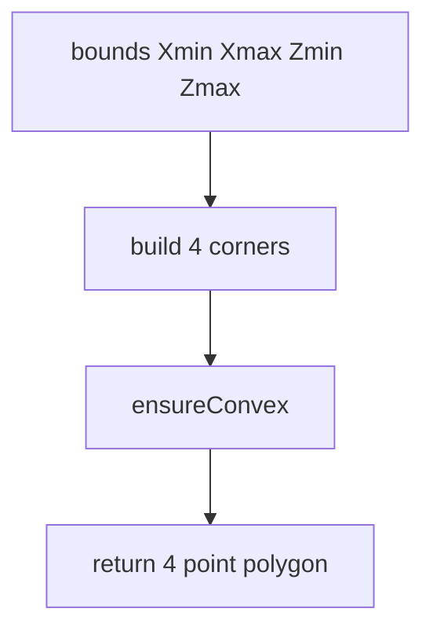
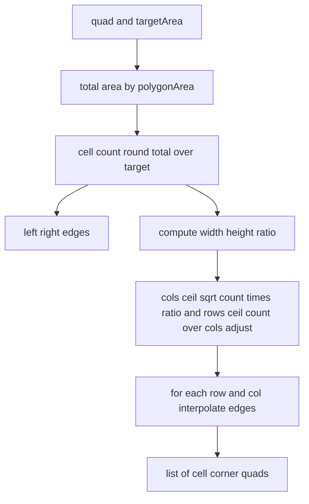
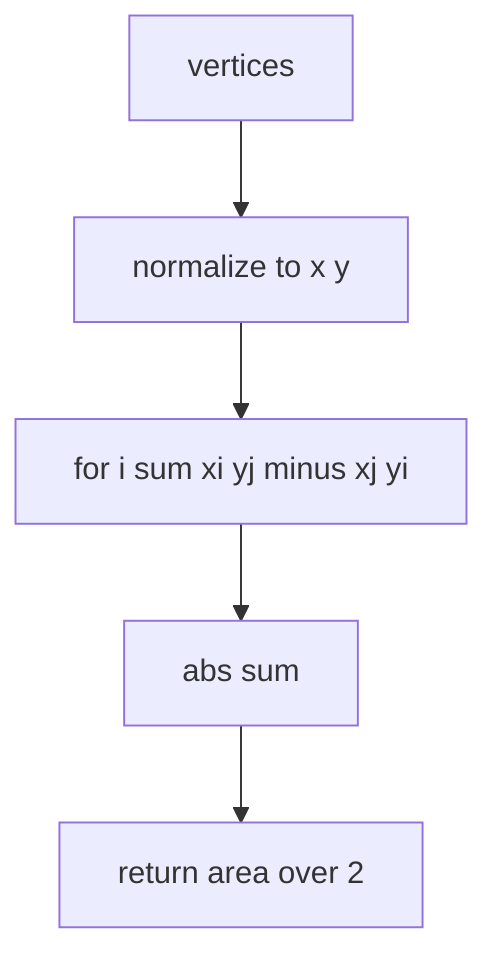
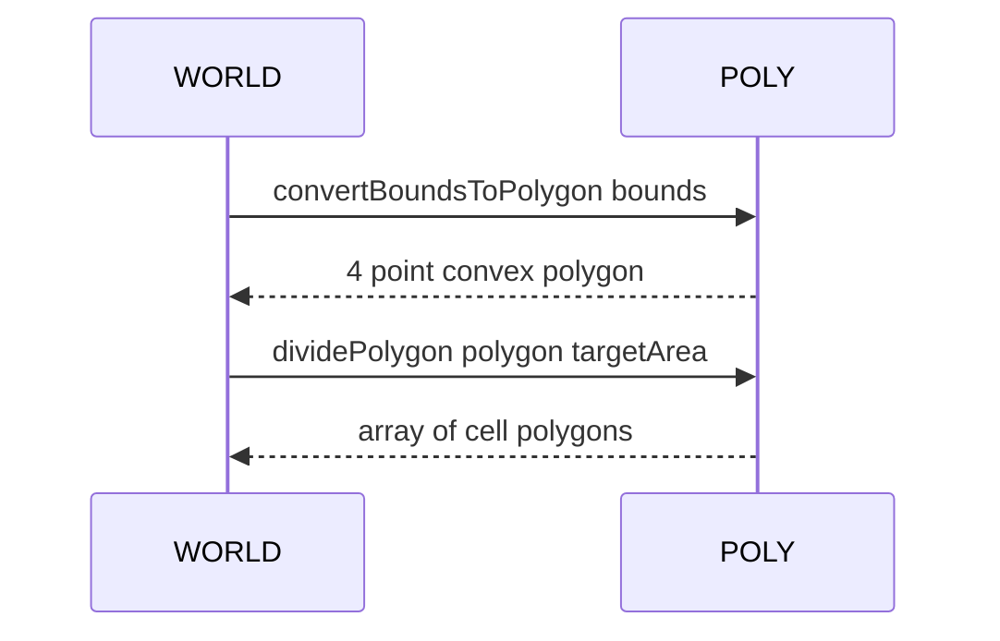

# POLY bounds and divisions

Converting axis aligned bounds to a polygon, dividing a quadrilateral into a grid, and computing polygon area.

Source anchors
- [AETHR.POLY:convertBoundsToPolygon()](../../dev/POLY.lua:1039)
- [AETHR.POLY:dividePolygon()](../../dev/POLY.lua:753)
- [AETHR.POLY:polygonArea()](../../dev/POLY.lua:826)
- Related: [AETHR.POLY:ensureConvex()](../../dev/POLY.lua:846)

Overview
- convertBoundsToPolygon builds a 4 corner polygon [minX,minZ] [maxX,minZ] [maxX,maxZ] [minX,maxZ] and enforces convexity
- dividePolygon splits a quad into rows and columns informed by area and aspect ratio, interpolating the four edges to generate cell polygons
- polygonArea computes area using the shoelace formula on normalized x y coordinates

convertBoundsToPolygon flow

dividePolygon flow

polygonArea flow

Sequence usage

Implementation notes
- convertBoundsToPolygon
  - Produces consistent corner order bottom left bottom right top right top left
  - Uses ensureConvex to swap vertices if any cross sign checks disagree
- dividePolygon
  - Chooses rows and cols to cover count while approximating the aspect ratio
  - Interpolates along both pairs of opposite edges per row and per column
- polygonArea
  - Normalizes each input vertex to {x,y} allowing inputs that carry y or z

Validation checklist
- convertBoundsToPolygon: [dev/POLY.lua](../../dev/POLY.lua:1039)
- dividePolygon: [dev/POLY.lua](../../dev/POLY.lua:753)
- polygonArea: [dev/POLY.lua](../../dev/POLY.lua:826)

Related docs
- Convert and order: [docs/poly/convert_and_order.md](./convert_and_order.md)
- Intersections and orientation: [docs/poly/intersections_and_orientation.md](./intersections_and_orientation.md)

Conventions
- Mermaid fenced blocks use GitHub Mermaid parser
- Labels inside brackets avoid double quotes and parentheses
- Links use relative paths for repository portability