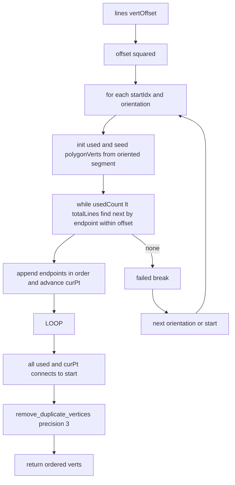
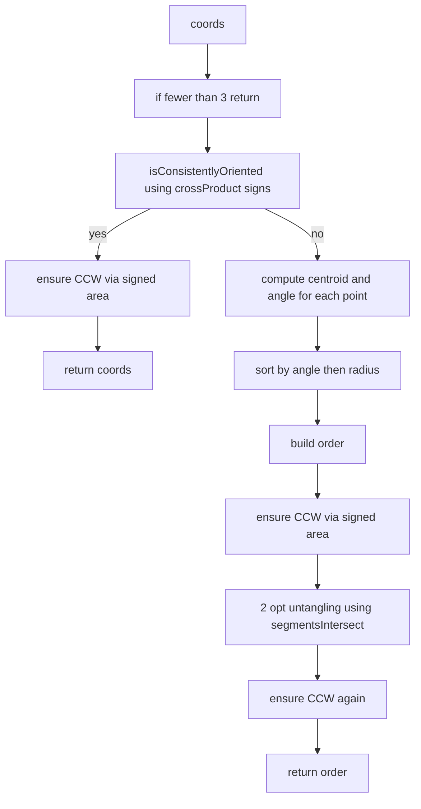
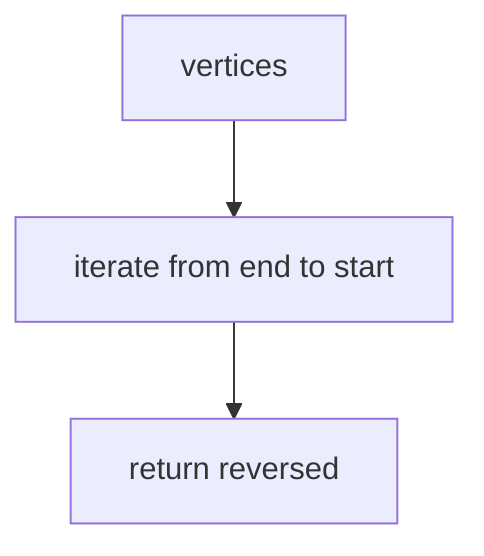
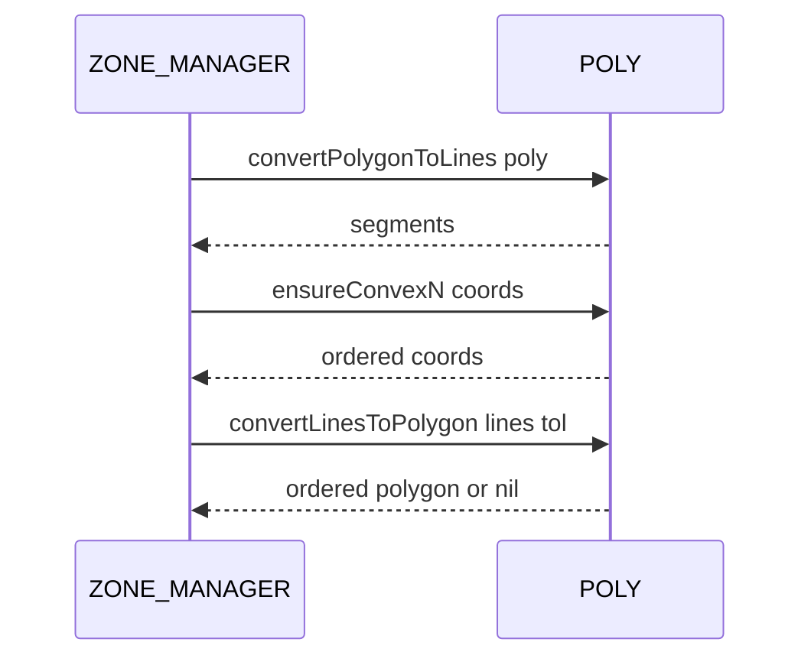

# POLY convert and order

Conversions between polygons and line segments, convexity fixes, ordering, and vertex reversal.

Source anchors
- [AETHR.POLY:convertLinesToPolygon()](../../dev/POLY.lua:582)
- [AETHR.POLY:convertPolygonToLines()](../../dev/POLY.lua:737)
- [AETHR.POLY:ensureConvex()](../../dev/POLY.lua:846)
- [AETHR.POLY:ensureConvexN()](../../dev/POLY.lua:863)
- [AETHR.POLY:reverseVertOrder()](../../dev/POLY.lua:1761)

Overview
- convertLinesToPolygon reorders unordered segments into a vertex loop using proximity within a tolerance, preserving original vertex objects and deduplicating close duplicates
- convertPolygonToLines generates edge segments from an ordered vertex list, normalizing y or z to y
- ensureConvex ensures 4 point polygons are convex by checking cross product signs and swapping as needed
- ensureConvexN attempts to enforce consistent orientation and remove self intersections while preserving all points, using centroid ordering and 2 opt untangling with cross product tests
- reverseVertOrder returns a new vertex list reversed

Algorithm: convertLinesToPolygon



Algorithm: ensureConvexN



convertPolygonToLines

```mermaid
flowchart TD
  IN[zone points] --> LOOP[i 1..n]
  LOOP --> NXT[j i mod n plus 1]
  NXT --> MAKE[{x=xi y=yi or zi} {x=xj y=yj or zj}]
  MAKE --> PUSH[append segment]
  PUSH --> LOOP
  LOOP -->|done| OUT[return lines]
```

reverseVertOrder



Sequence usage



Implementation notes
- convertLinesToPolygon
  - Uses squared distance under vertOffset to chain segments by nearest endpoint continuity without mutating the input segments
  - Deduplication builds a unique sequence by x y keys with optional precision
- ensureConvexN
  - First checks consistent orientation by the sign of successive cross products, ensuring all same sign
  - If mixed, re orders by centroid angle then removes crossings with 2 opt style reversal
  - Retains all points including colinear; does not collapse vertices
- ensureConvex
  - For four point bounds, tests cross product signs on each edge triplet and swaps the last two vertices if any sign disagrees

Validation checklist
- convertLinesToPolygon: [dev/POLY.lua](../../dev/POLY.lua:582)
- convertPolygonToLines: [dev/POLY.lua](../../dev/POLY.lua:737)
- ensureConvex: [dev/POLY.lua](../../dev/POLY.lua:846)
- ensureConvexN: [dev/POLY.lua](../../dev/POLY.lua:863)
- reverseVertOrder: [dev/POLY.lua](../../dev/POLY.lua:1761)

Related docs
- Intersections and orientation: [docs/poly/intersections_and_orientation.md](./intersections_and_orientation.md)
- Bounds and divisions: [docs/poly/bounds_and_divisions.md](./bounds_and_divisions.md)

Conventions
- Mermaid fenced blocks use GitHub Mermaid parser
- Labels inside brackets avoid double quotes and parentheses
- Links use relative paths for repository portability