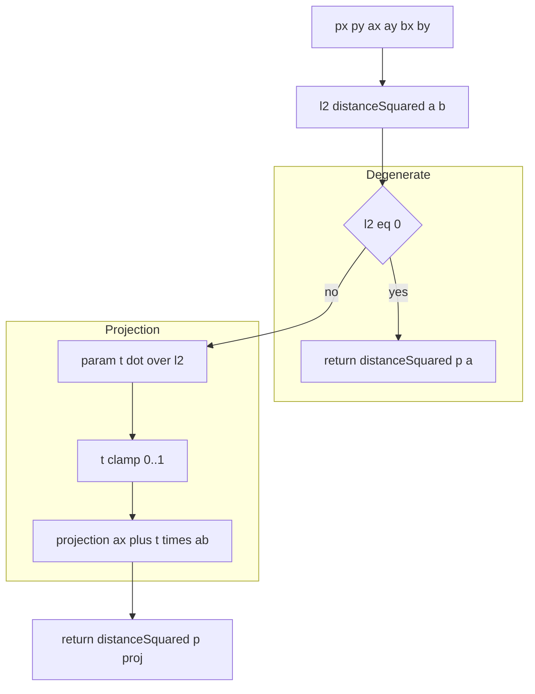
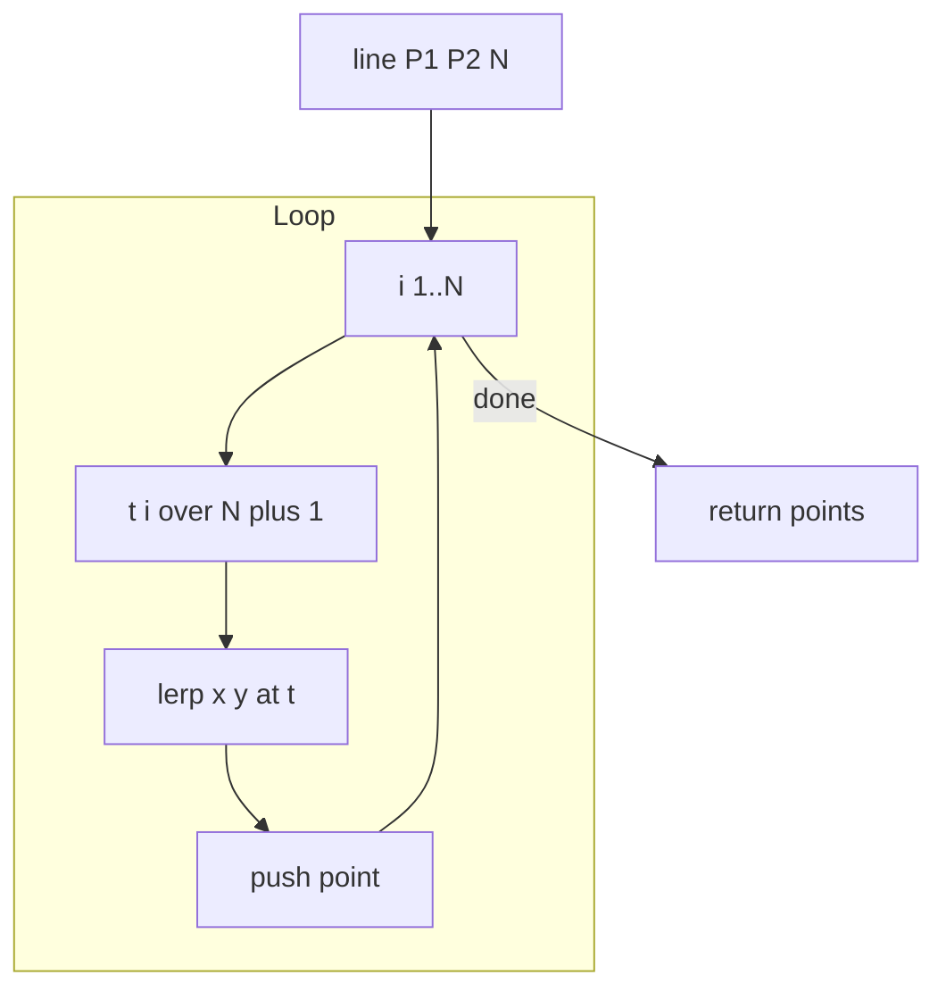
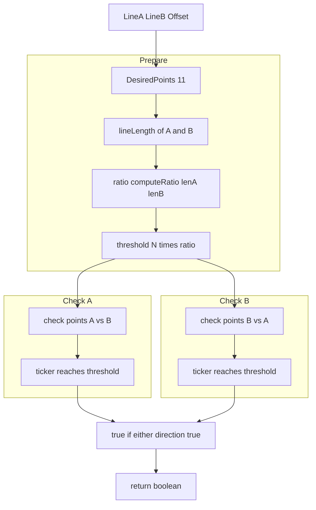
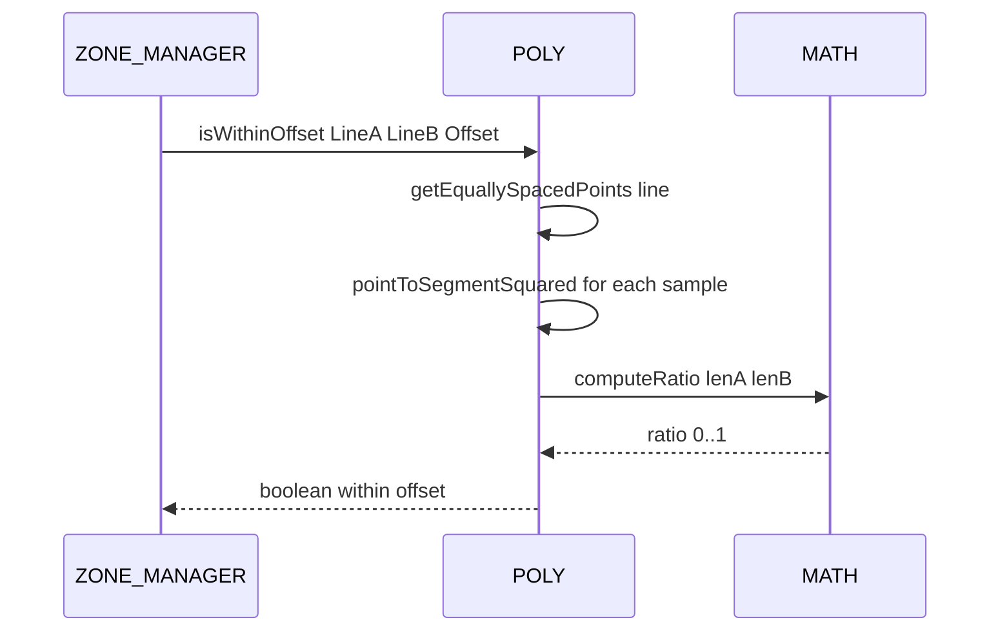

# POLY distance, projection, and offset

Squared distance to segment, dot based projection, interior sampling along segments, and approximate line offset checks.

Source anchors
- [AETHR.POLY:lineLength()](../../dev/POLY.lua:1056)
- [AETHR.POLY:getEquallySpacedPoints()](../../dev/POLY.lua:1074)
- [AETHR.POLY:isWithinOffset()](../../dev/POLY.lua:1106)
- [AETHR.POLY:pointToSegmentSquared()](../../dev/POLY.lua:1148)
- Related MATH: [AETHR.MATH:distanceSquared()](../../dev/MATH_.lua:58), [AETHR.MATH:dot()](../../dev/MATH_.lua:75), [AETHR.MATH:computeRatio()](../../dev/MATH_.lua:43)

# Overview
- lineLength returns Euclidean length of a segment
- getEquallySpacedPoints returns interior samples at equal parametric spacing
- pointToSegmentSquared computes squared distance from a point to the closest point on a segment using projection and clamping
- isWithinOffset tests if two segments are approximately within a given offset by sampling and counting confirmations scaled by a ratio of lengths

# pointToSegmentSquared flow

# getEquallySpacedPoints flow

# isWithinOffset flow

# Sequence usage

# Implementation notes
- pointToSegmentSquared uses projection parameter t = dot(pa, ba) over l2 and clamps to the closed segment
- isWithinOffset sampling density and the ratio threshold control sensitivity; confirmation counts scale with relative lengths
- lineLength is only used to compute the ratio driver for confirmation threshold in isWithinOffset

# Validation checklist
- lineLength: [dev/POLY.lua](../../dev/POLY.lua:1056)
- getEquallySpacedPoints: [dev/POLY.lua](../../dev/POLY.lua:1074)
- isWithinOffset: [dev/POLY.lua](../../dev/POLY.lua:1106)
- pointToSegmentSquared: [dev/POLY.lua](../../dev/POLY.lua:1148)

# Related docs
- Intersections and orientation: [docs/poly/intersections_and_orientation.md](./intersections_and_orientation.md)
- Point-in-polygon and overlaps: [docs/poly/point_in_polygon_and_overlap.md](./point_in_polygon_and_overlap.md)

# Conventions
- Mermaid fenced blocks use GitHub Mermaid parser
- Labels inside brackets avoid double quotes and parentheses
- Links use relative paths for repository portability