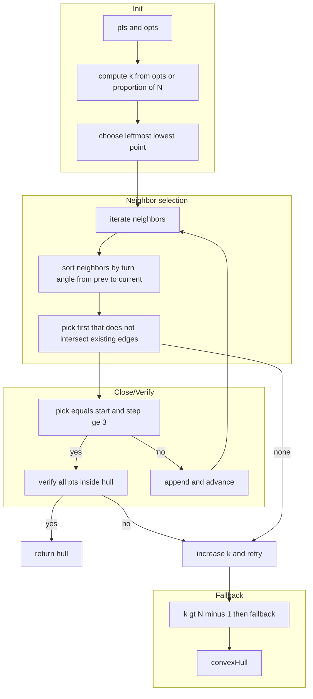
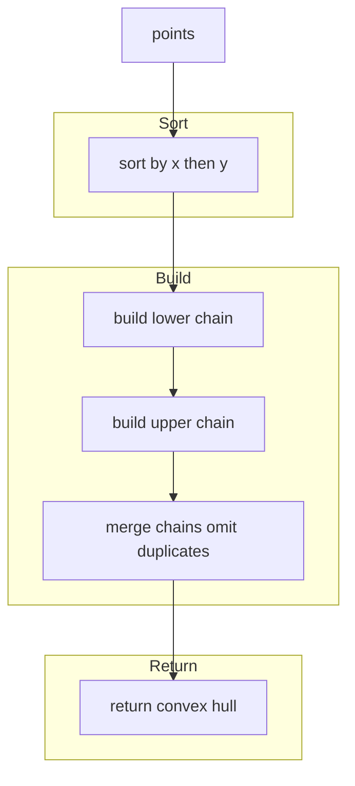
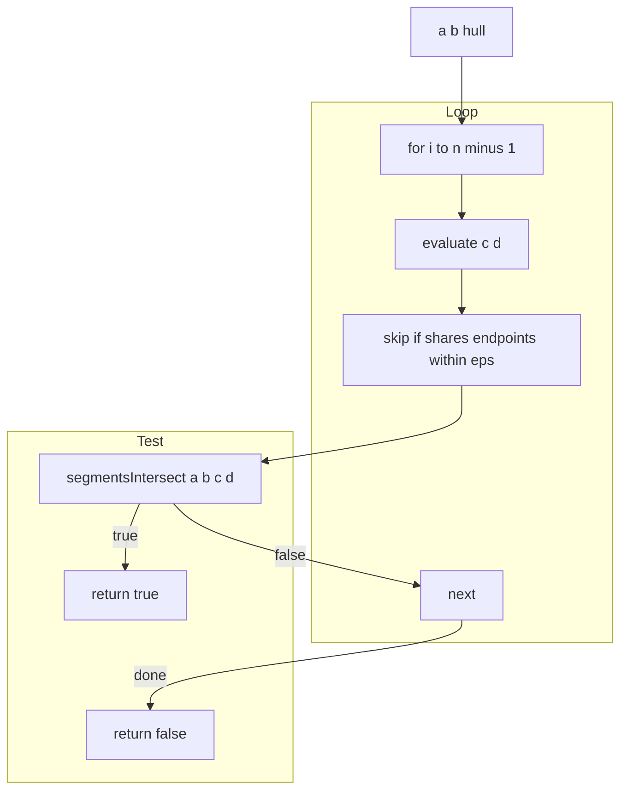
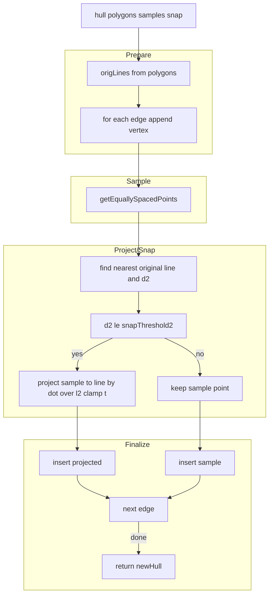
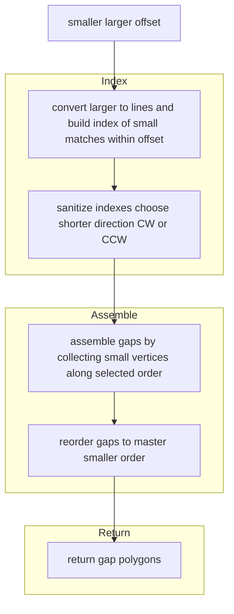
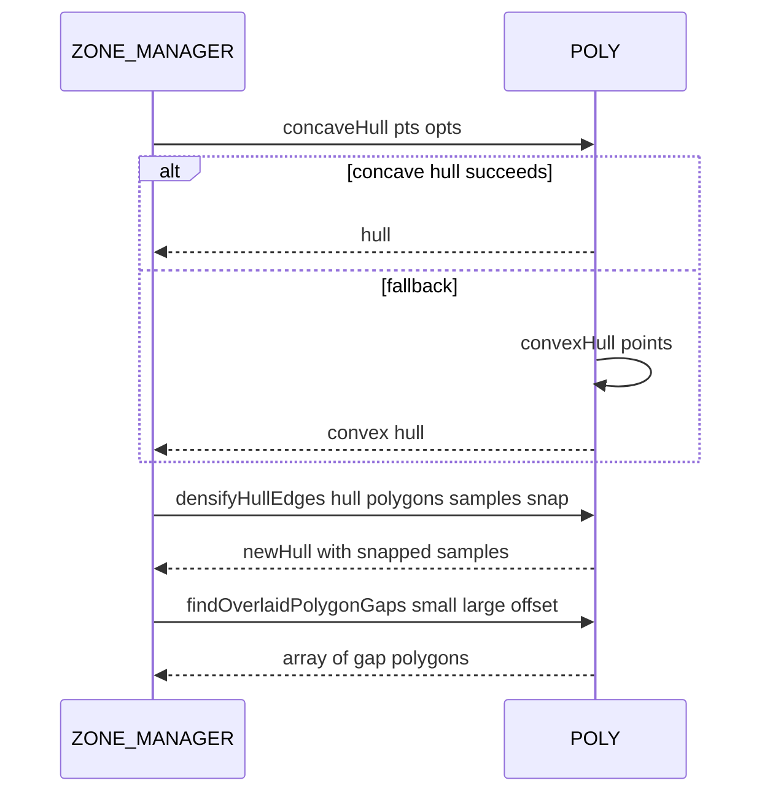

# POLY hulls densify and gaps

Concave and convex hull construction, hull edge densification and snapping, segment intersection helpers, and overlay gap detection.

# Source anchors
- [AETHR.POLY:concaveHull()](../../dev/POLY.lua:1308)
- [AETHR.POLY:convexHull()](../../dev/POLY.lua:1460)
- [AETHR.POLY:segmentIntersectsAny()](../../dev/POLY.lua:1533)
- [AETHR.POLY:densifyHullEdges()](../../dev/POLY.lua:1556)
- [AETHR.POLY:findOverlaidPolygonGaps()](../../dev/POLY.lua:1618)

# Overview
- concaveHull builds a hull by iteratively selecting neighbors among k nearest points with angle ordering; increases k on failure and verifies all points inside
- convexHull is a monotone chain fallback to produce a convex envelope when concave hull fails
- segmentIntersectsAny checks whether a proposed edge intersects any existing hull edges excluding adjacent or shared endpoints
- densifyHullEdges samples interior points along each hull edge and snaps them to nearest original polygon segments when within snap distance
- findOverlaidPolygonGaps identifies polygonal gaps created where a smaller polygon overlays edges of a larger polygon within a tolerance

# concaveHull flow

# convexHull flow

# segmentIntersectsAny flow

# densifyHullEdges flow

# findOverlaidPolygonGaps flow

# Sequence usage

# Implementation notes
- concaveHull uses neighbor ordering by [AETHR.MATH:turnAngle](../../dev/MATH_.lua:157) to enforce a forward sweep; verifies non crossing with segmentsIntersect
- densifyHullEdges prebuilds all original polygon segments once for nearest neighbor snapping using pointToSegmentSquared and projection parameter t
- findOverlaidPolygonGaps chooses the shorter direction through matched small vertices to assemble contiguous gap sequences and reorders them to match the master polygon

# Validation checklist
- concaveHull: [dev/POLY.lua](../../dev/POLY.lua:1308)
- convexHull: [dev/POLY.lua](../../dev/POLY.lua:1460)
- segmentIntersectsAny: [dev/POLY.lua](../../dev/POLY.lua:1533)
- densifyHullEdges: [dev/POLY.lua](../../dev/POLY.lua:1556)
- findOverlaidPolygonGaps: [dev/POLY.lua](../../dev/POLY.lua:1618)

# Related docs
- Intersections and orientation: [docs/poly/intersections_and_orientation.md](./intersections_and_orientation.md)
- Convert and order: [docs/poly/convert_and_order.md](./convert_and_order.md)

# Conventions
- Mermaid fenced blocks use GitHub Mermaid parser
- Subgraph labels use double quotes per [docs/_mermaid/README.md](../_mermaid/README.md)
- Labels inside brackets avoid double quotes and parentheses
- Links use relative paths for repository portability