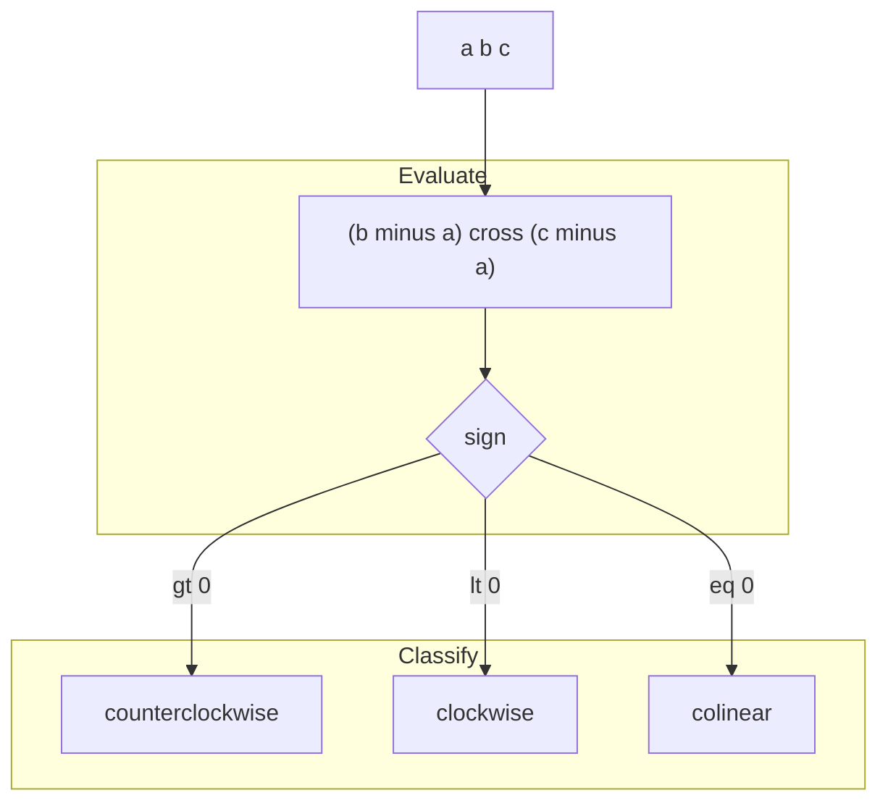
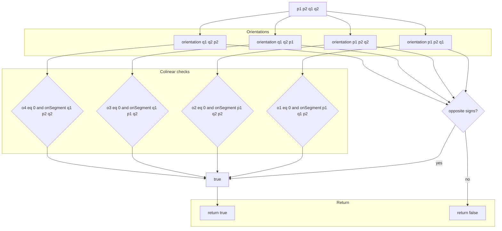
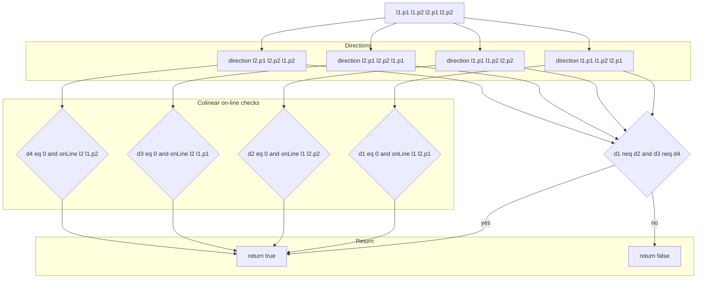
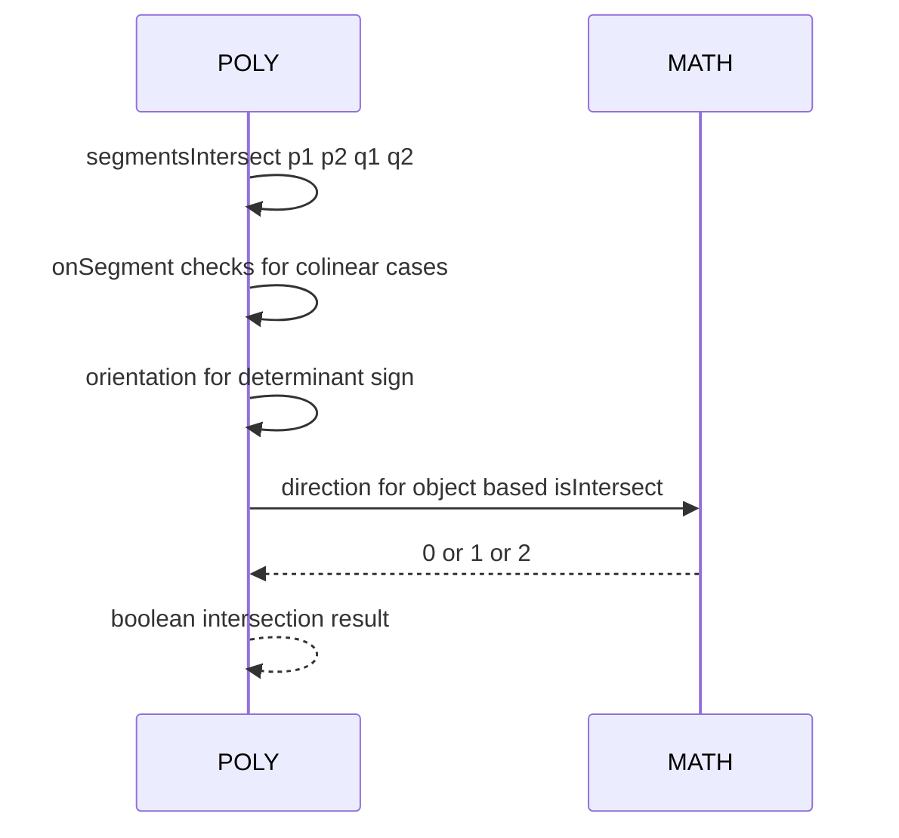

# POLY intersections and orientation

Core line intersection routines and orientation helpers used across polygon processing.

# Source anchors
- [AETHR.POLY:segmentsIntersect()](https://github.com/Gh0st352/AETHR/blob/main/dev/POLY.lua#L44)
- [AETHR.POLY:orientation()](https://github.com/Gh0st352/AETHR/blob/main/dev/POLY.lua#L180)
- [AETHR.POLY:isIntersect()](https://github.com/Gh0st352/AETHR/blob/main/dev/POLY.lua#L1249)
- [AETHR.POLY:onLine()](https://github.com/Gh0st352/AETHR/blob/main/dev/POLY.lua#L1286)
- Reference orientation test: [AETHR.MATH:direction()](https://github.com/Gh0st352/AETHR/blob/main/dev/MATH_.lua#L96)

# Overview
- orientation returns the signed area determinant for three points
  - gt 0 counterclockwise, lt 0 clockwise, 0 colinear
- segmentsIntersect implements the classic general-case intersection test with colinear on-segment checks
- isIntersect is a line object variant using MATH:direction and onLine for robust handling
- onLine checks bounding box inclusion for a colinear point relative to a segment

# Orientation flow

# segmentsIntersect flow

# isIntersect flow

# Sequence usage

# Implementation notes
- segmentsIntersect uses [AETHR.POLY:orientation()](https://github.com/Gh0st352/AETHR/blob/main/dev/POLY.lua#L180) and [AETHR.POLY:onSegment()](https://github.com/Gh0st352/AETHR/blob/main/dev/POLY.lua#L1286)
- isIntersect uses [AETHR.MATH:direction()](https://github.com/Gh0st352/AETHR/blob/main/dev/MATH_.lua#L96) and [AETHR.POLY:onLine()](https://github.com/Gh0st352/AETHR/blob/main/dev/POLY.lua#L1286)
- orientation normalizes points to {x,y} via [AETHR.POLY:normalizePoint()](https://github.com/Gh0st352/AETHR/blob/main/dev/POLY.lua#L236)

# Validation checklist
- segmentsIntersect: [dev/POLY.lua](https://github.com/Gh0st352/AETHR/blob/main/dev/POLY.lua#L44)
- orientation: [dev/POLY.lua](https://github.com/Gh0st352/AETHR/blob/main/dev/POLY.lua#L180)
- isIntersect: [dev/POLY.lua](https://github.com/Gh0st352/AETHR/blob/main/dev/POLY.lua#L1249)
- onLine: [dev/POLY.lua](https://github.com/Gh0st352/AETHR/blob/main/dev/POLY.lua#L1286)

# Related docs
- Distance and projections: [docs/poly/distance_projection_and_offset.md](./distance_projection_and_offset.md)
- Point in polygon: [docs/poly/point_in_polygon_and_overlap.md](./point_in_polygon_and_overlap.md)

# Conventions
- Mermaid fenced blocks use GitHub Mermaid parser
- Subgraph labels use double quotes per [docs/_mermaid/README.md](../_mermaid/README.md)
- Labels inside brackets avoid double quotes and parentheses
- Links use relative paths for repository portability